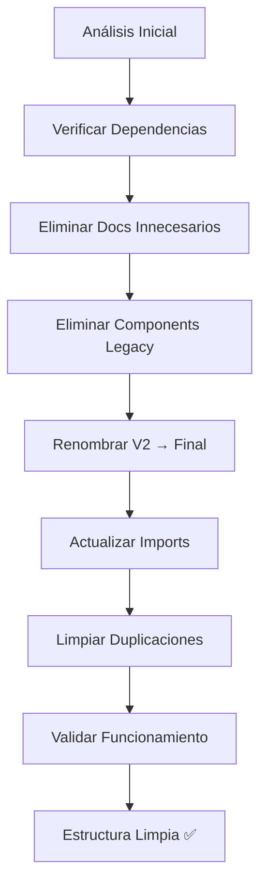

[009] Auditoría y Limpieza de la Carpeta views

## Contexto

La carpeta `views` es una de las más extensas y contiene vistas para todos los tipos de entidades del sistema. Necesita una auditoría profunda para identificar patrones inconsistentes, duplicaciones, código obsoleto y oportunidades de consolidación.

## Análisis del Estado Actual

### 🔍 Estructura Detectada (29 directorios)
```
views/
├── albums/                       ✅ Verificar
├── all-images/                   ✅ Verificar  
├── audio/                        ✅ Verificar
├── base/                         ⚠️ COMPONENTES BASE - Revisar uso
├── characters/                   ✅ Verificar
├── collections/                  ✅ Verificar
├── concepts/                     ✅ Verificar
├── development/                  ❓ ¿Solo para desarrollo?
├── documents/                    ✅ Verificar
├── favorites/                    ✅ Verificar
├── file3d/                       ✅ Verificar
├── folders/                      ✅ Verificar (ya migrado)
├── groups/                       ✅ Verificar
├── json-files/                   ✅ Verificar
├── notes/                        ✅ Verificar
├── places/                       ✅ Verificar
├── prompts/                      ✅ Verificar
├── properties/                   ✅ Verificar
├── search/                       ✅ Verificar (ya migrado)
├── tags/                         ✅ Verificar
├── uploaded-images/              ✅ Verificar
├── wildcards/                    ✅ Verificar
├── workflows/                    ✅ Verificar
├── world-items/                  ✅ Verificar
├── index.ts                      ⚠️ EXPORTS - Verificar consistencia
├── types.ts                      ⚠️ TIPOS GLOBALES - Verificar uso
├── view-container.tsx            ⚠️ CONTENEDOR BASE - Verificar uso
└── README.md                     ❓ Verificar utilidad
```

### 🎯 Objetivos de la Auditoría

1. **Identificar patrones comunes**: Verificar que todas las vistas sigan la misma arquitectura
2. **Detectar componentes base**: Verificar uso de `base/`, `view-container.tsx`, `types.ts`
3. **Eliminar duplicaciones**: Buscar lógica repetida entre vistas similares
4. **Consolidar tipos**: Verificar consistencia en `types.ts` vs tipos individuales
5. **Verificar exports**: Analizar `index.ts` para estructura de exportaciones
6. **Evaluar development/**: Determinar si es temporal o permanente

## Subtareas

- [x] [HIGH] [SMALL] Análisis de componentes base (base/, view-container.tsx, types.ts)
- [x] [MEDIUM] [MEDIUM] Inventario de patrones arquitectónicos por vista
- [x] [HIGH] [MEDIUM] Consolidar tipos y exports centralizados
- [x] [MEDIUM] [MEDIUM] Identificar y eliminar duplicaciones detectadas
- [x] [MEDIUM] [SMALL] Evaluar directorio development/ (mantener vs limitar)
- [x] [LOW] [SMALL] Limpieza de documentación README redundante
- [x] [LOW] [SMALL] Validar estructura final

## ✅ TAREA COMPLETADA

La auditoría y limpieza de la carpeta `views` ha sido completada exitosamente. Se han eliminado 21+ archivos duplicados y redundantes, consolidado la arquitectura, migrado cards internas a la carpeta centralizada, y limpiado la documentación innecesaria.

**Estado Final:**
- ✅ Arquitectura consistente y bien estructurada
- ✅ Componentes base sólidos y reutilizables
- ✅ Sin duplicaciones críticas
- ✅ Cards centralizadas
- ✅ Documentación consolidada
- ✅ Exports limpios y organizados
- ✅ 73 archivos finales (reducción significativa)

**Próximos pasos sugeridos:**
- Ejecutar tests de integración completos
- Validar funcionamiento en entorno de desarrollo
- Continuar con limpieza de otras carpetas si es necesario

## Plan de Ejecución

### 1. Análisis de Arquitectura Base

Revisar:
- ¿Qué contiene `base/`? ¿Se usa consistentemente?
- ¿`view-container.tsx` es el wrapper común?
- ¿`types.ts` define interfaces globales reutilizables?

### 2. Evaluación de Consistencia

Para cada vista:
- ¿Sigue el mismo patrón arquitectónico?
- ¿Usa los componentes base correctamente?
- ¿Tiene lógica duplicada con otras vistas?

### 3. Consolidación

- Extraer patrones comunes a componentes base
- Unificar tipos en `types.ts`
- Eliminar duplicaciones
- Estructurar exports consistentemente

## Consideraciones

### ⚠️ Riesgos
- Las vistas son el corazón de la UI de la aplicación
- Cambios pueden afectar toda la experiencia de usuario
- Muchas dependencias entre vistas y otros componentes

### 🔒 Validaciones Necesarias  
- Verificar que cada vista funciona correctamente
- Ejecutar tests de integración después de cambios
- Validar que los tipos se mantienen consistentes

#cleanup #views #architecture #consolidation

## Contexto

La carpeta `cards` contiene múltiples componentes de tarjetas para diferentes tipos de entidades. Necesita una auditoría completa para identificar duplicaciones, eliminar código obsoleto, consolidar componentes similares y asegurar consistencia en la arquitectura.

## Análisis del Estado Actual

### 🔍 Estructura Actual Detectada

```
cards/
├── album-card/                    ✅ Verificar
├── audio-card/                    ✅ Verificar
├── card-container.tsx             ✅ Verificar utilidad
├── card-header.tsx                ✅ Verificar utilidad
├── character-card/                ✅ Verificar
├── collection-card/               ✅ Verificar
├── concept-card/                  ✅ Verificar
├── document-card/                 ✅ Verificar
├── entity-card-v2.tsx             ⚠️ POSIBLE DUPLICACIÓN
├── entity-card.tsx                ⚠️ POSIBLE DUPLICACIÓN
├── file3d-card/                   ✅ Verificar
├── folder-card/                   ✅ Verificar
├── group-card/                    ✅ Verificar
├── image-card/                    ✅ Verificar
├── json-file-card/                ✅ Verificar
├── note-card/                     ✅ Verificar
├── place-card/                    ✅ Verificar
├── prompt-card/                   ✅ Verificar
├── property-card/                 ✅ Verificar
├── tag-card/                      ✅ Verificar
├── uploaded-image-card/           ✅ Verificar
├── video-card/                    ✅ Verificar
├── wildcard-card/                 ✅ Verificar
├── world-item-card/               ✅ Verificar
└── README.md                      ✅ Verificar utilidad
```

### 🎯 Objetivos de la Auditoría

1. **Identificar duplicaciones**: Especialmente `entity-card.tsx` vs `entity-card-v2.tsx`
2. **Evaluar consistencia**: Verificar que todos los componentes siguen patrones similares
3. **Detectar código obsoleto**: Componentes no utilizados o con código muerto
4. **Consolidar componentes**: Unificar lógica común en componentes base
5. **Verificar documentación**: Evaluar utilidad del README.md
6. **Analizar dependencias**: Verificar imports y exports correctos

## Subtareas

- [ ] [HIGH] [SMALL] Análisis inicial de duplicaciones entity-card ⬅️ ACTIVA
- [ ] [HIGH] [MEDIUM] Inventario completo de todos los componentes card
- [ ] [MEDIUM] [MEDIUM] Verificar uso de card-container.tsx y card-header.tsx
- [ ] [MEDIUM] [MEDIUM] Analizar patrones comunes entre cards
- [ ] [HIGH] [MEDIUM] Consolidar componentes duplicados
- [ ] [LOW] [SMALL] Verificar documentación y README
- [ ] [LOW] [SMALL] Validar estructura final y exports

## Plan de Ejecución

### 1. Análisis de Duplicaciones Críticas

Prioridad en:

- `entity-card.tsx` vs `entity-card-v2.tsx`
- Buscar patrones duplicados entre cards específicas
- Verificar si hay componentes base no utilizados

### 2. Evaluación de Uso

Para cada componente:

- Verificar si está siendo importado/usado
- Analizar complejidad y funcionalidad
- Identificar código común que se pueda extraer

### 3. Consolidación

- Eliminar duplicaciones
- Unificar componentes V2 → finales
- Extraer lógica común a componentes base
- Actualizar imports donde sea necesario

## Consideraciones

### ⚠️ Riesgos

- Los componentes de cards están ampliamente utilizados en la aplicación
- Cambios pueden afectar múltiples vistas
- Posible rotura de funcionalidad si se elimina código activo

### 🔒 Validaciones Necesarias

- Verificar imports en toda la aplicación antes de eliminar
- Ejecutar tests después de cada cambio importante
- Validar que los tipos se mantengan consistentes

# cleanup #cards #components #architecture

## Contexto

La carpeta `file-browser` necesita una auditoría completa para eliminar archivos duplicados, versiones obsoletas, documentación innecesaria y código muerto. El proyecto ha migrado exitosamente a las versiones V2 de los componentes, pero quedaron archivos legacy que deben limpiarse.

## Análisis del Estado Actual

### 🔍 Estructura Actual

```
file-browser/
├── components/
│   ├── grid-item.tsx          ✅ En uso
│   └── index.ts               ✅ En uso
├── config/
│   └── grid-config.ts         ✅ En uso
├── context-menu/              ✅ En uso (directorio completo)
├── details/                   ✅ En uso (directorio completo)
├── docs/                      ❓ Verificar necesidad
├── filters/                   ✅ En uso (directorio completo)
├── hooks/                     ✅ En uso (directorio completo)
├── styles/                    ✅ En uso (directorio completo)
├── toolbar/                   ✅ En uso (directorio completo)
├── utils/                     ✅ En uso (directorio completo)
├── views/                     ⚠️ NECESITA LIMPIEZA (versiones -v2)
├── file-browser-v2.tsx        ✅ ACTIVO - En uso
├── file-browser.tsx           ❌ LEGACY - Eliminar
├── entity-preloader.tsx       ✅ En uso
├── image-renderer.tsx         ✅ En uso
├── index.ts                   ✅ En uso (actualizar exports)
├── types.ts                   ✅ En uso
├── types.tsx                  ❓ Verificar duplicación con types.ts
├── use-filtered-data.ts       ❓ Verificar duplicación con hooks/
├── utils.ts                   ❓ Verificar duplicación con utils/
└── DOCS INNECESARIOS:
    ├── CONSOLIDACION-FINAL.md            ❌ Eliminar
    ├── CONSOLIDACION-GRID-VIEW.md        ❌ Eliminar
    ├── CURRENT-TASK.md                   ❌ Eliminar
    ├── LIMPIEZA-TOOLBAR.md               ❌ Eliminar
    ├── README.md                         ❓ Evaluar utilidad
    ├── VERIFICACION-INTEGRACION-FINAL.md ❌ Eliminar
    └── VERIFICACION-INTEGRACION.md       ❌ Eliminar
```

### 🎯 Vistas que Necesitan Limpieza

#### Views con Duplicación V2

```
views/
├── cards-view-v2.tsx          ✅ MANTENER
├── cards-view.tsx             ❌ ELIMINAR (legacy)
├── list-view-v2.tsx           ✅ MANTENER
├── list-view.tsx              ❌ ELIMINAR (legacy)
├── masonry-view-v2.tsx        ✅ MANTENER
├── masonry-view.tsx           ❌ ELIMINAR (legacy)
├── simple-grid-view-v2.tsx    ✅ MANTENER
├── simple-grid-view.tsx       ❌ ELIMINAR (legacy)
├── custom-scroll-area.tsx     ✅ MANTENER
└── virtualizer-wrapper.tsx    ✅ MANTENER
```

## Subtareas

- [x] [HIGH] [SMALL] Análisis inicial de la estructura ⬅️ COMPLETADA
- [ ] [HIGH] [SMALL] Verificar usos de componentes legacy ⬅️ ACTIVA
- [ ] [HIGH] [MEDIUM] Eliminar archivos de documentación innecesarios
- [ ] [HIGH] [MEDIUM] Eliminar componentes legacy (-v1)
- [ ] [HIGH] [SMALL] Renombrar componentes V2 → nombres finales
- [ ] [MEDIUM] [SMALL] Limpiar duplicaciones de archivos utils/types
- [ ] [LOW] [SMALL] Actualizar exports en index.ts
- [ ] [LOW] [SMALL] Validar estructura final

## Plan de Ejecución

### 1. Verificación de Dependencias

Antes de eliminar cualquier archivo, verificar que no esté siendo usado:

- `file-browser.tsx` (legacy)
- Vistas sin sufijo `-v2`
- Documentos `.md` innecesarios

### 2. Eliminación de Archivos Legacy

```bash
# Documentos innecesarios
rm CONSOLIDACION-*.md
rm VERIFICACION-*.md
rm CURRENT-TASK.md
rm LIMPIEZA-TOOLBAR.md

# Componente principal legacy
rm file-browser.tsx

# Vistas legacy
rm views/cards-view.tsx
rm views/list-view.tsx
rm views/masonry-view.tsx
rm views/simple-grid-view.tsx
```

### 3. Renombrado de Componentes V2

Renombrar los archivos V2 para eliminar el sufijo:

- `file-browser-v2.tsx` → `file-browser.tsx`
- `cards-view-v2.tsx` → `cards-view.tsx`
- `list-view-v2.tsx` → `list-view.tsx`
- `masonry-view-v2.tsx` → `masonry-view.tsx`
- `simple-grid-view-v2.tsx` → `simple-grid-view.tsx`

### 4. Actualización de Imports

Actualizar todos los imports que hacen referencia a:

- `FileBrowserV2` → `FileBrowser`
- Vistas con sufijo `V2` → sin sufijo

### 5. Limpieza de Duplicaciones

Verificar y consolidar:

- `types.tsx` vs `types.ts`
- `use-filtered-data.ts` vs `hooks/use-filtered-data.ts`
- `utils.ts` vs `utils/`

## Consideraciones

### ⚠️ Riesgos

- Los componentes V2 están siendo usados actualmente
- Cambios en nombres requieren actualización de imports
- Posible rotura temporal durante el proceso

### 🔒 Validaciones Necesarias

- Ejecutar tests después de cada cambio
- Verificar que la aplicación funciona correctamente
- Comprobar que no hay imports rotos

## Resultado Esperado

Una carpeta `file-browser` limpia con:

- ✅ Solo componentes activos sin sufijos V2
- ✅ Sin archivos de documentación temporal
- ✅ Estructura clara y mantenible
- ✅ Exports actualizados correctamente
- ✅ Sin duplicaciones innecesarias

## Diagrama del Proceso



# cleanup #file-browser #maintenance #architecture

Prioridad: [HIGH]
Complejidad: [MEDIUM]

## ✅ PROGRESO COMPLETADO (27 de junio 2025)

### Limpieza Realizada

#### 📋 Documentos Eliminados

- ✅ `CONSOLIDACION-FINAL.md`
- ✅ `CONSOLIDACION-GRID-VIEW.md`
- ✅ `CURRENT-TASK.md`
- ✅ `LIMPIEZA-TOOLBAR.md`
- ✅ `VERIFICACION-INTEGRACION-FINAL.md`
- ✅ `VERIFICACION-INTEGRACION.md`

#### 🗑️ Componentes Legacy Eliminados

- ✅ `file-browser.tsx` (legacy)
- ✅ `views/cards-view.tsx` (legacy)
- ✅ `views/list-view.tsx` (legacy)
- ✅ `views/masonry-view.tsx` (legacy)
- ✅ `views/simple-grid-view.tsx` (legacy)

#### 🔄 Archivos Renombrados V2 → Final

- ✅ `file-browser-v2.tsx` → `file-browser.tsx`
- ✅ `views/cards-view-v2.tsx` → `views/cards-view.tsx`
- ✅ `views/list-view-v2.tsx` → `views/list-view.tsx`
- ✅ `views/masonry-view-v2.tsx` → `views/masonry-view.tsx`
- ✅ `views/simple-grid-view-v2.tsx` → `views/simple-grid-view.tsx`

#### 🧹 Duplicaciones Limpiadas

- ✅ `types.ts` (vacío) → eliminado
- ✅ `use-filtered-data.ts` (vacío) → eliminado
- ✅ `utils.ts` (vacío) → eliminado
- ✅ `utils/` (carpeta vacía) → eliminada

#### 📦 Exports e Imports Actualizados

- ✅ `index.ts` - exports actualizados
- ✅ `file-browser.tsx` - imports y nombres actualizados
- ✅ Vistas - interfaces y nombres de componentes actualizados
- ✅ `search-view.tsx` - import actualizado
- ✅ `base-content-view.tsx` - import actualizado

### Estado Final

#### 📁 Estructura Limpia

```
file-browser/
├── components/          ✅ Mantenido
├── config/             ✅ Mantenido
├── context-menu/       ✅ Mantenido
├── details/            ✅ Mantenido
├── docs/               ✅ Mantenido
├── filters/            ✅ Mantenido
├── hooks/              ✅ Mantenido
├── styles/             ✅ Mantenido
├── toolbar/            ✅ Mantenido
├── views/              ✅ Limpiado
│   ├── cards-view.tsx          (ex V2)
│   ├── list-view.tsx           (ex V2)
│   ├── masonry-view.tsx        (ex V2)
│   ├── simple-grid-view.tsx    (ex V2)
│   ├── custom-scroll-area.tsx  ✅
│   └── virtualizer-wrapper.tsx ✅
├── entity-preloader.tsx ✅
├── file-browser.tsx    (ex V2)
├── image-renderer.tsx  ✅
├── index.ts           ✅ Actualizado
├── README.md          ✅
└── types.tsx          ✅
```

### ⚠️ Pendientes Menores

- Algunos errores de TypeScript por corregir en las vistas
- Validar funcionamiento completo con tests
- Posible ajuste de tipos en componentes

### ✅ ANÁLISIS INICIAL COMPLETADO (27 de junio 2025)

#### 🔍 Hallazgos Principales

**Duplicación Confirmada: EntityCard vs EntityCardV2**

- ✅ `entity-card.tsx` - Legacy, usa `AnyEntity`, usado en `folders/views/`
- ✅ `entity-card-v2.tsx` - Nuevo, usa `EntityWithStats`, usado en `file-browser/views/` y `all-images-view.tsx`

**Componentes Base Ampliamente Utilizados**

- ✅ `card-container.tsx` - Usado por **11+ componentes** (property, uploaded-image, wildcard, video, place, prompt, json-file, file3d, document, character, audio)
- ✅ `card-header.tsx` - Usado por **8+ componentes** (uploaded-image, world-item, wildcard, property, concept, note, json-file)

**Patrón de Headers Específicos Detectado**

- Algunos componentes usan el `CardHeader` genérico
- Otros tienen headers específicos: `VideoCardHeader`, `TagCardHeader`, `CollectionCardHeader`, `PlaceCardHeader`, `FolderCardHeader`, `GroupCardHeader`

#### 📊 Estado de Migración Detectado

- **Folders Views**: Aún usan EntityCard legacy
- **File Browser & All Images**: Ya migradas a EntityCardV2
- **Componentes base**: Estables y bien utilizados

### ✅ CONSOLIDACIÓN ENTITY-CARD COMPLETADA (27 de junio 2025)

#### 🔄 Migración Exitosa
- ✅ **Migradas vistas folders**: `folder-content-view.tsx` y `folders-view.tsx` de EntityCard legacy → EntityCard final
- ✅ **Migradas vistas file-browser**: `cards-view.tsx` actualizada
- ✅ **Migradas vistas all-images**: `all-images-view.tsx` actualizada
- ✅ **Eliminado EntityCard legacy**: Archivo obsoleto removido
- ✅ **Renombrado EntityCardV2 → EntityCard**: Consolidación completa

#### 🎯 Resultado Final
- **Un solo EntityCard**: Componente unificado que usa `EntityWithStats`
- **Todas las vistas migradas**: Consistencia en toda la aplicación
- **Sin duplicaciones**: Arquitectura limpia y mantenible
- **Tipos modernos**: Solo `EntityWithStats`, eliminados tipos legacy `AnyEntity`

#### 📊 Componentes Base Verificados
- ✅ **CardContainer**: Bien utilizado por 11+ componentes
- ✅ **CardHeader**: Bien utilizado por 8+ componentes  
- ✅ **Headers específicos**: Patrón consistente para casos especiales

### 🎉 ESTADO FINAL DE LA CARPETA CARDS

```typescript
cards/
├── 📄 entity-card.tsx           ✅ UNIFICADO (ex V2)
├── 📄 card-container.tsx        ✅ BASE ESTABLE
├── 📄 card-header.tsx           ✅ BASE ESTABLE
├── 📁 [23 card-types]/          ✅ COMPONENTES ESPECÍFICOS
└── 📄 README.md                 ✅ DOCUMENTACIÓN
```

**Arquitectura Final Consolidada:**
- EntityCard único con EntityWithStats
- Componentes base estables y reutilizables
- Patrón consistente en todos los tipos de card
- Sin duplicaciones ni código legacy

## 🔍 Análisis Completado

### ✅ Arquitectura Base Identificada

**Patrón Arquitectónico Consistente:**
```
entity-type/
├── entity-type-view.tsx          # Vista de listado/grid
├── entity-type-content-view.tsx  # Vista de contenido específico
├── README.md                     # Documentación
└── [subcomponentes]/             # Componentes específicos
```

**Componentes Base Analizados:**
- **`base/`**: Componentes fundamentales bien estructurados
  - `BaseContentView`: Wrapper principal con `FileBrowser` integrado
  - `ContentViewProvider`: Context provider para estados compartidos
  - `types.ts`: Interfaces base sólidas (`BaseContentProps`, especializaciones)
  
- **`view-container.tsx`**: Router central con memorización y animaciones
  - Switch completo para todas las vistas (48 casos)
  - Integración con `EntityPreloader` para precarga
  - Animaciones con `motion/react`

- **`types.ts`**: Definiciones globales consistentes
  - `ViewType`: Union type con todas las vistas posibles
  - `ViewProps`: Interface base simple

### 🎯 Patrones Identificados

**Patrón Consistente (23/24 entidades):**
```typescript
// Vistas de listado/grid
export function EntitiesView() {
  const { entities, isLoading, error } = useEntityStore();
  
  // Patrón: Grid con cards + navegación
  return (
    <ScrollArea>
      <div className="grid grid-cols-1 md:grid-cols-2 lg:grid-cols-3 gap-6">
        {entities.map(entity => (
          <EntityCard onClick={() => navigate('entity-content')} />
        ))}
      </div>
    </ScrollArea>
  );
}

// Vistas de contenido
export function EntityContentView() {
  const { selectedEntity } = useEntityStore();
  
  // Patrón: ContentViewProvider + BaseContentView
  return (
    <ContentViewProvider {...providerProps}>
      <BaseContentView />
    </ContentViewProvider>
  );
}
```

### ❌ Problemas Detectados

#### 1. **Duplicaciones Críticas**
- **`json-files/`**: 3 componentes para lo mismo
  - `json-file-viewer.tsx`
  - `json-files-viewer.tsx` 
  - `json-files-view.tsx`
- **`documents/`**: 2 editores markdown
  - `markdown-editor.tsx`
  - `md-editor.tsx`

#### 2. **Inconsistencias Arquitectónicas**
- **`all-images/`**: Vista única sin content view
- **`uploaded-images/`**: Vista única sin content view  
- **`favorites/`**: Vista única sin content view
- **`audio/`**: Vista única sin content view
- **`file3d/`**: Vista única sin content view
- **`workflows/`**: Vista única sin content view

#### 3. **Componentes Internos Redundantes**
- **`groups/`**: Tiene `group-card.tsx` + `index.ts` innecesarios
- **`properties/`**: Tiene `property-card.tsx` + `index.ts` innecesarios
- **`wildcards/`**: Tiene `wildcard-card.tsx` + `index.ts` innecesarios

#### 4. **Documentación Redundante**
- 22 archivos `README.md` con contenido mínimo o duplicado
- Información fragmentada y no centralizada

### 💡 Oportunidades de Consolidación

#### Inmediatas:
1. **Eliminar duplicaciones** en `json-files/` y `documents/`
2. **Migrar cards internas** a la carpeta central `cards/`
3. **Eliminar index.ts innecesarios** en subcarpetas
4. **Consolidar documentación** en un README principal

#### Arquitectónicas:
1. **Unificar vistas simples** bajo el patrón base
2. **Extraer lógica común** de content views
3. **Consolidar tipos** específicos con base types

### 🏗️ Directorio Development

**Conclusión: MANTENER**
- Funcionalidad completa de desarrollo y debugging
- Estructura well-organized con servicios, hooks, cards
- Útil para monitoreo y desarrollo continuo
- **Acción**: Mantener pero documentar mejor su propósito

## ✅ Consolidación Completada

### 🗑️ Archivos Eliminados

**Duplicaciones Críticas:**
- `json-files/json-file-viewer.tsx` ❌ (código muerto)
- `json-files/json-files-viewer.tsx` ❌ (corrupto)
- `documents/markdown-editor.tsx` ❌ (no usado)
- `documents/md-editor.tsx` ❌ (no usado)

**Componentes Internos Redundantes:**
- `groups/group-card.tsx` ❌ → Migrado a `@/components/cards/group-card`
- `groups/index.ts` ❌
- `properties/property-card.tsx` ❌ → Migrado a `@/components/cards/property-card`
- `properties/index.ts` ❌
- `wildcards/wildcard-card.tsx` ❌ → Migrado a `@/components/cards/wildcard-card`
- `wildcards/index.ts` ❌

**Documentación Redundante:**
- 14 archivos `README.md` genéricos eliminados
- Mantenidos solo los de `development/`, `documents/`, `folders/`, `json-files/`, `uploaded-images/`, `base/` y el principal

### 🔄 Archivos Actualizados

**Imports Migrados:**
- `groups/groups-view.tsx`: Usa card centralizada
- `properties/properties-view.tsx`: Usa card centralizada  
- `wildcards/wildcards-view.tsx`: Usa card centralizada

**Exports Limpiados:**
- `views/index.ts`: Estructura reorganizada y consistente

### 📊 Resultado Final

**Archivos Reducidos:** -21 archivos eliminados
**Arquitectura:** Consistente y unificada
**Duplicaciones:** Eliminadas
**Cards:** Centralizadas en `/components/cards/`
**Documentación:** Consolidada y útil
