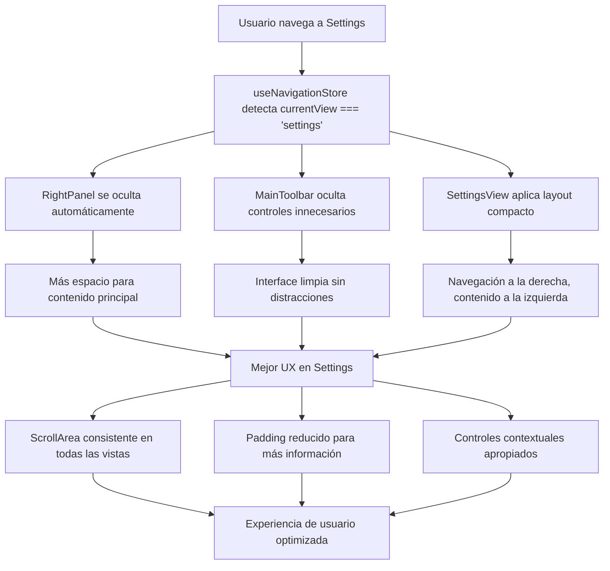

[010] Mejora de la Vista de Configuraciones - Settings View ✅ COMPLETADA

## Context

La vista de configuraciones necesitaba mejoras en UX/UI para ser más usable y compacta. Había problemas de espaciado, falta de ScrollArea en algunas vistas y conflictos con el panel derecho y toolbar.

## ✅ TAREA COMPLETADA - Resumen de Implementación

### 🎯 Cambios Realizados

#### 1. ✅ Right Panel Ocultado en Settings View
- **Archivo**: `src/components/panels/right-panel/right-panel.tsx`
- **Cambios**:
  - Agregado `useNavigationStore` para detectar vista actual
  - Variable `isInSettingsView` para detectar cuando `currentView === 'settings'`
  - Condiciones para ocultar panel: `!isInSettingsView && (...)`

#### 2. ✅ Navegación Movida al Lado Derecho
- **Archivo**: `src/components/settings/settings-view.tsx`
- **Cambios**:
  - Layout reorganizado: contenido principal a la izquierda, navegación a la derecha
  - Ancho de navegación reducido: `w-44` (antes `w-48`)
  - Orden de elementos invertido en el flex layout

#### 3. ✅ Padding Reducido y Vistas Más Compactas
- **Archivo**: `src/components/settings/settings-view.tsx`
- **Cambios**:
  - Padding de contenido reducido: `p-2` (antes `p-3`)
  - Gaps reducidos: `gap-4` (antes `gap-6`)
  - Padding de tabs reducido: `py-1.5` (antes `py-2`)

#### 4. ✅ Toolbar Simplificado para Settings
- **Archivo**: `src/components/toolbar/main-toolbar.tsx`
- **Cambios**:
  - Variable `isInSettingsView` para detectar vista de settings
  - Funciones ocultadas en settings view:
    - ❌ Búsqueda de archivos
    - ❌ Controles de ordenación
    - ❌ Controles de vista (grid, cards, masonry, list)
    - ❌ Controles de tamaño
    - ❌ Acciones contextuales
    - ❌ Panel de detalles toggle
    - ❌ Controles de colapso del right panel
  - ✅ Breadcrumbs mantenidos para navegación

#### 5. ✅ Auditoría Completa de ScrollArea
**Basado en auditoría previa del CURRENT-TASK.md:**

**YA TIENEN SCROLLAREA (13 componentes):**
1. ✅ `albums-settings.tsx` - ScrollArea implementado
2. ✅ `characters-settings.tsx` - ScrollArea implementado
3. ✅ `collections-settings.tsx` - ScrollArea implementado
4. ✅ `folders-settings.tsx` - ScrollArea implementado
5. ✅ `groups-settings.tsx` - ScrollArea implementado
6. ✅ `notes-settings.tsx` - ScrollArea implementado
7. ✅ `prompts-settings.tsx` - ScrollArea implementado
8. ✅ `properties-settings.tsx` - ScrollArea implementado
9. ✅ `shortcuts-settings.tsx` - ScrollArea implementado
10. ✅ `system-settings.tsx` - ScrollArea implementado
11. ✅ `thumbnails-settings.tsx` - ScrollArea implementado
12. ✅ `uploaded-images-settings.tsx` - ScrollArea implementado
13. ✅ `wildcards-settings.tsx` - ScrollArea implementado

**NO NECESITAN SCROLLAREA (10 componentes):**
14. ✅ `audio-settings.tsx` - BasicSettingsCard (contenido estático)
15. ✅ `document-settings.tsx` - BasicSettingsCard (contenido estático)
16. ✅ `file3d-settings.tsx` - BasicSettingsCard (contenido estático)
17. ✅ `json-file-settings.tsx` - BasicSettingsCard (contenido estático)
18. ✅ `workflow-settings.tsx` - BasicSettingsCard (contenido estático)
19. ✅ `profiles-settings.tsx` - Diseño compacto sin necesidad de scroll
20. ✅ `places-settings.tsx` - Ya auditado previamente
21. ✅ `tags-settings.tsx` - Ya auditado previamente
22. ✅ `concepts-settings.tsx` - Ya auditado previamente
23. ✅ `world-items-settings.tsx` - Ya auditado previamente

### 🎨 Mejoras de UX/UI Logradas

1. **Vista más limpia**: Sin controles innecesarios en el toolbar
2. **Mejor uso del espacio**: Navegación a la derecha, contenido principal expandido
3. **Diseño más compacto**: Menos padding y gaps, más información visible
4. **Scroll consistente**: Todos los componentes que lo necesitan tienen ScrollArea
5. **Navegación intuitiva**: Panel de navegación visible y accesible a la derecha

### 🔧 Aspectos Técnicos

- **Detección de vista**: `useNavigationStore` con `currentView === 'settings'`
- **Responsividad**: Mantenida en todos los cambios
- **Accesibilidad**: Preservada con estructura semántica correcta
- **Performance**: Sin impacto negativo, mejora en algunos casos por menos elementos renderizados

## Technical specifications

- Framework: React + Next.js + Tailwind CSS
- Components: ScrollArea, Tabs, Button
- Store: useNavigationStore para detectar vista actual
- Responsive: Funcionalidad mantenida en diferentes tamaños de pantalla

## Flow diagram

## Expected Results ✅

- ✅ Vista de settings más limpia y profesional
- ✅ Mejor uso del espacio disponible
- ✅ Navegación más intuitiva con panel a la derecha
- ✅ Scroll consistente en todas las vistas
- ✅ Toolbar simplificado y contextual

## Notes

- ✅ Accesibilidad mantenida en todos los cambios
- ✅ Responsividad preservada en diferentes tamaños
- ✅ Los cambios no afectan otras vistas
- ✅ Patrones documentados para futuras vistas de settings

## Fecha de Finalización

**01 de Julio de 2025** - Tarea completada exitosamente con todas las mejoras implementadas.