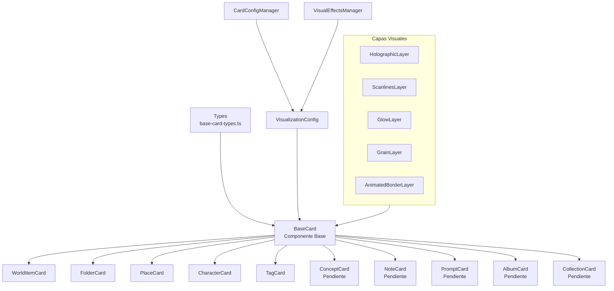
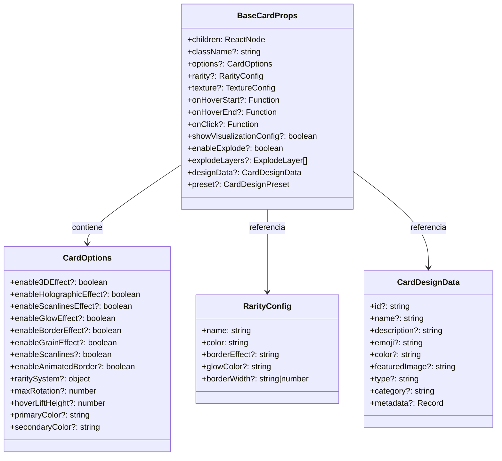
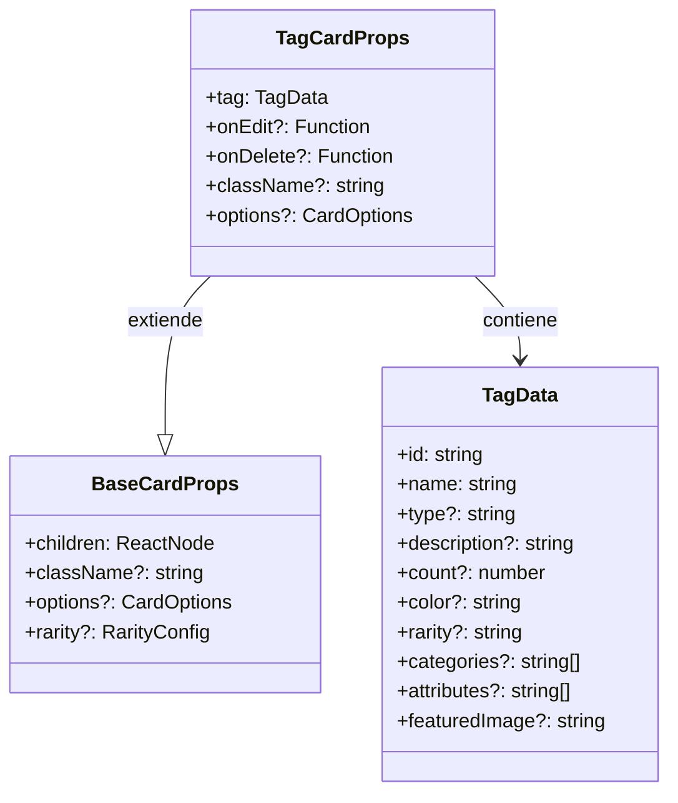
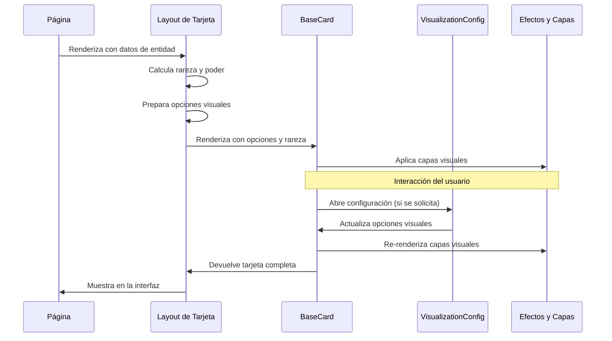
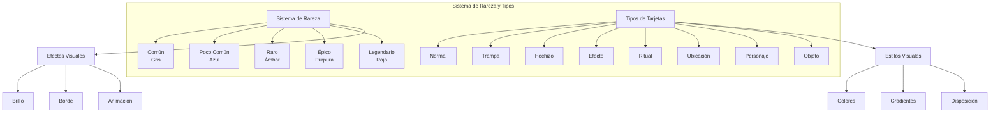

# Diagrama del Sistema de Tarjetas

Este diagrama ilustra la arquitectura del sistema de tarjetas de entidades, mostrando la relación entre los diferentes componentes y layouts.

## Arquitectura General

## Estructura del Componente BaseCard

## Estructura de un Layout de Tarjeta Específico

## Flujo de Renderizado de Tarjetas

## Sistema Visual de Rareza

