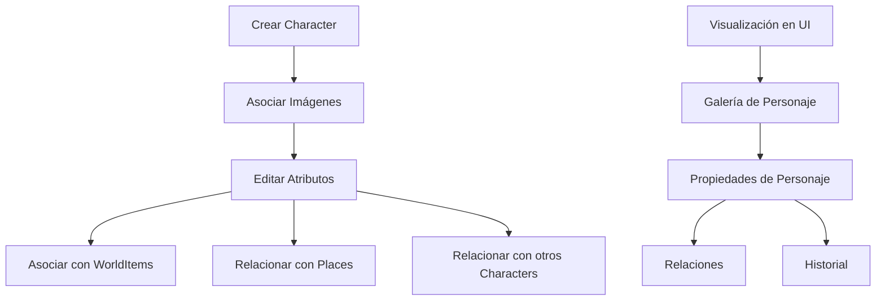

# Documentación de la Entidad Character

## Introducción

La entidad `Character` representa personajes en el sistema de gestión de imágenes. Esta entidad permite a los usuarios organizar y categorizar imágenes relacionadas con personajes específicos, especialmente útil para artistas, escritores, diseñadores de juegos y creadores de contenido narrativo.

## Estructura de la Entidad

### Propiedades Básicas

```typescript
interface Character {
    id: string;               // Identificador único (CUID)
    name: string;             // Nombre del personaje (único)
    description?: string;     // Descripción opcional
    emoji: string;            // Emoji para representación visual (default: 👤)
    color: string;            // Color temático (default: #3b82f6)
    shortcut?: string;        // Acceso rápido opcional
    category?: string;        // Categoría (default: "general")

    // Configuración
    sortBy: string;           // Criterio de ordenación (default: "name")
    filters: string;          // Filtros serializados (default: "empty_array")

    // Atributos del personaje
    level: number;            // Nivel del personaje (default: 1)
    class: string;            // Clase o profesión (default: "unknown")
    race: string;             // Raza o especie (default: "unknown")
    type?: string;            // Tipo adicional opcional
    alignment: string;        // Alineamiento (default: "neutral")

    // Características detalladas (serializadas)
    backstory: string;                // Historia de fondo
    stats: string;                    // Estadísticas serializadas
    psychologicalProfile: string;     // Perfil psicológico
    socialProfile: string;            // Perfil social
    relationships: string;            // Relaciones serializadas
    goals: string;                    // Objetivos serializados
    fears: string;                    // Miedos serializados
    beliefs: string;                  // Creencias serializadas
    personality: string;              // Rasgos de personalidad serializados
    skills: string;                   // Habilidades serializadas
    abilities: string;                // Capacidades serializadas

    // Visualización
    featuredImage?: string;           // Imagen destacada (referencia)
    isFavorite: boolean;              // Marcado como favorito

    // Metadatos
    createdAt: Date;                  // Fecha de creación
    updatedAt: Date;                  // Fecha de última actualización
}
```

## Diagrama de Flujo



## Estructura de Carpetas

```
src/
├─ types/
│  ├─ entities/
│  │  ├─ character/
│  │     ├─ types.ts            # Tipos principales del personaje
│  │     └─ index.ts            # Exportaciones
├─ transformers/
│  ├─ character/
│  │  ├─ index.ts               # Exportaciones y funciones públicas
│  │  ├─ transformer.ts         # Transformadores principales
│  │  ├─ serializers.ts         # Serializadores/deserializadores
│  │  ├─ mappers.ts             # Funciones de mapeo
│  │  └─ types.ts               # Tipos internos del transformador
├─ components/
│  ├─ cards/
│  │  ├─ character-card/        # Componentes de tarjeta de personaje
│  ├─ views/
│  │  ├─ characters/            # Vistas para personajes
├─ app/
│  └─ api/
│     └─ characters/            # API endpoints para personajes
│        └─ route.ts            # Manejadores de rutas
├─ utils/
│  └─ character/                # Utilidades específicas para personajes
│     ├─ helpers.ts             # Funciones auxiliares
│     ├─ validators.ts          # Validadores
│     └─ index.ts               # Exportaciones
```

## Interacciones con el Sistema de Eventos

### Eventos Emitidos

- `character:created` - Cuando se crea un personaje nuevo
- `character:updated` - Cuando se modifica un personaje existente
- `character:deleted` - Cuando se elimina un personaje
- `character:images:added` - Cuando se asocian imágenes a un personaje
- `character:images:removed` - Cuando se desasocian imágenes de un personaje

## Ejemplos de Uso en el Proyecto

### Creación de un Personaje

```typescript
import { createCharacter } from '@/transformers/character';

// Crear un personaje básico
const newCharacter = await createCharacter({
  name: "Aragorn",
  description: "Heredero de Isildur y rey de Gondor",
  class: "ranger",
  race: "human",
  alignment: "lawful good",
  category: "fantasy",
  level: 20,
  backstory: "Criado en Rivendell con el nombre de Estel, Aragorn es el heredero de Isildur...",
  // Las propiedades que son arrays se serializarán automáticamente
  goals: ["Reclamar el trono de Gondor", "Derrotar a Sauron", "Unir a los pueblos libres"],
  abilities: ["Rastreo", "Sigilo", "Liderazgo", "Combate con espada"],
  skills: ["Supervivencia", "Sabiduría", "Medicina"]
});

console.log(`Personaje creado: ${newCharacter.id}`);
```

### Obtención de Personajes

```typescript
import { searchCharacters, getCharacterById } from '@/transformers/character';

// Buscar personajes por criterios
const searchResult = await searchCharacters({
  filters: {
    text: "Aragorn",
    race: "human",
    class: "ranger"
  },
  sortBy: "name",
  sortDirection: "asc",
  take: 10,
  skip: 0
});

console.log(`Encontrados ${searchResult.total} personajes`);

// Obtener un personaje específico con todas sus relaciones
const character = await getCharacterById("character_id_here");
if (character) {
  console.log(`Personaje: ${character.name}`);
  console.log(`Imágenes asociadas: ${character.images.length}`);
  console.log(`Lugares asociados: ${character.places.length}`);
}
```

### Asociación de Imágenes con Personaje

```typescript
import { prisma } from '@/lib/prisma';
import { getCharacterById } from '@/transformers/character';

// Asociar imágenes a un personaje
async function associateImagesWithCharacter(characterId: string, imageIds: string[]) {
  // Crear conexiones entre personaje e imágenes
  await prisma.character.update({
    where: { id: characterId },
    data: {
      images: {
        connect: imageIds.map(id => ({ id }))
      }
    }
  });

  // Obtener el personaje actualizado con sus relaciones
  const updatedCharacter = await getCharacterById(characterId);
  return updatedCharacter;
}

// Ejemplo de uso
const updatedCharacter = await associateImagesWithCharacter(
  "character_id_here",
  ["image_id_1", "image_id_2"]
);
```

### Actualización de un Personaje

```typescript
import { updateCharacter } from '@/transformers/character';

// Actualizar atributos de un personaje
const updatedCharacter = await updateCharacter("character_id_here", {
  description: "Nueva descripción actualizada",
  level: 21,
  // Actualizar arrays serializados
  skills: ["Supervivencia", "Sabiduría", "Medicina", "Diplomacia"],
  relationships: [
    { id: "character_id_2", type: "ally", name: "Legolas" },
    { id: "character_id_3", type: "ally", name: "Gimli" }
  ]
});
```

## Consideraciones Importantes

1. **Serialización de Datos**: Varios campos como `goals`, `abilities`, `skills`, etc., se almacenan como strings serializados en la base de datos. Los transformadores se encargan de serializar/deserializar estos campos automáticamente.

2. **Relaciones**: Un personaje puede relacionarse con múltiples entidades del sistema:
   - Imágenes y Videos asociados
   - Otros personajes relacionados
   - Lugares donde aparece
   - Objetos que utiliza
   - Colecciones, grupos y álbumes a los que pertenece

3. **Índices**: La entidad tiene índices para optimizar búsquedas por nombre, fecha de creación, clase, raza y categoría.

## Integraciones con Otras Entidades

La entidad Character se integra con:

- **Image**: Las imágenes pueden estar asociadas a personajes mediante relación many-to-many
- **Video**: Los videos pueden estar asociados a personajes mediante relación many-to-many
- **Place**: Los personajes pueden estar asociados a lugares mediante relación many-to-many
- **WorldItem**: Los personajes pueden estar relacionados con elementos del mundo mediante relación many-to-many
- **Group**: Los personajes pueden ser agrupados mediante relación many-to-many
- **Otros Characters**: Los personajes pueden relacionarse entre sí mediante relación many-to-many

## Casos de Uso Típicos

1. **Worldbuilding para narradores**: Crear y organizar personajes para novelas, juegos de rol o proyectos narrativos.
2. **Organización de referencias visuales**: Asociar referencias visuales a personajes específicos.
3. **Creación de universos ficticios**: Estructurar relaciones entre personajes, lugares y objetos.
4. **Generación de AI**: Utilizar los atributos de personajes como prompt de referencia para generar arte con IA.

## Conclusión

La entidad Character enriquece el sistema de gestión de imágenes con capacidades de organización narrativa, facilitando el trabajo de creadores de contenido que necesitan gestionar personajes visuales de manera eficiente. Su completa integración con otras entidades del sistema permite crear redes de relaciones complejas para proyectos de worldbuilding.