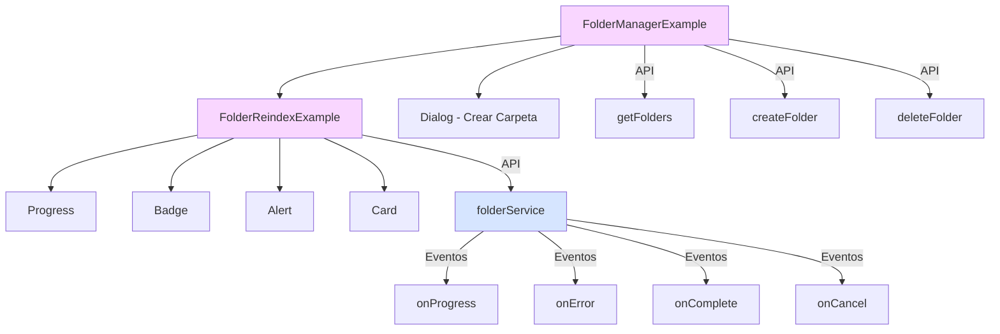

# Componentes de Ejemplo para el Servicio de Carpetas

Esta documentación describe los componentes de ejemplo que demuestran la integración del servicio de carpetas funcional con la interfaz de usuario React.

## Diagrama de Componentes



## Estructura de Archivos

- **`src/components/examples/folder-manager-example.tsx`**: Componente principal que gestiona múltiples carpetas
- **`src/components/examples/folder-reindex-example.tsx`**: Componente para reindexar una carpeta individual
- **`src/app/examples/folder-management/page.tsx`**: Página de demostración independiente
- **`src/components/views/development/development-view.tsx`**: Integración con el panel de desarrollo

## Componentes

### FolderManagerExample

Componente principal que muestra y gestiona una lista de carpetas.

#### Características

- Listado de carpetas con estado de carga
- Formulario modal para crear nuevas carpetas
- Botones para eliminar carpetas individuales
- Funcionalidad para reindexar todas las carpetas
- Estado vacío con mensaje informativo
- Integración con toasts para notificaciones

#### Estado

- `folders`: Lista de carpetas del sistema
- `loading`: Estado de carga de datos
- `dialogOpen`: Control del modal de creación
- `newFolderPath`, `newFolderName`, `folderType`: Datos del formulario

#### Eventos y Callbacks

- `loadFolders()`: Carga inicial de carpetas
- `handleFolderUpdated()`: Actualiza estado cuando cambian las estadísticas
- `handleDeleteFolder()`: Elimina una carpeta
- `handleCreateFolder()`: Crea una nueva carpeta
- `reindexAllFolders()`: Reindexación global con notificaciones

### FolderReindexExample

Componente para mostrar y reindexar una carpeta individual.

#### Características

- Visualización del progreso de reindexación en tiempo real
- Barra de progreso con porcentaje
- Métricas de rendimiento (tiempo, velocidad, archivos)
- Visualización de resultados al completar
- Manejo de errores con alertas
- Botones para iniciar y cancelar operaciones

#### Estado

- `isReindexing`: Si está en proceso de reindexación
- `progress`: Datos de progreso actual
- `error`: Mensaje de error si existe
- `result`: Resultado de la operación

#### Eventos y Callbacks

- `startReindex()`: Inicia la reindexación con callbacks
- `cancelReindex()`: Cancela la operación en curso
- `getElapsedTime()`: Calcula tiempo transcurrido
- `getPhaseLabel()`: Traduce las fases de operación
- `formatBytes()`: Función de utilidad para formatear tamaños

## Integración con el Servicio de Carpetas

Estos componentes demuestran varias técnicas de integración:

1. **Gestión de estado distribuido**:
   - Estado global con Server Actions
   - Estado local con React useState
   - Estado transitorio con callbacks de eventos

2. **Flujo de eventos bidireccional**:
   - Componente → Servicio: Iniciar/cancelar operaciones
   - Servicio → Componente: Notificaciones de progreso/resultado

3. **Patrones de UI reactiva**:
   - Feedback visual en tiempo real
   - Manejo elegante de errores
   - Estados de carga y vacíos
   - Animaciones de transición

4. **Limpieza de recursos**:
   - Eliminación de listeners al desmontar
   - Gestión explícita del ciclo de vida

## Ejemplos de Uso

### En Panel de Desarrollo

```tsx
// En development-view.tsx
<TabsContent value="folders" className="mt-4">
  <Card className="border-2 border-primary/10">
    <CardContent className="p-4">
      <FolderManagerExample />
    </CardContent>
  </Card>
</TabsContent>
```

### Como Página Independiente

```tsx
// En app/examples/folder-management/page.tsx
export default function FolderManagementPage() {
  return (
    <div className="container mx-auto py-8">
      <div className="border rounded-lg p-6 bg-card">
        <FolderManagerExample />
      </div>
    </div>
  );
}
```

### Como Componente Personalizado

```tsx
// Uso personalizado
<FolderManagerExample
  initialFilters={{ type: 'images' }}
  onFolderSelect={(folder) => handleFolderSelection(folder)}
  readOnly={false}
/>
```

## Mejores Prácticas Demostradas

1. **Separación de Responsabilidades**:
   - Componentes pequeños con propósito único
   - Separación de datos, lógica y presentación

2. **Manejo de Errores Robusto**:
   - Errores visualizados en contexto
   - Recuperación elegante de fallos

3. **Consistencia Visual**:
   - Uso del sistema de diseño shadcn/ui
   - Estilo coherente con Tailwind

4. **Feedback al Usuario**:
   - Indicadores de progreso en tiempo real
   - Mensajes de éxito/error claros

5. **Rendimiento**:
   - Componentes memoizados donde apropiado
   - Carga y actualización eficiente de datos