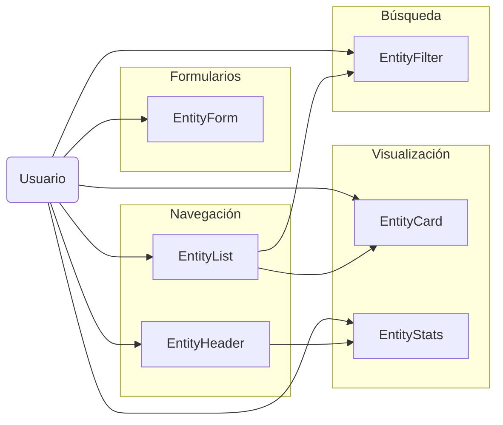

# Componentes UI Reutilizables

Este documento describe los componentes UI reutilizables desarrollados para mejorar la consistencia y potenciar la experiencia de usuario en la aplicación.

## Componentes disponibles

1. [EntityCard](#entitycard) - Tarjeta para mostrar entidades
2. [EntityList](#entitylist) - Lista o grid de entidades con búsqueda y filtros
3. [EntityStats](#entitystats) - Mostrar estadísticas de entidades
4. [EntityForm](#entityform) - Formulario dinámico para entidades
5. [EntityHeader](#entityheader) - Encabezado de página para entidades
6. [EntityFilter](#entityfilter) - Sistema avanzado de filtros

## Diagrama de relaciones



## Estructura de componentes

Los componentes se encuentran en el directorio `src/components/ui/`:

```
src/components/ui/
├── entity-card.tsx
├── entity-list.tsx
├── entity-stats.tsx
├── entity-form.tsx
├── entity-header.tsx
├── entity-filter.tsx
└── README.md
```

## EntityForm

Componente reutilizable para formularios de entidades con validación dinámica.

### Características principales

- Generación dinámica de formularios basados en una definición de campos
- Validación avanzada con Zod
- Múltiples tipos de campos soportados
- Manejo de errores consistente
- Confirmación antes de enviar
- Integración con toast

### Tipos de campos soportados

- `text` - Campos de texto simples
- `textarea` - Áreas de texto multilínea
- `select` - Selector de opciones simple
- `multiselect` - Selector múltiple
- `switch` - Interruptor booleano
- `color` - Selector de color con picker
- `emoji` - Selector de emoji
- `tags` - Campo para etiquetas
- `date` - Selector de fecha
- `number` - Campo numérico
- `url` - Campo para URL

### Ejemplo de uso

```tsx
import { EntityForm, EntityFormField } from '@/components/ui/entity-form';

// Definir los campos del formulario
const fields: EntityFormField[] = [
  {
    name: 'name',
    label: 'Nombre',
    type: 'text',
    placeholder: 'Nombre de la entidad',
    required: true,
    validation: {
      minLength: 3,
      maxLength: 50,
    }
  },
  {
    name: 'description',
    label: 'Descripción',
    type: 'textarea',
    placeholder: 'Describe la entidad...',
    fullWidth: true,
  },
  {
    name: 'category',
    label: 'Categoría',
    type: 'select',
    options: [
      { label: 'General', value: 'general' },
      { label: 'Técnico', value: 'technical' },
    ],
  },
  {
    name: 'isPublic',
    label: 'Es público',
    type: 'switch',
    description: 'Si está activo, será visible para todos los usuarios',
  },
];

// Usar en componente
function MyEntityForm() {
  const handleSubmit = async (data) => {
    // Procesar los datos del formulario
    console.log(data);

    // Por ejemplo, llamar a una acción del servidor
    const result = await createEntity(data);
    return result;
  };

  return (
    <EntityForm
      title="Crear nueva entidad"
      description="Complete todos los campos para crear una nueva entidad"
      fields={fields}
      initialData={{ category: 'general', isPublic: true }}
      onSubmit={handleSubmit}
      onCancel={() => router.back()}
      submitLabel="Crear entidad"
      cancelLabel="Cancelar"
      formStyle="card"
    />
  );
}
```

### Props

| Prop | Tipo | Descripción |
|------|------|-------------|
| `title` | `string` | Título del formulario |
| `description` | `string` | Descripción del formulario |
| `fields` | `EntityFormField[]` | Definición de campos del formulario |
| `initialData` | `Record<string, any>` | Datos iniciales para el formulario |
| `onSubmit` | `(data: Record<string, any>) => Promise<void> \| void` | Función a ejecutar al enviar el formulario |
| `onCancel` | `() => void` | Función a ejecutar al cancelar |
| `submitLabel` | `string` | Texto del botón de envío (por defecto: "Guardar") |
| `cancelLabel` | `string` | Texto del botón de cancelar (por defecto: "Cancelar") |
| `isLoading` | `boolean` | Indicador de carga en curso |
| `confirmBeforeSubmit` | `boolean` | Si debe mostrar confirmación antes de enviar |
| `confirmMessage` | `string` | Mensaje de confirmación |
| `showToastOnSuccess` | `boolean` | Si debe mostrar toast al completar con éxito |
| `successMessage` | `string` | Mensaje para el toast de éxito |
| `redirectUrl` | `string` | URL a la que redirigir después de enviar con éxito |
| `formStyle` | `'default' \| 'compact' \| 'card'` | Estilo del formulario |
| `className` | `string` | Clases adicionales para el formulario |

## EntityHeader

Componente para encabezados consistentes de páginas de entidades, que incluye título, descripción, breadcrumbs, acciones y estadísticas.

### Características principales

- Breadcrumbs integrados para navegación
- Acciones principales y secundarias (en menú desplegable)
- Integración con estadísticas
- Botón de favorito configurable
- Imagen destacada opcional
- Personalización de colores

### Ejemplo de uso

```tsx
import { EntityHeader } from '@/components/ui/entity-header';
import { PencilIcon, TrashIcon } from 'lucide-react';

function EntityDetailPage() {
  const handleDelete = async () => {
    // Lógica para eliminar la entidad
  };

  const handleEdit = () => {
    router.push('/entidades/123/editar');
  };

  const handleToggleFavorite = async () => {
    // Lógica para marcar/desmarcar como favorito
  };

  return (
    <EntityHeader
      title="Mi Entidad"
      subtitle="Categoría: General"
      description="Esta es una descripción detallada de mi entidad que explica su propósito y características principales."
      icon={<DatabaseIcon className="h-5 w-5" />}
      backUrl="/entidades"
      primaryColor="#6366f1"
      stats={[
        { label: 'Elementos', value: 42 },
        { label: 'Vistas', value: 1024 },
        { label: 'Descargas', value: 128 },
      ]}
      breadcrumbItems={[
        { label: 'Dashboard', href: '/' },
        { label: 'Entidades', href: '/entidades' },
        { label: 'Mi Entidad' },
      ]}
      showFavoriteButton={true}
      isFavorite={true}
      onToggleFavorite={handleToggleFavorite}
      actions={[
        {
          label: 'Editar',
          icon: <PencilIcon className="h-4 w-4" />,
          variant: 'outline',
          onClick: handleEdit,
        },
        {
          label: 'Eliminar',
          icon: <TrashIcon className="h-4 w-4" />,
          variant: 'destructive',
          inDropdown: true,
          onClick: handleDelete,
        },
        {
          label: 'Duplicar',
          inDropdown: true,
          onClick: () => handleDuplicate(),
        },
      ]}
    />
  );
}
```

### Props

| Prop | Tipo | Descripción |
|------|------|-------------|
| `title` | `string` | Título principal |
| `subtitle` | `string` | Subtítulo opcional |
| `description` | `string` | Descripción opcional |
| `icon` | `React.ReactNode` | Icono para mostrar junto al título |
| `backUrl` | `string` | URL de retorno (para el enlace "Volver") |
| `backLabel` | `string` | Texto para el enlace de retorno (por defecto: "Volver") |
| `primaryColor` | `string` | Color principal en formato hex (por defecto: "#3b82f6") |
| `stats` | `StatItem[]` | Items de estadísticas para mostrar |
| `actions` | `EntityHeaderAction[]` | Acciones disponibles para la entidad |
| `featuredImage` | `string` | URL de imagen destacada |
| `breadcrumbItems` | `Array<{label: string, href?: string}>` | Items para la ruta de navegación |
| `isFavorite` | `boolean` | Si es favorito |
| `onToggleFavorite` | `() => void` | Función para cambiar estado de favorito |
| `showFavoriteButton` | `boolean` | Si se debe mostrar el botón de favorito |
| `className` | `string` | Clases adicionales para el contenedor |
| `rightContent` | `React.ReactNode` | Contenido personalizado para la sección derecha |

## EntityFilter

Componente avanzado para filtros complejos de entidades, con soporte para guardado y reutilización de filtros.

### Características principales

- Múltiples tipos de filtros
- Búsqueda rápida integrada
- Guardado de filtros personalizados
- Vista de filtros activos como badges
- UI adaptable (compacta o normal)

### Tipos de filtros soportados

- `text` - Búsqueda por texto
- `select` - Selector de opciones
- `multiselect` - Selector múltiple
- `checkbox` - Lista de checkboxes
- `radio` - Grupo de radio buttons
- `date` - Selector de fecha
- `dateRange` - Rango de fechas
- `number` - Campo numérico
- `numberRange` - Rango numérico
- `boolean` - Filtro booleano

### Ejemplo de uso

```tsx
import { EntityFilter, EntityFilterDefinition, SavedFilter } from '@/components/ui/entity-filter';
import { useState } from 'react';

function FilterableEntityList() {
  const [filterValues, setFilterValues] = useState<Record<string, any>>({});
  const [savedFilters, setSavedFilters] = useState<SavedFilter[]>([
    {
      name: "Recientes y activos",
      values: {
        status: 'active',
        sortBy: 'recent',
      }
    }
  ]);

  // Definir los filtros
  const filters: EntityFilterDefinition[] = [
    {
      id: 'searchTerm',
      label: 'Búsqueda',
      type: 'text',
      placeholder: 'Buscar por nombre o descripción',
    },
    {
      id: 'category',
      label: 'Categoría',
      type: 'select',
      options: [
        { label: 'General', value: 'general' },
        { label: 'Técnico', value: 'technical' },
        { label: 'Artístico', value: 'artistic' },
      ],
    },
    {
      id: 'status',
      label: 'Estado',
      type: 'radio',
      options: [
        { label: 'Todos', value: 'all' },
        { label: 'Activos', value: 'active' },
        { label: 'Inactivos', value: 'inactive' },
      ],
    },
    {
      id: 'isPublic',
      label: 'Es público',
      type: 'boolean',
    },
    {
      id: 'createdAfter',
      label: 'Creado después de',
      type: 'date',
    },
  ];

  // Manejar guardado de filtro
  const handleSaveFilter = (filter: SavedFilter) => {
    setSavedFilters([...savedFilters, filter]);
  };

  // Manejar eliminación de filtro
  const handleDeleteFilter = (name: string) => {
    setSavedFilters(savedFilters.filter(f => f.name !== name));
  };

  return (
    <div className="space-y-4">
      <EntityFilter
        filters={filters}
        initialValues={filterValues}
        onChange={setFilterValues}
        showQuickSearch={true}
        searchPlaceholder="Buscar entidades..."
        allowSavedFilters={true}
        savedFilters={savedFilters}
        onSaveFilter={handleSaveFilter}
        onDeleteSavedFilter={handleDeleteFilter}
      />

      {/* Mostrar resultados filtrados */}
      <div>
        {/* Aquí irían los resultados filtrados según filterValues */}
        {JSON.stringify(filterValues)}
      </div>
    </div>
  );
}
```

### Props

| Prop | Tipo | Descripción |
|------|------|-------------|
| `filters` | `EntityFilterDefinition[]` | Definiciones de filtros disponibles |
| `initialValues` | `Record<string, any>` | Valores iniciales de los filtros |
| `onChange` | `(values: Record<string, any>) => void` | Función llamada cuando cambian los filtros |
| `showQuickSearch` | `boolean` | Si mostrar barra de búsqueda rápida (por defecto: true) |
| `searchPlaceholder` | `string` | Placeholder para búsqueda rápida |
| `allowSavedFilters` | `boolean` | Si permite guardar filtros favoritos |
| `savedFilters` | `SavedFilter[]` | Filtros guardados iniciales |
| `onSaveFilter` | `(filter: SavedFilter) => void` | Función llamada cuando se guarda un filtro |
| `onDeleteSavedFilter` | `(name: string) => void` | Función llamada cuando se elimina un filtro |
| `showActiveCount` | `boolean` | Si mostrar contador de filtros activos |
| `className` | `string` | Clases adicionales |
| `clearButtonText` | `string` | Texto del botón de limpiar filtros |
| `compact` | `boolean` | Si debe ser compacto (menos espaciado) |

## Integración entre componentes

Estos componentes están diseñados para trabajar juntos, creando una experiencia de usuario coherente:

1. `EntityList` puede mostrar una colección de `EntityCard`
2. `EntityHeader` puede usar el mismo formato de `StatItem` que `EntityStats`
3. `EntityForm` puede usarse para crear/editar entidades mostradas en `EntityList`
4. `EntityFilter` puede integrarse con `EntityList` para filtrado avanzado

## Ejemplo de página completa

A continuación se muestra un ejemplo de cómo integrar varios componentes en una página:

```tsx
import { EntityFilter } from '@/components/ui/entity-filter';
import { EntityHeader } from '@/components/ui/entity-header';
import { EntityList } from '@/components/ui/entity-list';
import { Button } from '@/components/ui/button';
import { PlusIcon } from 'lucide-react';
import { useState } from 'react';

export default function EntitiesPage() {
  const [filterValues, setFilterValues] = useState({});

  // ... definir filtros, entidades, acciones, etc.

  return (
    <div className="space-y-8">
      {/* Encabezado de la página */}
      <EntityHeader
        title="Entidades"
        description="Gestione todas las entidades del sistema"
        stats={[
          { label: 'Total', value: entities.length },
          { label: 'Activas', value: entities.filter(e => e.isActive).length },
        ]}
        actions={[
          {
            label: 'Crear entidad',
            icon: <PlusIcon className="h-4 w-4" />,
            href: '/entities/new',
          }
        ]}
      />

      {/* Filtros */}
      <EntityFilter
        filters={filterDefinitions}
        onChange={setFilterValues}
        showQuickSearch={true}
      />

      {/* Lista de entidades */}
      <EntityList
        items={filteredEntities}
        viewType="grid"
        allowViewChange={true}
        pagination={true}
        itemsPerPage={12}
      />
    </div>
  );
}
```

## Conclusión

Estos componentes UI reutilizables proporcionan una base sólida para crear interfaces de usuario consistentes y funcionales para la gestión de entidades. Al utilizarlos, se puede reducir significativamente el tiempo de desarrollo y mejorar la experiencia del usuario final.