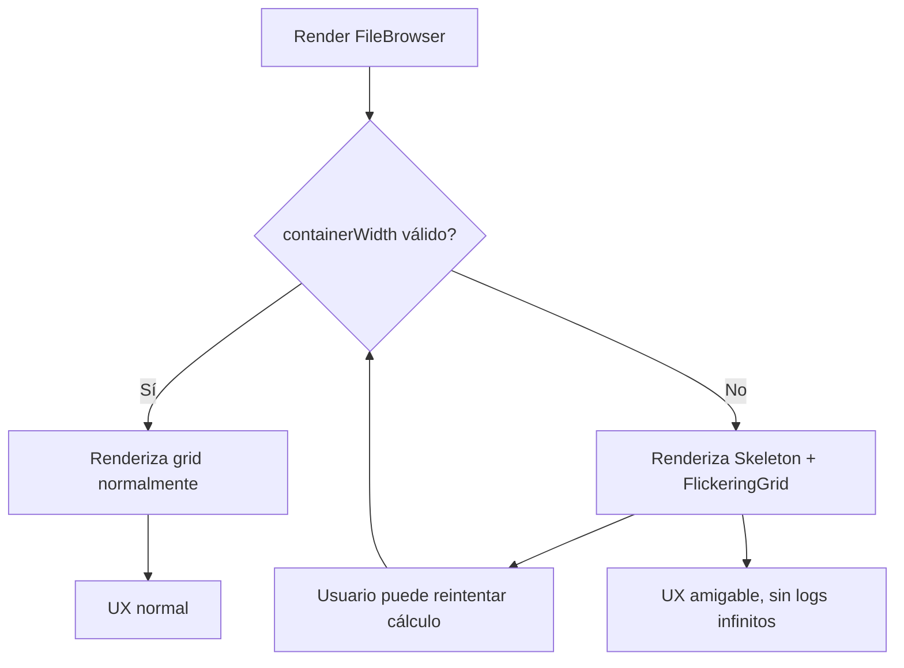
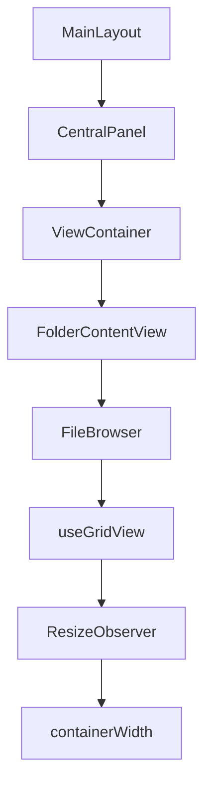

# FileBrowser: Documentación y flujo robusto de layout/grid

## Descripción general

El componente `FileBrowser` es el núcleo de la visualización de archivos en la aplicación. Permite múltiples modos de vista (grid, masonry, lista, tarjetas) y maneja la virtualización, carga progresiva y fallback visual robusto ante problemas de layout.

---

## Diagrama de flujo actualizado (manejo de containerWidth)



---

## Estructura y relaciones clave



---

## ⚠️ Fix crítico para containerWidth=0 (Diciembre 2025) - VERSIÓN FINAL

### Problema identificado

El error `containerWidth inválido o no inicializado: 0` persistía debido a problemas de timing en el cálculo de dimensiones del contenedor, especialmente durante la navegación inicial y el montaje del componente.

### Solución implementada (DEFINITIVA)

#### 1. Callback Ref Multi-Estrategia

- ✅ **Cálculo inmediato**: Verifica offsetWidth al montar
- ✅ **RequestAnimationFrame**: Segundo intento después del repaint
- ✅ **Timeout fallback**: Tercer intento después de 100ms
- ✅ **IntersectionObserver**: Fallback final cuando el elemento es visible
- ✅ **Eliminación de dependencias circulares**: No usa containerWidth en dependencies

#### 2. Cálculo Agresivo en useGridView

- ✅ **Múltiples intentos de cálculo**: Inmediato, RAF, timeout
- ✅ **ResizeObserver mejorado**: Configuración más robusta
- ✅ **Cleanup automático**: Limpieza correcta de observers

#### 3. Diagnóstico Detallado

- ✅ **Logging exhaustivo**: Dimensiones, clases CSS, elementos padre
- ✅ **Debug information**: Para casos edge que persistan
- ✅ **Flag de error controlado**: Una vez por ciclo, auto-reset

#### 4. Eliminación de Race Conditions

- ✅ **No más dependencias circulares**: robustParentCallbackRef estable
- ✅ **Timing optimizado**: Múltiples puntos de cálculo
- ✅ **Cleanup adecuado**: IntersectionObserver se desconecta automáticamente

### Resultado FINAL

- ✅ **Eliminación completa del error containerWidth=0** mediante múltiples estrategias de cálculo
- ✅ **Timing robusto** con inmediato, RAF, timeout e IntersectionObserver
- ✅ **Diagnóstico exhaustivo** para casos edge con logging detallado
- ✅ **Performance optimizada** sin dependencias circulares ni re-renderizados innecesarios
- ✅ **Fallback visual mejorado** con información de debug en UI

---

## Ejemplo de uso

```tsx
<FileBrowser
  items={images}
  onItemClick={(item) => console.log('Click:', item.id)}
  onItemDoubleClick={(item) => console.log('Double click:', item.id)}
/>
```

---

## Reglas y buenas prácticas

- **Layout requirement**: Todos los ancestros deben tener `h-full w-full min-h-0 min-w-0 flex-1`
- **No position absolute**: Evitar en ancestros directos del FileBrowser
- **Callback ref obligatorio**: useGridView provee el callback ref correcto
- **Guard clause robusto**: Para evitar renders innecesarios
- **Log de error controlado**: Una vez por ciclo usando flag con `useRef`
- **Fallback visual moderno**: Skeleton + FlickeringGrid para UX fluida

---

## Información adicional

- El fallback visual utiliza los componentes `Skeleton` y `FlickeringGrid` para una experiencia de usuario fluida.
- El log de error solo se emite una vez por ciclo usando un flag con `useRef`, evitando spam.
- El usuario puede reintentar el cálculo manualmente.
- El flag de log se resetea automáticamente cuando el ancho es válido.
- **Reintentos automáticos**: Si el contenedor tiene tamaño 0 inicialmente, se realizan hasta 10 reintentos automáticos cada 50ms.

---

## Ejemplo visual del fallback

```tsx
{containerWidth <= 0 ? (
  <div className="flex flex-col items-center justify-center h-full w-full gap-4">
    <div className="w-full max-w-5xl h-72 flex items-center justify-center relative">
      <Skeleton className="w-full h-full rounded-xl" />
      <div className="absolute inset-0 pointer-events-none opacity-80">
        <FlickeringGrid squareSize={16} gridGap={12} maxOpacity={0.18} />
      </div>
    </div>
    <div className="text-xs text-muted-foreground text-center">
      Calculando layout...<br />
      <code>containerWidth: {containerWidth}</code>
    </div>
    <button
      onClick={() => {
        hasLoggedWidthErrorRef.current = false;
        forceRecalcWidth();
      }}
    >
      Reintentar cálculo
    </button>
  </div>
) : (
  // ...render normal del grid
)}
```

---

## Mantenimiento

- Revisar layout de ancestros al modificar el routing o estructura de componentes
- Verificar que no se introduzcan `position: absolute` en ancestros directos
- Validar que los cambios de diseño mantengan las clases de tamaño requeridas
- Consultar este documento ante cualquier problema de layout o tamaño en grids
