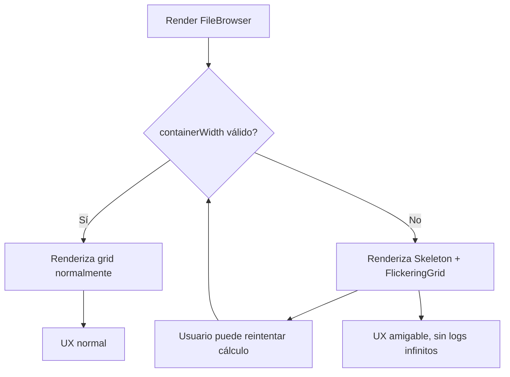

# FileBrowser: Documentación y flujo robusto de layout/grid

## Descripción general

El componente `FileBrowser` es el núcleo de la visualización de archivos en la aplicación. Permite múltiples modos de vista (grid, masonry, lista, tarjetas) y maneja la virtualización, carga progresiva y fallback visual robusto ante problemas de layout.

---

## Diagrama de flujo actualizado (manejo de containerWidth)



---

## Estructura y relaciones clave

- `file-browser.tsx`: lógica principal, fallback visual, logs y control de errores.
- `hooks/use-grid-view.ts`: cálculo y observación de ancho, ResizeObserver.
- `ui/skeleton.tsx` y `ui/flickering-grid.tsx`: componentes visuales para el fallback.

---

## Ejemplo de uso

```tsx
<FileBrowser items={files} />
// Si el contenedor aún no tiene ancho (por ejemplo, el padre está oculto o la app está cargando),
// el usuario verá un grid animado y un mensaje de "Calculando layout..." en vez de errores o pantalla vacía.
```

---

## Reglas y buenas prácticas

- Guard clause robusto para evitar renders innecesarios.
- Log de error controlado y no repetitivo.
- Fallback visual moderno y amigable.
- Código comentado y documentado.
- Siempre usar ResizeObserver y fallback manual para el cálculo de ancho.

---

## Información adicional

- El fallback visual utiliza los componentes `Skeleton` y `FlickeringGrid` para una experiencia de usuario fluida.
- El log de error solo se emite una vez por ciclo usando un flag con `useRef`, evitando spam.
- El usuario puede reintentar el cálculo manualmente.
- El flag de log se resetea automáticamente cuando el ancho es válido.

---

## Ejemplo visual del fallback

```tsx
{!containerWidth || containerWidth <= 0 ? (
  <div className="flex flex-col items-center justify-center h-full w-full gap-4">
    <div className="w-full max-w-5xl h-72 flex items-center justify-center relative">
      <Skeleton className="w-full h-full rounded-xl" />
      <div className="absolute inset-0 pointer-events-none opacity-80">
        <FlickeringGrid squareSize={16} gridGap={12} maxOpacity={0.18} />
      </div>
    </div>
    <div className="text-xs text-muted-foreground text-center">
      Calculando layout...<br />
      <code>containerWidth: {containerWidth}</code><br />
      <code>ancho real del div padre: {realWidth}</code>
    </div>
    <button
      type="button"
      className="mt-2 px-3 py-1 rounded bg-muted text-xs hover:bg-accent border"
      onClick={() => {
        hasLoggedWidthErrorRef.current = false;
        forceRecalcWidth();
      }}
    >
      Reintentar cálculo
    </button>
  </div>
) : (
  // ...render normal del grid
)}
```

---

## Mantenimiento

- Mantener este documento actualizado ante cualquier cambio en la lógica de layout o fallback visual.
- Revisar y actualizar el diagrama mermaid si se modifica el flujo de cálculo de ancho o el guard clause.
