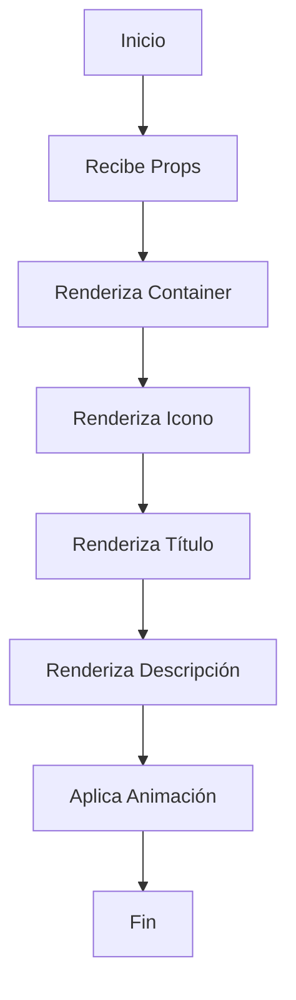

# Empty State Component

## Descripción General

El componente `EmptyState` es un componente de presentación que se utiliza para mostrar un estado vacío o sin contenido en la aplicación. Proporciona una interfaz visual consistente para comunicar la ausencia de datos o contenido al usuario.

### Propósito

- Mostrar un estado vacío de manera visualmente atractiva
- Proporcionar feedback visual al usuario cuando no hay contenido
- Mantener una experiencia de usuario consistente en estados vacíos

### Responsabilidades

- Renderizar un icono personalizable
- Mostrar un título descriptivo
- Mostrar un mensaje de descripción
- Aplicar animaciones de entrada
- Mantener estilos consistentes

### Ubicación

- Path: `src/components/core/data-display/empty-state/empty-state.tsx`
- Tipo: Client Component

## Interfaz

### Props

```typescript
interface EmptyStateProps {
	icon: LucideIcon; // Icono de Lucide React
	title: string; // Título del estado vacío
	description: string; // Descripción detallada
	className?: string; // Clases CSS opcionales
}
```

### Eventos

- No maneja eventos directamente

### Estados

- No mantiene estado interno

### Métodos Públicos

- No expone métodos públicos

## Dependencias

### Componentes Relacionados

- No tiene dependencias directas de otros componentes

### Librerías Externas

- `lucide-react`: Para iconos
- `motion/react`: Para animaciones
- `@/lib/utils`: Utilidad cn para composición de clases

### Hooks Personalizados

- No utiliza hooks personalizados

## Ejemplos de Uso

### Caso Básico

```tsx
import { FileIcon } from "lucide-react";

<EmptyState
	icon={FileIcon}
	title="No hay archivos"
	description="No se encontraron archivos en esta carpeta"
/>;
```

### Con Clases Personalizadas

```tsx
<EmptyState
	icon={ImageIcon}
	title="Sin imágenes"
	description="No hay imágenes disponibles"
	className="h-full bg-secondary"
/>
```

## Consideraciones

### Performance

- Componente ligero sin cálculos complejos
- Animaciones optimizadas con Motion
- No realiza re-renders innecesarios

### Accesibilidad

- Estructura semántica con títulos
- Textos descriptivos para lectores de pantalla
- Contraste adecuado con colores del tema

### Responsive Design

- Altura adaptable con h-[50vh]
- Centrado vertical y horizontal
- Tamaños de texto responsivos

### Mejores Prácticas

- Usar iconos significativos
- Mensajes claros y concisos
- Mantener consistencia visual
- Evitar estados vacíos cuando sea posible

## Diagrama de Flujo



## Notas de Implementación

- El componente usa "use client" para animaciones del lado del cliente
- Implementa animaciones suaves de fade in y slide up
- Utiliza el sistema de temas para colores y estilos
- Mantiene una estructura simple y reutilizable
