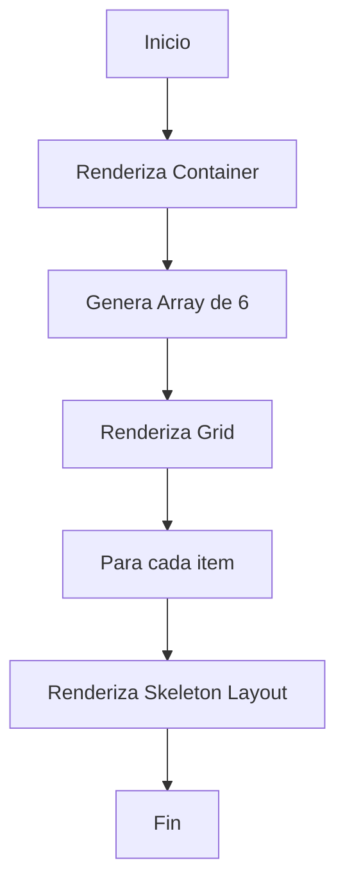
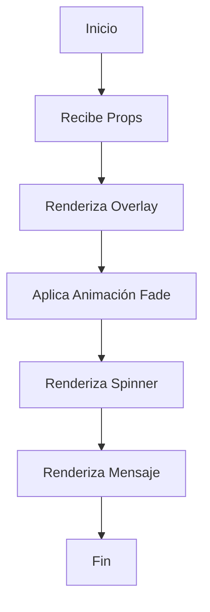

# Loading Components

## LoadingState Component

### Descripción General

El componente `LoadingState` es un componente de feedback que muestra un estado de carga mediante esqueletos (skeletons) para representar el contenido que se está cargando. Proporciona una experiencia de carga más agradable y reduce la percepción de tiempo de espera.

#### Propósito

- Mostrar un estado de carga con esqueletos animados
- Mantener el layout mientras se carga el contenido
- Reducir la percepción de tiempo de carga

#### Responsabilidades

- Renderizar una grid de esqueletos
- Mantener un layout responsivo
- Simular la estructura del contenido real

#### Ubicación

- Path: `src/components/core/feedback/loading/loading-state.tsx`
- Tipo: Client Component

### Interfaz

#### Props

- No recibe props

#### Eventos

- No maneja eventos directamente

#### Estados

- No mantiene estado interno

### Dependencias

- `@/components/ui/skeleton`: Componente base de esqueleto

### Ejemplos de Uso

```tsx
<LoadingState />
```

### Consideraciones

#### Performance

- Renderiza 6 elementos de esqueleto
- Grid responsivo con breakpoints
- Animaciones CSS nativas

#### Responsive Design

- Grid cols: 1 (mobile), 2 (tablet), 3 (desktop)
- Espaciado adaptativo
- Altura y anchura relativas

## LoadingScreen Component

### Descripción General

El componente `LoadingScreen` es una pantalla de carga a pantalla completa que muestra un indicador de carga animado y un mensaje opcional. Se utiliza para operaciones que requieren bloquear la interfaz temporalmente.

#### Propósito

- Mostrar un estado de carga a pantalla completa
- Bloquear la interacción durante operaciones largas
- Proporcionar feedback visual del estado de carga

#### Responsabilidades

- Renderizar un spinner animado
- Mostrar un mensaje de carga personalizable
- Aplicar animaciones de entrada
- Bloquear la interfaz temporalmente

#### Ubicación

- Path: `src/components/core/feedback/loading/loading-screen.tsx`
- Tipo: Client Component

### Interfaz

#### Props

```typescript
interface LoadingScreenProps {
	message?: string; // Mensaje opcional (default: "Cargando...")
}
```

#### Eventos

- No maneja eventos directamente

#### Estados

- No mantiene estado interno

### Dependencias

- `motion/react`: Para animaciones
- `lucide-react`: Para el icono de carga

### Ejemplos de Uso

#### Caso Básico

```tsx
<LoadingScreen />
```

#### Con Mensaje Personalizado

```tsx
<LoadingScreen message="Procesando imágenes..." />
```

### Consideraciones

#### Performance

- Animaciones optimizadas con Motion
- Bloqueo de interfaz con z-index alto
- Transiciones suaves

#### Accesibilidad

- Mensaje descriptivo para lectores de pantalla
- Contraste adecuado
- Indicador visual de progreso

#### Mejores Prácticas

- Usar para operaciones largas
- Mensajes claros y concisos
- Evitar uso excesivo

## Diagramas de Flujo

### LoadingState



### LoadingScreen



## Notas de Implementación

### LoadingState

- Utiliza CSS Grid para layout responsivo
- Implementa esqueletos para simular contenido
- Mantiene consistencia con el diseño real

### LoadingScreen

- Usa "use client" para animaciones
- Implementa animaciones de entrada suaves
- Bloquea la interacción con overlay
- Mantiene mensaje personalizable
