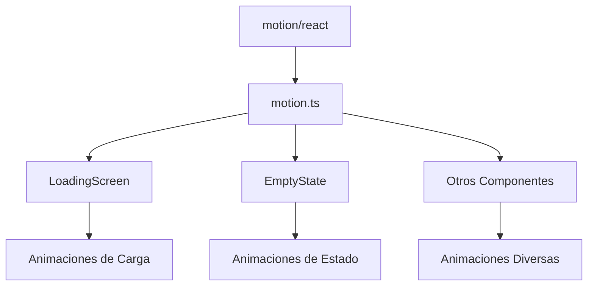

# Motion Component

## Descripción General

El componente `motion` es un wrapper sobre la librería `motion/react` que proporciona una capa de abstracción para las animaciones en la aplicación. Este componente facilita la reutilización y consistencia de las animaciones en todo el proyecto.

### Propósito

- Centralizar la importación de motion
- Mantener consistencia en animaciones
- Facilitar la reutilización de componentes animados

### Responsabilidades

- Exportar la instancia de motion
- Mantener una única fuente de importación
- Facilitar el testing y mocking

### Ubicación

- Path: `src/components/motion.ts`
- Tipo: Utility Component

## Interfaz

### Exports

```typescript
export const motion = m; // donde m es la importación de motion/react
```

### Dependencias

- `motion/react`: Librería principal de animaciones

## Ejemplos de Uso

### Caso Básico

```tsx
import { motion } from "@/components/motion";

<motion.div animate={{ opacity: [0, 1] }} className="my-component">
	Contenido animado
</motion.div>;
```

### Con Animaciones Complejas

```tsx
import { motion } from "@/components/motion";

<motion.div
	animate={{
		scale: [0.9, 1],
		opacity: [0, 1],
	}}
	transition={{
		duration: 0.3,
		ease: "easeOut",
	}}
>
	Contenido con animación compleja
</motion.div>;
```

## Consideraciones

### Performance

- Importación optimizada
- No añade overhead adicional
- Mantiene el tree-shaking de la librería original

### Mejores Prácticas

- Usar siempre esta importación en lugar de motion/react directo
- Mantener animaciones consistentes
- Evitar animaciones innecesarias
- Considerar el rendimiento en dispositivos de gama baja

## Notas de Implementación

- Re-exporta motion desde motion/react
- No modifica la funcionalidad original
- Permite extensiones futuras si son necesarias
- Facilita el cambio de librería de animaciones si fuera necesario

## Uso en el Proyecto

El componente `motion` se utiliza en varios lugares de la aplicación:

1. **LoadingScreen**

   - Animaciones de fade in
   - Escalado suave
   - Transiciones fluidas

2. **EmptyState**

   - Animaciones de entrada
   - Transiciones suaves
   - Feedback visual

3. **Otros Componentes**
   - Transiciones de página
   - Animaciones de hover
   - Efectos de interacción

## Diagrama de Integración



## Recomendaciones

1. **Uso Consistente**

   - Mantener patrones de animación similares
   - Reutilizar valores de animación comunes
   - Documentar animaciones complejas

2. **Performance**

   - Evitar animaciones pesadas en mobile
   - Considerar `prefers-reduced-motion`
   - Optimizar valores de transición

3. **Mantenimiento**
   - Centralizar valores de animación comunes
   - Mantener documentación actualizada
   - Revisar impacto en performance
