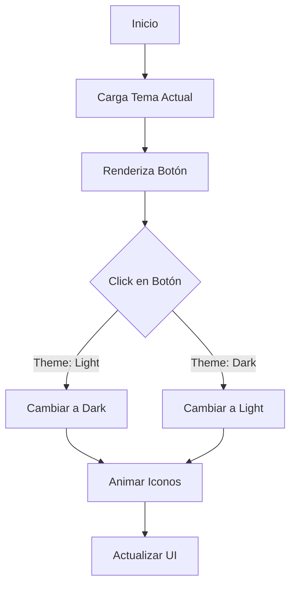

# Theme Toggle Component

## Descripción General

El componente `ThemeToggle` es un botón que permite al usuario alternar entre los temas claro y oscuro de la aplicación. Proporciona una interfaz visual intuitiva con animaciones suaves y feedback visual inmediato.

### Propósito

- Permitir cambiar entre temas claro y oscuro
- Proporcionar feedback visual del tema actual
- Mantener una experiencia de usuario consistente

### Responsabilidades

- Manejar el cambio de tema
- Mostrar el estado actual del tema
- Proporcionar animaciones de transición
- Mantener accesibilidad

### Ubicación

- Path: `src/components/core/theme/theme-toggle.tsx`
- Tipo: Client Component

## Interfaz

### Props

- No recibe props directamente

### Hooks

```typescript
const { theme, setTheme } = useTheme();
```

### Estados

- Utiliza el estado global de tema a través de `next-themes`

### Eventos

- `onClick`: Alterna entre temas claro y oscuro

## Dependencias

### Componentes Relacionados

- `Button` de `@/components/ui/button`

### Librerías Externas

- `next-themes`: Para gestión del tema
- `lucide-react`: Para iconos (Sun, Moon)

## Ejemplos de Uso

### Caso Básico

```tsx
import { ThemeToggle } from "@/components/core/theme/theme-toggle";

<ThemeToggle />;
```

### En Navbar

```tsx
<nav className="flex items-center justify-between">
	<Logo />
	<ThemeToggle />
</nav>
```

## Consideraciones

### Performance

- Cambios de tema optimizados
- Animaciones CSS eficientes
- No causa re-renders innecesarios

### Accesibilidad

- Incluye texto para lectores de pantalla
- Contraste adecuado en ambos temas
- Interacción por teclado

### Responsive Design

- Tamaño consistente en todos los dispositivos
- Animaciones suaves en todas las pantallas
- Interacción táctil optimizada

### Mejores Prácticas

- Persistencia del tema seleccionado
- Transiciones suaves entre temas
- Feedback visual inmediato
- Soporte para preferencias del sistema

## Diagrama de Flujo



## Implementación

### Estructura del Componente

```tsx
<Button
	variant="ghost"
	size="icon"
	onClick={() => setTheme(theme === "light" ? "dark" : "light")}
>
	<Sun className="..." />
	<Moon className="..." />
	<span className="sr-only">Toggle theme</span>
</Button>
```

### Animaciones

- Rotación de iconos
- Escalado suave
- Transiciones CSS

### Estados Visuales

1. **Tema Claro**

   - Sol visible
   - Luna oculta
   - Rotación 0°

2. **Tema Oscuro**
   - Luna visible
   - Sol oculto
   - Rotación -90°

## Notas de Implementación

- Usa "use client" para interactividad
- Integrado con next-themes
- Animaciones CSS para performance
- Mantiene estado global del tema
- Soporte para SSR
