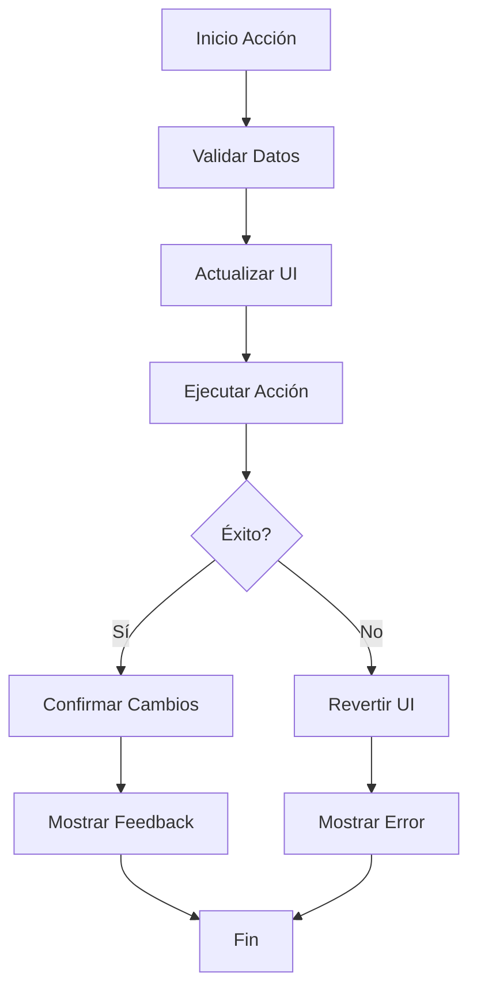
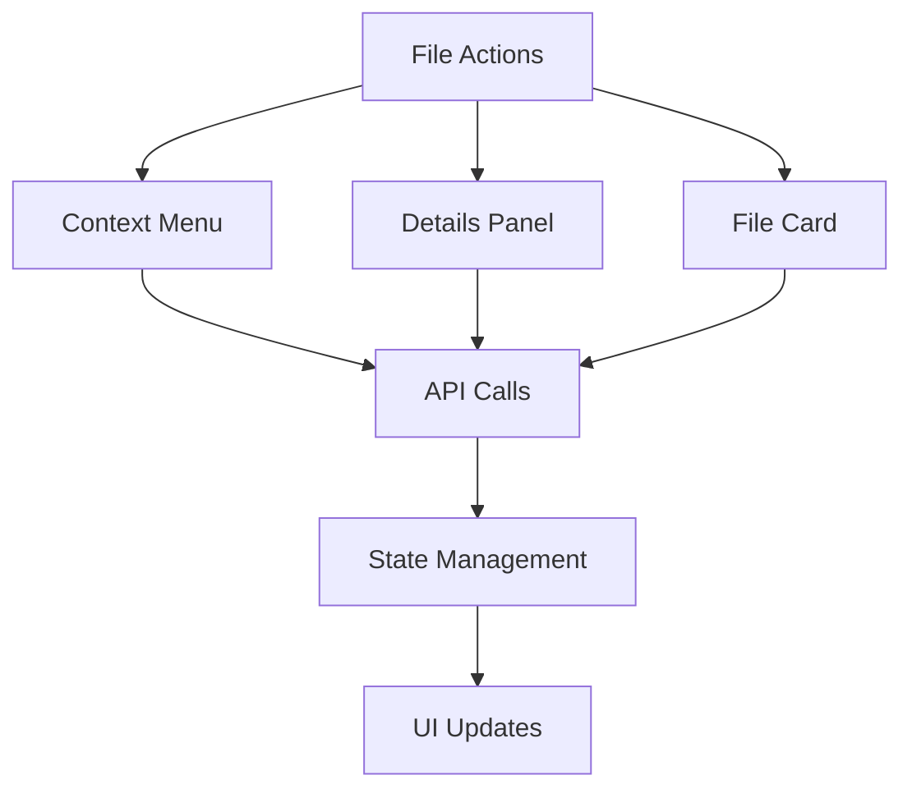

# File Actions

## Descripción General

Las `File Actions` son un conjunto de operaciones y manipulaciones que se pueden realizar sobre los archivos en la aplicación. Estas acciones están integradas principalmente a través del menú contextual y los paneles de detalles, proporcionando una interfaz consistente para interactuar con los archivos.

### Propósito

- Proporcionar operaciones comunes sobre archivos
- Mantener consistencia en las interacciones
- Gestionar el estado de los archivos
- Proporcionar feedback visual de las acciones

### Responsabilidades

- Ejecutar operaciones sobre archivos
- Manejar estados de carga y errores
- Actualizar el estado global
- Proporcionar feedback al usuario
- Mantener consistencia de datos

### Ubicación

- Integrado en múltiples componentes:
  - `src/components/features/file-grid/context-menu.tsx`
  - `src/components/features/file-grid/file-card.tsx`
  - `src/components/panels/details/details-panel.tsx`

## Acciones Disponibles

### 1. Gestión de Archivos

```typescript
interface FileActions {
	"mark-toggle": () => void; // Marcar/Desmarcar archivo
	"favorite-toggle": () => void; // Alternar favorito
	preview: () => void; // Vista previa de imagen
	open: () => void; // Abrir ubicación
	download: () => void; // Descargar archivo
	copy: () => void; // Copiar al portapapeles
	delete: () => void; // Eliminar archivo
}
```

### 2. Gestión de Colecciones

```typescript
interface CollectionActions {
	"collection-add": (data: { collectionId: string }) => void;
	"collection-create": (data: {
		name: string;
		emoji: string;
		description: string;
		color: string;
	}) => void;
}
```

### 3. Gestión de Etiquetas

```typescript
interface TagActions {
	"tag-add": (data: { tagId: string }) => void;
	"tag-create": (data: {
		name: string;
		color: string;
		description: string;
	}) => void;
}
```

## Implementación

### Estructura de Acción

```typescript
type ActionHandler = (
	action: string,
	file: FileItem,
	data?: any
) => Promise<void>;
```

### Manejo de Estado

- Actualización optimista del estado
- Rollback en caso de error
- Feedback visual inmediato
- Gestión de errores consistente

### Integración con API

- Endpoints RESTful
- Manejo de respuestas
- Validación de datos
- Gestión de errores

## Ejemplos de Uso

### Marcar como Favorito

```typescript
const handleFavoriteToggle = async (file: FileItem) => {
	const newState = !file.isFavorite;
	// Actualización optimista
	updateLocalState(file, { isFavorite: newState });
	try {
		await api.updateFavorite(file.id, newState);
	} catch (error) {
		// Rollback en caso de error
		updateLocalState(file, { isFavorite: !newState });
		showError("No se pudo actualizar favorito");
	}
};
```

### Agregar a Colección

```typescript
const handleAddToCollection = async (file: FileItem, collectionId: string) => {
	showLoading("Agregando a colección...");
	try {
		const result = await api.addToCollection(collectionId, file.id);
		updateLocalState(file, { collections: [...file.collections, result] });
		showSuccess("Agregado a colección");
	} catch (error) {
		showError("No se pudo agregar a la colección");
	}
};
```

## Consideraciones

### Performance

- Actualizaciones optimistas
- Caché de operaciones
- Batch updates cuando es posible
- Gestión eficiente de recursos

### UX

- Feedback inmediato
- Indicadores de progreso
- Mensajes claros
- Acciones reversibles

### Seguridad

- Validación de permisos
- Sanitización de datos
- Prevención de operaciones duplicadas
- Manejo seguro de archivos

## Diagrama de Flujo



## Integración de Componentes



## Mejoras Futuras

1. **Funcionalidad**

   - Operaciones en lote
   - Más acciones de edición
   - Historial de acciones
   - Acciones programadas

2. **Performance**

   - Mejor gestión de caché
   - Operaciones offline
   - Sincronización inteligente
   - Compresión de datos

3. **UX**
   - Más atajos de teclado
   - Gestos táctiles
   - Drag and drop mejorado
   - Previsualización de acciones

## Notas de Implementación

### Gestión de Estado

- Usa Zustand para estado global
- Mantiene consistencia de datos
- Implementa actualizaciones optimistas
- Maneja rollbacks automáticos

### Manejo de Errores

- Errores descriptivos
- Recuperación automática
- Logging detallado
- Feedback contextual

### Optimizaciones

- Debounce en operaciones frecuentes
- Throttling en actualizaciones UI
- Caché de operaciones comunes
- Batch updates cuando es posible
