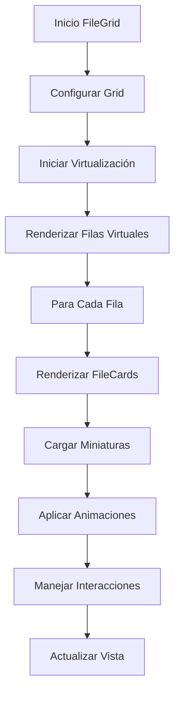
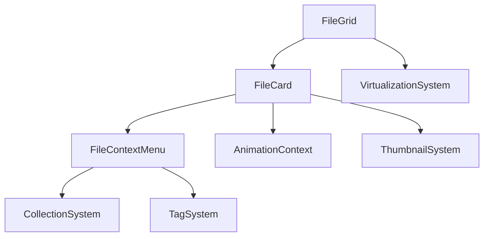

# File Grid Component

## Descripción General

El componente `FileGrid` es un componente complejo que maneja la visualización y gestión de archivos en una cuadrícula virtual optimizada. Proporciona una interfaz eficiente para mostrar grandes cantidades de archivos con funcionalidades avanzadas como virtualización, carga infinita y animaciones fluidas.

### Propósito

- Mostrar archivos en una cuadrícula eficiente
- Manejar grandes cantidades de archivos sin problemas de rendimiento
- Proporcionar interacciones ricas con los archivos
- Optimizar la carga y renderizado de miniaturas

### Responsabilidades

- Virtualización de la cuadrícula
- Gestión de scroll infinito
- Manejo de selección de archivos
- Optimización de rendimiento
- Gestión de interacciones del usuario

### Ubicación

- Path: `src/components/features/file-grid/`
- Tipo: Feature Component

## Subcomponentes

### 1. FileGrid (`file-grid.tsx`)

Componente principal que maneja la cuadrícula virtual y la disposición de los archivos.

#### Configuración

```typescript
const GRID_CONFIG = {
	minColumns: 3,
	maxColumns: 6,
	gap: 4,
	itemBaseWidth: 200,
	overscanCount: 15,
	scrollingDelay: 150,
	batchSize: 20,
	breakpoints: {
		sm: 640,
		md: 768,
		lg: 1024,
		xl: 1280,
	},
};
```

#### Props

```typescript
interface FileGridProps {
	onItemClick?: (item: FileItem) => void;
	onItemDoubleClick?: (item: FileItem) => void;
	items: FileItem[];
	loadMoreItems?: () => void;
}
```

### 2. FileCard (`file-card.tsx`)

Componente que representa cada archivo individual en la cuadrícula.

#### Props

```typescript
interface FileCardProps {
	item: FileItem;
	thumbnailSize?: ThumbnailSize;
	onClick?: (item: FileItem) => void;
	onDoubleClick?: (item: FileItem) => void;
	style?: React.CSSProperties;
	index?: number;
	totalColumns?: number;
	shouldLoad?: boolean;
	hasBeenRendered?: boolean;
}
```

### 3. FileContextMenu (`context-menu.tsx`)

Menú contextual con acciones para cada archivo.

#### Props

```typescript
interface FileContextMenuProps {
	file: FileItem;
	children: React.ReactNode;
	onAction: (action: string, file: FileItem, data?: any) => void;
}
```

### 4. AnimationContext (`animation-context.tsx`)

Contexto para manejar animaciones coordinadas en la cuadrícula.

## Características Principales

### Virtualización

- Implementa `@tanstack/react-virtual` para renderizado eficiente
- Maneja ventanas de visualización dinámicas
- Optimiza el rendimiento con grandes conjuntos de datos

### Carga Infinita

- Implementa detección de intersección para carga automática
- Maneja carga por lotes para optimizar rendimiento
- Proporciona feedback visual durante la carga

### Gestión de Miniaturas

- Carga lazy de miniaturas
- Cache de miniaturas renderizadas
- Manejo de errores en carga de miniaturas

### Interacciones

- Selección múltiple (Shift + Click)
- Menú contextual rico en funcionalidades
- Soporte para drag and drop
- Animaciones fluidas

## Ejemplos de Uso

### Básico

```tsx
<FileGrid
	items={files}
	onItemClick={handleFileClick}
	onItemDoubleClick={handleFileOpen}
/>
```

### Con Carga Infinita

```tsx
<FileGrid
	items={files}
	loadMoreItems={fetchMoreFiles}
	onItemClick={handleFileClick}
/>
```

## Consideraciones

### Performance

- Virtualización para grandes conjuntos de datos
- Carga lazy de miniaturas
- Optimización de re-renders
- Cache de elementos renderizados

### Accesibilidad

- Navegación por teclado
- Roles ARIA apropiados
- Mensajes descriptivos
- Soporte para lectores de pantalla

### Responsive Design

- Grid adaptativo
- Breakpoints configurables
- Interacciones táctiles
- Optimización móvil

## Diagrama de Flujo



## Integración de Componentes



## Mejoras Futuras

1. **Optimización**

   - Implementar web workers para procesamiento
   - Mejorar sistema de cache
   - Optimizar animaciones en dispositivos de gama baja

2. **Funcionalidad**

   - Soporte para vista de lista
   - Filtros avanzados
   - Ordenamiento personalizado
   - Búsqueda integrada

3. **UX**
   - Mejoras en gestos táctiles
   - Más opciones de personalización
   - Mejores animaciones de transición
   - Feedback háptico en móviles

## Notas de Implementación

### FileGrid

- Usa ResizeObserver para adaptación responsiva
- Implementa virtualización optimizada
- Maneja estados de scroll y carga

### FileCard

- Implementa sistema de cache de miniaturas
- Usa Motion para animaciones fluidas
- Maneja estados de selección y hover

### FileContextMenu

- Integra acciones del sistema
- Maneja colecciones y etiquetas
- Proporciona accesos directos

### AnimationContext

- Coordina animaciones entre componentes
- Optimiza rendimiento de animaciones
- Proporciona delays calculados
