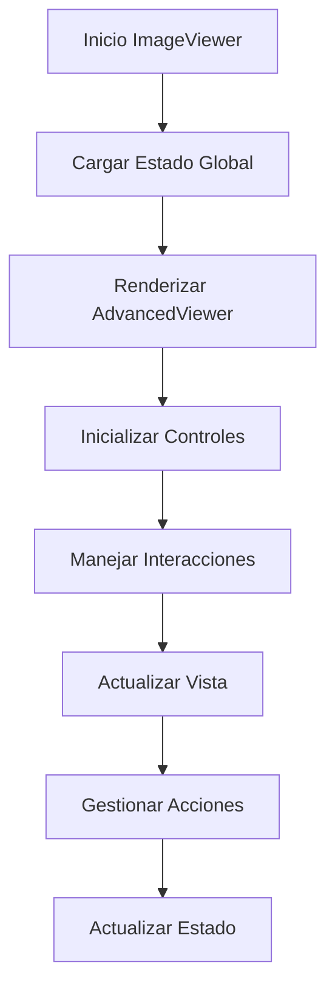
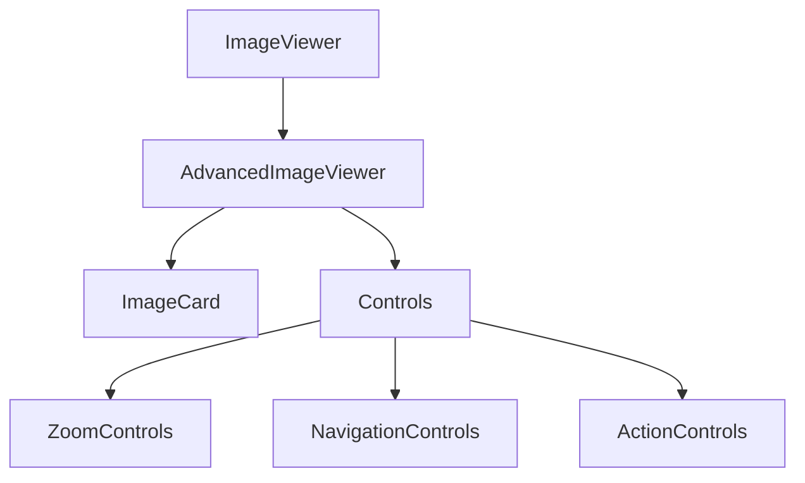

# File Viewer Component

## Descripción General

El componente `FileViewer` es un visor avanzado de imágenes que proporciona una experiencia rica en funcionalidades para la visualización y manipulación de imágenes. Incluye características como zoom, navegación por teclado, animaciones suaves y controles de interfaz intuitivos.

### Propósito

- Proporcionar una interfaz avanzada para visualización de imágenes
- Ofrecer controles intuitivos para manipulación de imágenes
- Mantener una experiencia de usuario fluida y responsiva
- Optimizar la carga y visualización de imágenes

### Responsabilidades

- Gestión de estado del visor
- Control de zoom y posicionamiento
- Navegación entre imágenes
- Manejo de acciones (copiar, descargar)
- Optimización de rendimiento

### Ubicación

- Path: `src/components/features/file-viewer/`
- Tipo: Feature Component

## Subcomponentes

### 1. ImageViewer (`file-viewer.tsx`)

Componente principal que maneja el estado global y la lógica de visualización.

#### Props

```typescript
interface ImageViewerProps {
	// No recibe props directamente, usa estado global
}
```

### 2. AdvancedImageViewer (`components/advanced-file-viewer.tsx`)

Componente que implementa la funcionalidad avanzada del visor.

#### Props

```typescript
interface AdvancedImageViewerProps {
	images: ImageItem[];
	initialIndex?: number;
	isOpen: boolean;
	onClose: () => void;
}

interface ImageItem {
	id: string;
	name: string;
	type: "image";
	thumbnail?: string;
	src?: string;
	alt?: string;
	width?: number;
	height?: number;
	duration?: number;
	fps?: number;
	mimeType?: string;
}
```

### 3. ImageCard (`components/file-viewer-card.tsx`)

Componente para renderizar imágenes individuales con optimizaciones.

#### Props

```typescript
interface ImageCardProps {
	src: string;
	alt: string;
	width?: number;
	height?: number;
	priority?: boolean;
	className?: string;
	onClick?: () => void;
}
```

## Características Principales

### Control de Imagen

- Zoom in/out con rueda del mouse y botones
- Reseteo de vista
- Posicionamiento mediante arrastre
- Ajuste automático al contenedor

### Navegación

- Teclas de flecha para navegar entre imágenes
- Atajos de teclado para acciones comunes
- Navegación circular (loop)
- Indicadores visuales de posición

### Optimización

- Carga lazy de imágenes
- Intersection Observer para optimización
- Gestión de errores de carga
- Feedback visual durante carga

### Acciones

- Copiar imagen al portapapeles
- Descargar imagen
- Cerrar visor
- Resetear vista

## Ejemplos de Uso

### Uso Básico

```tsx
import { ImageViewer } from "@/components/features/file-viewer";

<ImageViewer />; // Se controla a través del estado global
```

### Uso de ImageCard

```tsx
<ImageCard
	src="/path/to/image.jpg"
	alt="Descripción de la imagen"
	width={800}
	height={600}
	priority={true}
	onClick={handleClick}
/>
```

## Consideraciones

### Performance

- Optimización de carga de imágenes
- Gestión eficiente de memoria
- Animaciones optimizadas
- Lazy loading inteligente

### Accesibilidad

- Navegación por teclado
- Mensajes descriptivos
- Estados de foco visibles
- Soporte para lectores de pantalla

### UX/UI

- Animaciones suaves
- Feedback visual claro
- Controles intuitivos
- Diseño responsivo

## Diagrama de Flujo



## Integración de Componentes



## Mejoras Futuras

1. **Funcionalidad**

   - Soporte para más formatos de archivo
   - Edición básica de imágenes
   - Anotaciones y marcadores
   - Modo presentación

2. **Performance**

   - Precarga inteligente
   - Compresión adaptativa
   - Caché mejorado
   - Optimización de memoria

3. **UX**
   - Gestos táctiles avanzados
   - Transiciones personalizables
   - Más atajos de teclado
   - Modo picture-in-picture

## Notas de Implementación

### Estado Global

- Usa Zustand para gestión de estado
- Mantiene estado de visualización
- Gestiona colección de imágenes
- Controla navegación

### Optimizaciones

- Implementa lazy loading
- Usa Image de Next.js
- Optimiza tamaños de imagen
- Gestiona memoria eficientemente

### Interacciones

- Maneja eventos de teclado
- Implementa controles táctiles
- Proporciona feedback visual
- Gestiona errores gracefully
