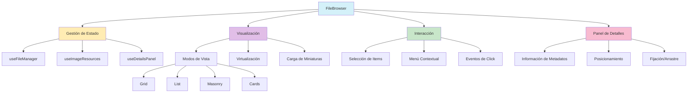
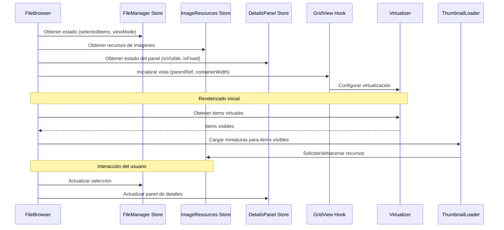

# Documentación del Componente FileBrowser

## Descripción General

El componente `FileBrowser` es una interfaz avanzada para visualizar y gestionar archivos de imágenes en diferentes modos de visualización. Permite la navegación, selección, y visualización detallada de imágenes con soporte para virtualización, carga optimizada de miniaturas y un panel de detalles interactivo.



## Estructura y Componentes

### Propiedades

```typescript
export interface FileBrowserProps {
	items: FileItem[]; // Lista de archivos a mostrar
	isResizing?: boolean; // Indica si el contenedor está siendo redimensionado
	onItemClick?: (item: FileItem) => void; // Manejador de clic en item
	onItemDoubleClick?: (item: FileItem) => void; // Manejador de doble clic en item
	loadMoreItems?: () => void; // Función para cargar más items (scroll infinito)
}
```

### Hooks Principales

El componente utiliza varios hooks personalizados para separar la lógica:

1. **useFileManager**: Gestiona el estado global de selección y vista de archivos
2. **useImageResources**: Maneja la carga y caché de recursos de imágenes
3. **useDetailsPanel**: Controla la visibilidad y posición del panel de detalles
4. **useGridView**: Gestiona la visualización y scroll del grid
5. **useGridVirtualizer**: Implementa la virtualización para renderizado eficiente
6. **useThumbnailLoader**: Optimiza la carga de miniaturas

## Flujo de Datos



## Modos de Visualización

El componente soporta cuatro modos de visualización diferentes:

1. **Grid**: Vista en cuadrícula regular con tamaños uniformes
2. **List**: Vista de lista con información detallada en filas
3. **Masonry**: Vista en mosaico con alturas variables según proporción de imagen
4. **Cards**: Vista de tarjetas con información adicional

Cada modo utiliza un componente específico (`GridView`, `ListView`, `MasonryView`, `CardsView`) que implementa su propia lógica de renderizado y estilo.

## Optimizaciones de Rendimiento

- **Virtualización**: Solo renderiza los elementos visibles en pantalla
- **Carga diferida de miniaturas**: Carga solo las miniaturas visibles
- **Debounce en scroll**: Reduce la frecuencia de actualizaciones durante el scroll
- **Caché de recursos**: Almacena miniaturas ya cargadas para reutilización
- **Transiciones optimizadas**: Manejo de transiciones entre modos de vista

## Panel de Detalles

El panel de detalles es un componente flotante que muestra información detallada de los elementos seleccionados:

- Puede ser arrastrado por la interfaz (cuando no está fijado)
- Puede fijarse en una posición específica
- Muestra metadatos de las imágenes seleccionadas
- Se puede mostrar/ocultar según necesidad

## Manejo de Errores

El componente incluye manejo de casos especiales:

- Detección y procesamiento de ReactPromise
- Validación de IDs de items
- Manejo de items inválidos o corruptos
- Logging detallado para depuración

## Integración con el Sistema

El componente se integra con varios sistemas de la aplicación:

- Sistema de gestión de archivos
- Sistema de metadatos de imágenes
- Sistema de selección y navegación
- Sistema de caché y optimización de recursos

## Ejemplo de Uso

```tsx
<FileBrowser
	items={images}
	onItemClick={handleImageSelect}
	onItemDoubleClick={handleImageOpen}
	loadMoreItems={fetchMoreImages}
/>
```

## Consideraciones Técnicas

- El componente utiliza Zustand para gestión de estado global
- Implementa virtualización con @tanstack/react-virtual
- Utiliza Framer Motion para animaciones del panel de detalles
- Implementa optimizaciones para carga de imágenes y rendimiento
- Soporta interacciones avanzadas como arrastrar y soltar, menú contextual, etc.
