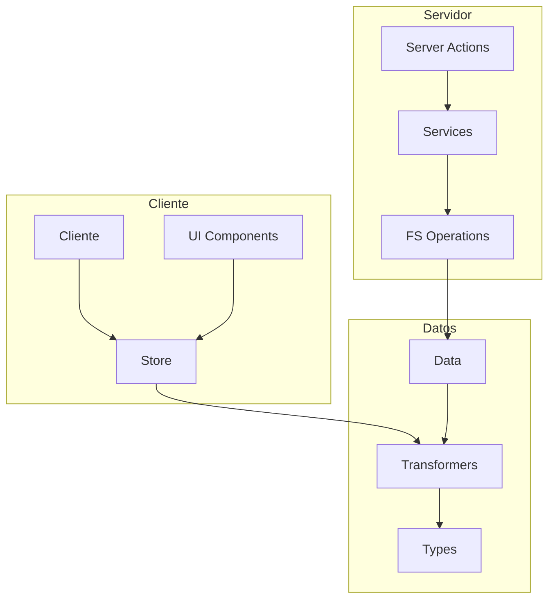

# Componente File

## Descripción

El componente File proporciona una estructura completa para la gestión de archivos y directorios en la aplicación.
Incluye tipos, transformadores, un store de estado con Zustand y servicios funcionales para operaciones de sistema de archivos.

## Diagrama de Flujo



## Estructura de Archivos

```
src/
├── types/
│   └── entities/
│       └── file/
│           ├── base.ts         # Tipos base
│           ├── extended.ts     # Tipos extendidos
│           ├── enums.ts        # Enumeraciones
│           └── index.ts        # Exportaciones
│
├── transformers/
│   └── file/
│       ├── mappers.ts         # Funciones de mapeo
│       ├── serializers.ts     # Serialización/deserialización
│       └── index.ts           # Transformador principal y exportaciones
│
├── store/
│   └── entities/
│       └── file/
│           ├── index.ts         # Store principal
│           └── slices/
│               ├── core.slice.ts      # Estado principal y operaciones
│               ├── ui.slice.ts        # Estado de UI
│               └── filters.slice.ts   # Filtros y ordenación
│
├── services/
│   └── file/
│       ├── file.service.ts     # Servicio funcional
│       └── index.ts            # Exportaciones
│
└── app/
    └── actions/
        └── files/
            ├── index.ts                # Exportaciones
            ├── browse.actions.ts       # Navegación de archivos
            ├── operations.actions.ts   # Operaciones de archivos
            ├── upload.actions.ts       # Carga de archivos
            └── errors.actions.ts       # Manejo de errores
```

## Componentes

### Types

Los tipos de File están estructurados jerárquicamente:

1. **Base**: Definiciones básicas para archivos y directorios
2. **Extended**: Tipos extendidos con propiedades adicionales
3. **Enums**: Enumeraciones para tipos de archivo, estados, etc.
4. **Index**: Exportación centralizada

### Transformers

Los transformadores de File convierten entre diferentes formatos:

1. **mappers.ts**: Funciones para mapear datos del sistema de archivos a objetos TypeScript
2. **serializers.ts**: Funciones para serializar/deserializar para transmisión
3. **index.ts**: Funciones principales con manejo de errores

### Store (Zustand)

El store de File utiliza el patrón de slices:

1. **core.slice.ts**: Gestión de archivos y navegación
2. **ui.slice.ts**: Estado relacionado con la UI (selección, modos de vista)
3. **filters.slice.ts**: Lógica de filtrado y ordenación

### Service

El servicio de File sigue un enfoque funcional para operaciones de sistema de archivos:

1. **file.service.ts**: Funciones para operaciones CRUD en el sistema de archivos
2. **index.ts**: Exportación centralizada

### Server Actions

Las acciones del servidor están organizadas por funcionalidad:

1. **browse.actions.ts**: Navegación y exploración de archivos
2. **operations.actions.ts**: Operaciones CRUD para archivos y carpetas
3. **upload.actions.ts**: Manejo de cargas de archivos
4. **errors.actions.ts**: Manejo centralizado de errores

## Ejemplos de Uso

### Navegación de directorios

```typescript
import { readDirectory } from '@/services/file';
import { transformFiles } from '@/transformers/file';

// En un componente o acción del servidor
async function explorarDirectorio(path: string) {
  const result = await readDirectory(path);
  const files = transformFiles(result.items);
  return files;
}
```

### Uso del store

```typescript
import { useFileStore } from '@/store/entities/file';

// En un componente React
function FileExplorer() {
  // Acceder al estado
  const files = useFileStore.use.files();
  const currentDirectory = useFileStore.use.currentDirectory();
  const filteredAndSortedFiles = useFileStore.use.getFilteredAndSortedFiles();

  // Acceder a acciones
  const { navigateToDirectory, navigateUp } = useFileStore();

  // Trabajar con selección
  const selectedFileIds = useFileStore.use.selectedFileIds();
  const { selectFile, toggleSelectFile, deselectAllFiles } = useFileStore();

  // ...
}
```

### Operaciones de archivos

```typescript
import {
  createDirectory,
  copyFileOrDirectory,
  moveFileOrDirectory,
  deleteFileOrDirectory
} from '@/services/file';

// En una acción del servidor
async function crearDirectorio(path: string, nombre: string) {
  const rutaCompleta = `${path}/${nombre}`;
  const resultado = await createDirectory(rutaCompleta);
  return resultado;
}
```

## Integración con Otras Entidades

El componente File está estrechamente relacionado con:

1. **Image**: Para gestión de archivos de imagen
2. **Video**: Para gestión de archivos de video
3. **Folder**: Para la estructura de carpetas

## Notas de Implementación

- El servicio implementa operaciones de FS de forma segura
- Se maneja la navegación recursiva de directorios
- Se implementan filtros por tipo, tamaño, fecha y más
- Se proporciona un sistema de rutas para navegación
- Las operaciones de copia/movimiento manejan conflictos
- Se incluye soporte para arrastrar y soltar