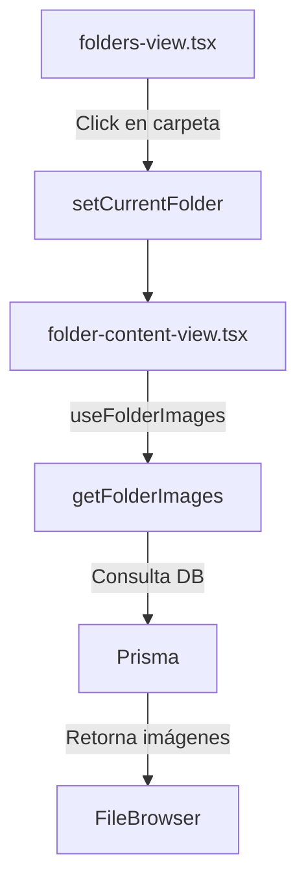

# 📂 Componente de Carpetas

## 📋 Descripción General

El sistema de carpetas permite a los usuarios organizar y visualizar imágenes almacenadas en el sistema de archivos local. Este componente proporciona una interfaz para navegar por las carpetas, ver su contenido y realizar operaciones como reindexación.

## 🧩 Estructura de Componentes

```
src/components/folders/
├── views/
│   ├── folders-view.tsx       # Vista principal de lista de carpetas
│   ├── folder-content-view.tsx # Vista del contenido de una carpeta
│   └── folder-tree-view.tsx   # Vista jerárquica de carpetas
├── adapters/                  # Adaptadores para diferentes fuentes de datos
└── diagnostics/               # Herramientas de diagnóstico para carpetas
```

## 📊 Flujo de Datos

1. **Carga de Carpetas**:
   - `folders-view.tsx` carga la lista de carpetas usando `folderService.getFolders()`
   - Las carpetas se transforman y almacenan en el estado local

2. **Selección de Carpeta**:
   - Al hacer clic en una carpeta, se actualiza el store de navegación y el store de carpetas
   - Se navega a la vista de contenido de carpeta (`folder-content-view.tsx`)

3. **Carga de Imágenes**:
   - `folder-content-view.tsx` utiliza el hook `useFolderImages` para obtener las imágenes
   - Las imágenes se pasan al componente `FileBrowser` para su visualización

## 🔄 Flujo de Navegación



## 🛠️ Hooks Principales

### `useFolderImages`

Este hook utiliza React Query para obtener y cachear las imágenes de una carpeta específica:

```typescript
export function useFolderImages(folderId: string | null) {
  return useQuery({
    queryKey: [FOLDER_IMAGES_KEY, folderId],
    queryFn: () => {
      if (!folderId) return [];
      return getFolderImages(folderId);
    },
    enabled: !!folderId,
    staleTime: 30 * 1000, // 30 segundos
    gcTime: 5 * 60 * 1000, // 5 minutos
    refetchOnWindowFocus: false,
    refetchOnMount: false
  });
}
```

### `useFolder`

Este hook proporciona acceso al estado actual de la carpeta y sus imágenes:

```typescript
export const useFolder = () => {
  const store = useUnifiedFileManager();

  return {
    // 📍 Estado actual de carpeta
    currentFolder: store.currentFolder,
    folderImages: store.currentContext === 'folder' ? store.currentItems : [],
    displayedImages: store.currentContext === 'folder' ? store.displayedItems : [],
    isLoading: store.isLoading && store.currentContext === 'folder',

    // 🎯 Acciones de carpeta
    setCurrentFolder: store.setCurrentFolder,

    // 📊 Información de carpetas
    folders: store.folders,

    // 🔍 Utilidades
    findFolder: (id: string) => store.folders.find(f => f.id === id),
    getFolderStats: () => ({
      totalFolders: store.folders.length,
      currentFolderItemCount: store.currentContext === 'folder' ? store.currentItems.length : 0,
      displayedItemCount: store.currentContext === 'folder' ? store.displayedItems.length : 0
    })
  };
};
```

## 📝 Acciones Principales

### `getFolderImages`

Esta función obtiene las imágenes de una carpeta específica desde la base de datos:

```typescript
export async function getFolderImages(folderId: string): Promise<FileItem[]> {
  try {
    logger.info(`Obteniendo imágenes de la carpeta ${folderId}`);

    // Verificar que el ID es válido
    if (!folderId || folderId.trim() === '') {
      logger.warn('ID de carpeta inválido');
      return [];
    }

    // Obtener imágenes de la carpeta
    const images = await prisma.image.findMany({
      where: {
        folderId: folderId,
      },
      select: {
        id: true,
        name: true,
        path: true,
        size: true,
        width: true,
        height: true,
        metadata: true,
        thumbnail: true,
        thumbnailSize: true,
        thumbnailWidth: true,
        thumbnailHeight: true,
        createdAt: true,
        updatedAt: true,
        tags: {
          select: {
            id: true,
            name: true,
            color: true,
          }
        }
      },
      orderBy: {
        name: 'asc',
      },
    });

    // Transformar a FileItem
    return images.map(image => ({
      id: image.id,
      name: image.name || 'Sin nombre',
      path: image.path || '',
      type: 'image',
      mimeType: 'image/jpeg',
      processingStatus: 'completed',
      size: image.size || 0,
      width: image.width || 0,
      height: image.height || 0,
      metadata: image.metadata || '{}',
      thumbnail: image.thumbnail
        ? `/api/images/${image.id}/thumbnail`
        : null,
      thumbnailSize: image.thumbnailSize || 0,
      thumbnailWidth: image.thumbnailWidth || 0,
      thumbnailHeight: image.thumbnailHeight || 0,
      createdAt: image.createdAt,
      updatedAt: image.updatedAt,
      tags: image.tags.map(tag => ({
        id: tag.id,
        name: tag.name,
        color: tag.color
      }))
    }));
  } catch (error) {
    logger.error(`Error al obtener imágenes de la carpeta ${folderId}:`, error);
    return [];
  }
}
```

## 🔍 Solución de Problemas Comunes

### Imágenes no se muestran en la vista de carpeta

**Problema**: Las imágenes no se cargan o no se muestran en la vista de contenido de carpeta.

**Solución**:
1. Verificar que la función `getFolderImages` está implementada correctamente
2. Comprobar que el hook `useFolderImages` está siendo utilizado en `folder-content-view.tsx`
3. Asegurarse de que el ID de la carpeta se está pasando correctamente
4. Revisar los logs para detectar posibles errores en la consulta a la base de datos

### Error al cambiar entre carpetas

**Problema**: Al cambiar de una carpeta a otra, se produce un error o no se actualizan las imágenes.

**Solución**:
1. Verificar que `setCurrentFolder` se está llamando con el ID correcto
2. Comprobar que el store de navegación se está actualizando correctamente
3. Asegurarse de que el hook `useFolderImages` está reaccionando al cambio de ID

## 🔄 Mejoras Recientes

### Corrección de carga de imágenes

Se implementó la función `getFolderImages` para obtener correctamente las imágenes de una carpeta específica desde la base de datos. Esta función se integra con el hook `useFolderImages` para proporcionar una experiencia de usuario fluida y optimizada.

### Optimización del rendimiento

Se mejoró el rendimiento de la carga de imágenes mediante:
- Caché con React Query (30 segundos de frescura, 5 minutos de retención)
- Transformación eficiente de datos
- Manejo adecuado de errores y estados de carga

## 📈 Próximas Mejoras

- Implementar carga infinita para carpetas con muchas imágenes
- Añadir filtros y ordenación avanzada
- Mejorar la visualización de miniaturas con carga progresiva
- Implementar arrastrar y soltar para organizar imágenes entre carpetas