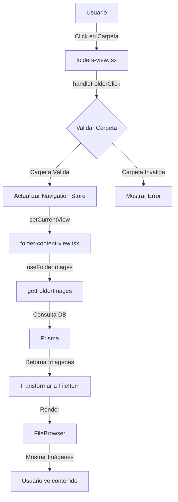
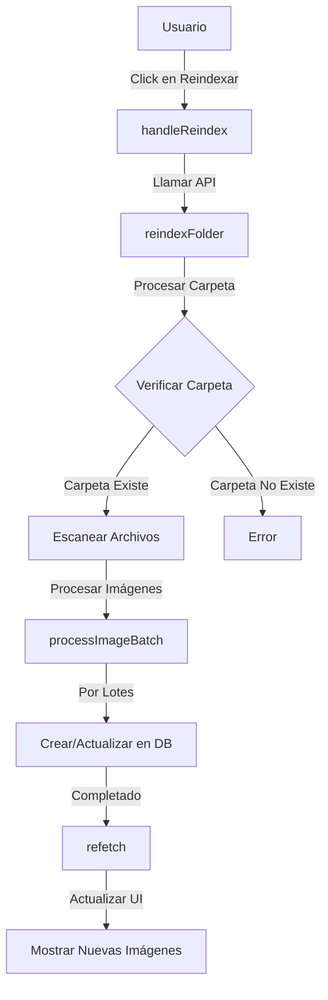
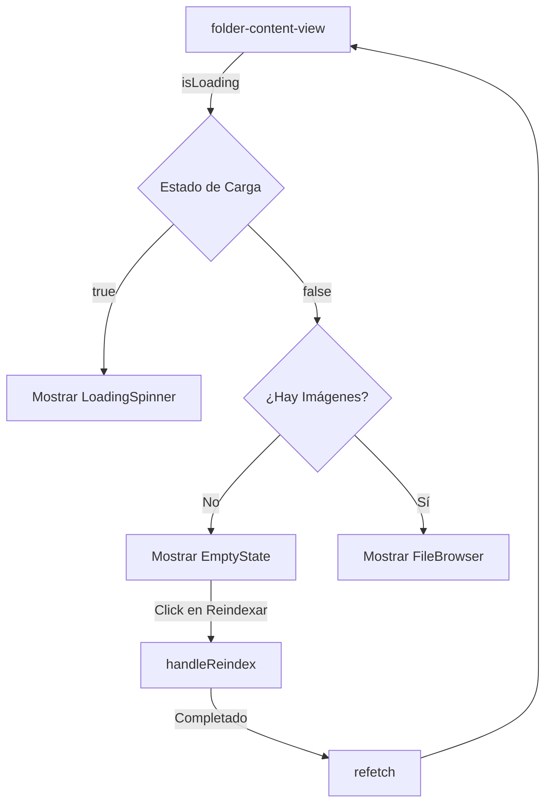
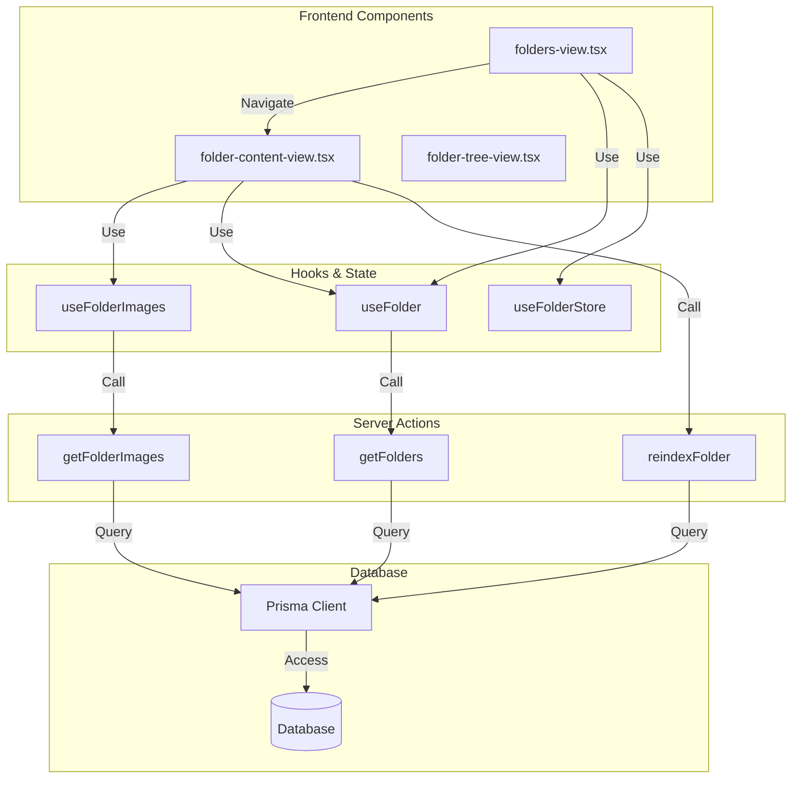
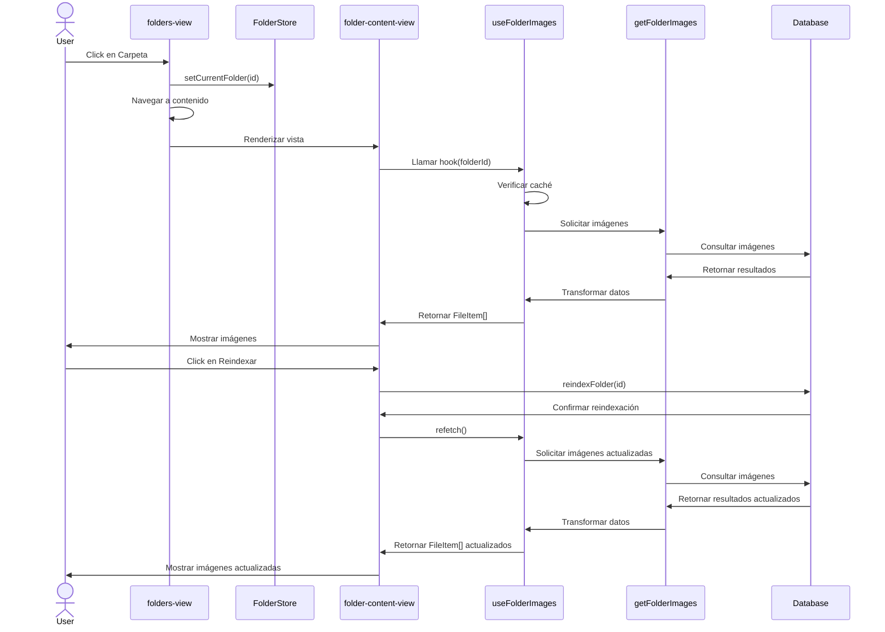
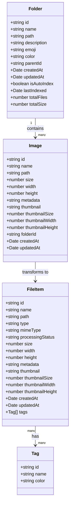

# 📊 Diagramas de Flujo del Componente de Carpetas

## 🔄 Flujo de Navegación Principal



## 🔄 Flujo de Reindexación de Carpetas



## 🔄 Flujo de Datos del Hook useFolderImages

```mermaid
flowchart LR
    A[folder-content-view] -->|currentFolderId| B[useFolderImages]
    B -->|queryKey| C[React Query Cache]
    C -->|Cache Hit| D[Retornar Datos Cacheados]
    C -->|Cache Miss| E[getFolderImages]
    E -->|folderId| F[Prisma Query]
    F -->|DB Results| G[Transformar Datos]
    G -->|FileItem[]| H[Actualizar Cache]
    H -->|data| I[folder-content-view]
    D -->|data| I
```

## 🔄 Flujo de Estado de Carga



## 🔄 Arquitectura del Sistema de Carpetas



## 🔄 Flujo de Interacción del Usuario



## 🔄 Estructura de Datos

