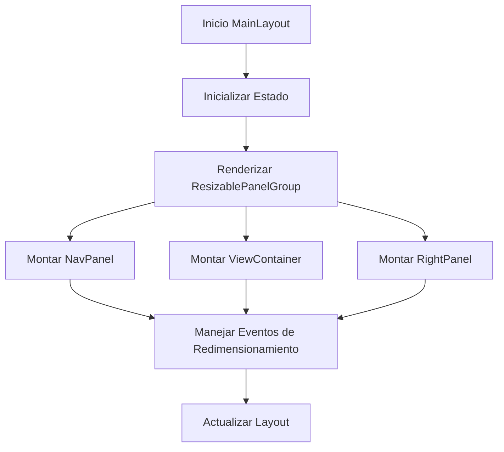

# Componentes de Layout

## MainLayout

### Descripción General

El `MainLayout` es el componente principal que define la estructura base de la aplicación. Implementa un diseño de tres paneles redimensionables que proporcionan una experiencia de usuario flexible y adaptable.

### Ubicación

`src/components/layout/main-layout.tsx`

### Responsabilidades

- Definir la estructura principal de la aplicación
- Gestionar los paneles redimensionables
- Manejar el estado de redimensionamiento
- Proporcionar una interfaz consistente
- Integrar los componentes de navegación y contenido

### Estructura

```
+------------------+------------------+------------------+
|                 |                  |                  |
|   NavPanel      |  ViewContainer   |   RightPanel    |
|   (20%)         |     (60%)        |    (20%)        |
|                 |                  |                  |
|                 |                  |                  |
|                 |                  |                  |
|                 |                  |                  |
+------------------+------------------+------------------+
```

### Interfaz

```typescript
interface MainLayoutProps {} // No requiere props

// Estado interno
const [isResizing, setIsResizing] = useState(false);
```

### Dependencias

- `@/components/panels/nav/nav-panel`
- `@/components/panels/right-panel`
- `@/components/views/view-container`
- `@/components/ui/resizable`

### Ejemplo de Uso

```tsx
<main className="h-[100vh] w-full overflow-hidden">
	<MainLayout />
</main>
```

### Consideraciones

#### Performance

- Implementa estado de redimensionamiento para optimizar renders
- Utiliza paneles con tamaños mínimos y máximos definidos
- Evita re-renders innecesarios durante el redimensionamiento

#### Accesibilidad

- Proporciona controles de redimensionamiento accesibles
- Mantiene una estructura semántica clara
- Soporta navegación por teclado

#### Diseño Responsivo

- Utiliza porcentajes para dimensiones de paneles
- Implementa límites de redimensionamiento
- Mantiene una experiencia consistente en diferentes tamaños

### Configuración de Paneles

#### Panel Izquierdo (NavPanel)

- Tamaño por defecto: 20%
- Tamaño mínimo: 15%
- Tamaño máximo: 30%
- Incluye efecto de blur y fondo semi-transparente

#### Panel Central (ViewContainer)

- Tamaño por defecto: 60%
- Tamaño mínimo: 40%
- Contiene el contenido principal de la vista actual

#### Panel Derecho (RightPanel)

- Tamaño por defecto: 20%
- Tamaño mínimo: 15%
- Tamaño máximo: 30%
- Incluye efecto de blur y fondo semi-transparente

### Flujo de Trabajo



### Notas de Implementación

- Utiliza el componente `ResizablePanelGroup` para gestionar el redimensionamiento
- Implementa handles de redimensionamiento entre paneles
- Mantiene estado de redimensionamiento para optimizar la experiencia
- Utiliza efectos visuales para mejorar la apariencia
- Sigue un diseño modular y mantenible
