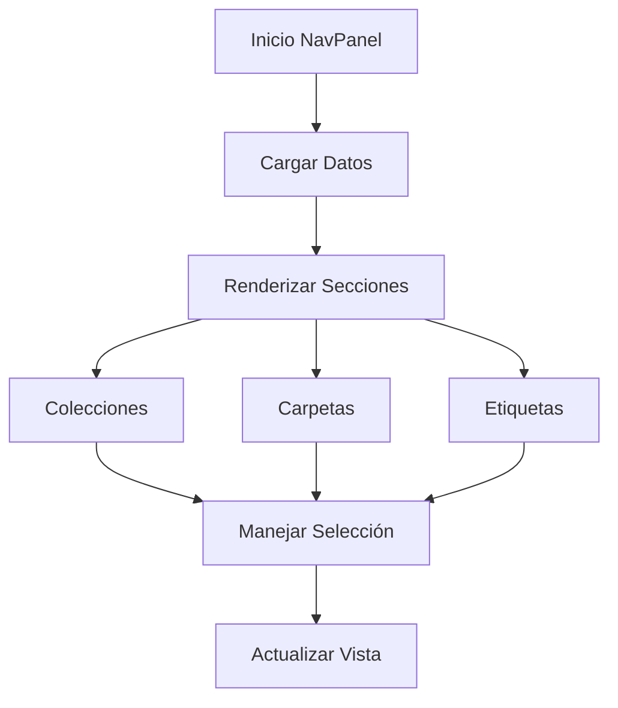

# NavPanel

## Descripción General

El `NavPanel` es un componente de navegación principal que proporciona acceso a las diferentes secciones y funcionalidades de la aplicación. Implementa una interfaz de usuario jerárquica con soporte para colecciones, carpetas y etiquetas.

## Ubicación

`src/components/panels/nav/nav-panel.tsx`

## Responsabilidades

- Proporcionar navegación principal de la aplicación
- Gestionar la visualización de colecciones
- Manejar la navegación de carpetas
- Administrar la visualización de etiquetas
- Mantener el estado de navegación activo
- Proporcionar feedback visual de la selección actual

## Interfaz

```typescript
interface NavPanelProps {} // No requiere props

// Hooks y Estados
const { currentView, currentCollectionId, currentFolderId, currentTagId } =
	useNavigationStore();
const { collections } = useCollectionStore();
const { folders } = useFolderStore();
const { tags } = useTagStore();
```

## Dependencias

- `@/store/navigation`
- `@/store/collections`
- `@/store/folders`
- `@/store/tags`
- `@/components/ui/button`
- `@/components/ui/scroll-area`
- `lucide-react` (para iconos)

## Estructura de Navegación

```
NavPanel
├── Colecciones
│   ├── Colección 1
│   ├── Colección 2
│   └── ...
├── Carpetas
│   ├── Carpeta 1
│   ├── Carpeta 2
│   └── ...
└── Etiquetas
    ├── Etiqueta 1
    ├── Etiqueta 2
    └── ...
```

## Ejemplo de Uso

```tsx
<ResizablePanel defaultSize={20} minSize={15} maxSize={30}>
	<NavPanel />
</ResizablePanel>
```

## Consideraciones

### Performance

- Utiliza virtualización para listas largas
- Implementa memorización de callbacks
- Optimiza renders con estados derivados

### Accesibilidad

- Proporciona navegación por teclado
- Mantiene estructura semántica
- Incluye roles ARIA apropiados
- Soporta estados de foco visibles

### Diseño Responsivo

- Se adapta al espacio disponible
- Implementa truncamiento de texto
- Mantiene consistencia visual
- Soporta diferentes densidades de contenido

## Estilos y Temas

- Utiliza Tailwind CSS para estilos
- Implementa efectos de hover y selección
- Soporta tema claro y oscuro
- Mantiene consistencia con el diseño global

## Interacciones

### Colecciones

- Click: Navega a la vista de colección
- Muestra emoji y contador
- Resalta la selección actual
- Proporciona feedback visual en hover

### Carpetas

- Click: Navega a la vista de carpeta
- Muestra icono y contador
- Resalta la selección actual
- Implementa navegación jerárquica

### Etiquetas

- Click: Navega a la vista de etiqueta
- Muestra color personalizado
- Implementa diseño compacto
- Soporta múltiples etiquetas

## Flujo de Trabajo



## Notas de Implementación

- Utiliza ScrollArea para contenido desbordado
- Implementa transiciones suaves
- Mantiene estado de navegación global
- Proporciona feedback visual inmediato
- Sigue patrones de diseño consistentes

## Mejoras Futuras

- [ ] Implementar drag and drop para reorganización
- [ ] Agregar soporte para favoritos
- [ ] Mejorar la gestión de grandes cantidades de items
- [ ] Implementar búsqueda rápida
- [ ] Agregar atajos de teclado personalizables
