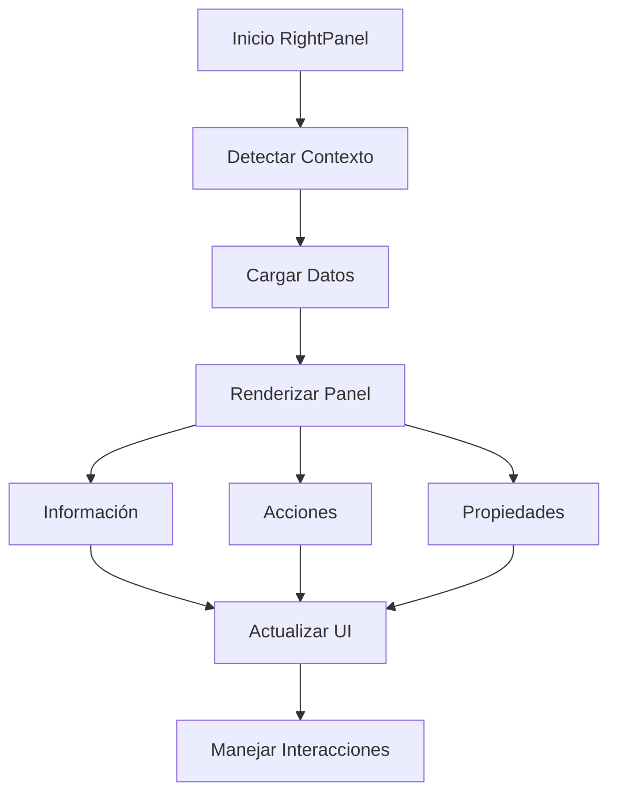

# RightPanel

## Descripción General

El `RightPanel` es un componente que proporciona información contextual y acciones relacionadas con el elemento o vista actualmente seleccionada. Implementa una interfaz dinámica que se adapta al contexto actual de la aplicación.

## Ubicación

`src/components/panels/right-panel.tsx`

## Responsabilidades

- Mostrar información detallada del elemento seleccionado
- Proporcionar acciones contextuales
- Gestionar la visualización de metadatos
- Mantener sincronización con el estado global
- Proporcionar feedback visual de acciones

## Interfaz

```typescript
interface RightPanelProps {} // No requiere props

// Hooks y Estados
const { selectedItem } = useFileManager();
const { currentView } = useNavigationStore();
```

## Dependencias

- `@/store/file-manager`
- `@/store/navigation`
- `@/components/ui/tabs`
- `@/components/ui/scroll-area`
- `@/components/ui/separator`

## Estructura

```
RightPanel
├── Información
│   ├── Detalles del Archivo
│   ├── Metadatos
│   └── Estadísticas
├── Acciones
│   ├── Edición
│   ├── Compartir
│   └── Eliminar
└── Propiedades
    ├── Etiquetas
    ├── Colecciones
    └── Atributos
```

## Ejemplo de Uso

```tsx
<ResizablePanel defaultSize={20} minSize={15} maxSize={30}>
	<RightPanel />
</ResizablePanel>
```

## Consideraciones

### Performance

- Implementa carga bajo demanda de información
- Utiliza memorización para datos complejos
- Optimiza actualizaciones de UI

### Accesibilidad

- Proporciona navegación por teclado
- Mantiene estructura semántica
- Incluye descripciones para acciones
- Soporta estados de foco

### Diseño Responsivo

- Se adapta al espacio disponible
- Implementa scrolling para contenido extenso
- Mantiene legibilidad en diferentes tamaños
- Soporta colapso en móviles

## Secciones Principales

### Información del Archivo

- Nombre y tipo
- Dimensiones (para imágenes)
- Tamaño y fecha
- Ubicación en el sistema

### Acciones Contextuales

- Edición de metadatos
- Gestión de etiquetas
- Operaciones de archivo
- Acciones rápidas

### Propiedades y Metadatos

- Etiquetas asignadas
- Colecciones asociadas
- Atributos personalizados
- Información EXIF (para imágenes)

## Flujo de Trabajo



## Estados y Transiciones

### Sin Selección

- Muestra mensaje informativo
- Proporciona acciones globales
- Mantiene UI minimalista

### Elemento Seleccionado

- Carga información detallada
- Habilita acciones contextuales
- Muestra propiedades específicas

### Múltiples Elementos

- Muestra información agregada
- Habilita acciones en lote
- Proporciona estadísticas grupales

## Notas de Implementación

- Utiliza sistema de pestañas para organizar contenido
- Implementa transiciones suaves entre estados
- Mantiene sincronización con selección actual
- Proporciona feedback visual inmediato
- Sigue patrones de diseño consistentes

## Mejoras Futuras

- [ ] Implementar historial de acciones
- [ ] Agregar previsualización de imágenes
- [ ] Mejorar edición en lote
- [ ] Implementar acciones personalizables
- [ ] Agregar soporte para plugins
- [ ] Mejorar rendimiento con datos grandes
