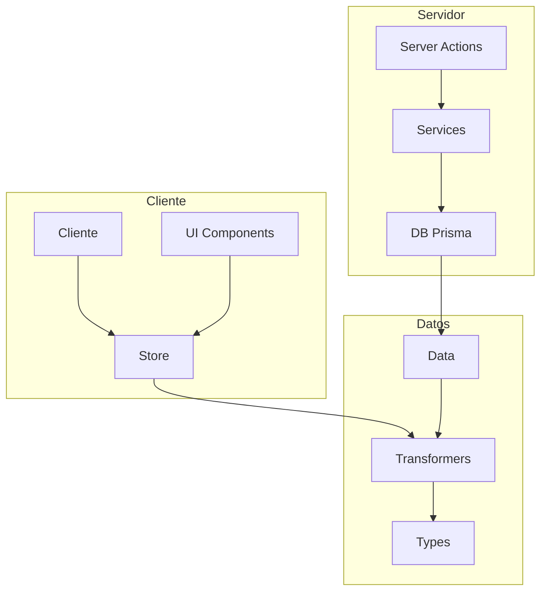

# Componente Metadata

## Descripción

El componente Metadata proporciona una estructura completa para gestionar los metadatos de imágenes en la aplicación.
Incluye tipos, transformadores, un store de estado con Zustand y servicios funcionales para operaciones CRUD.

## Diagrama de Flujo



## Estructura de Archivos

```
src/
├── types/
│   └── entities/
│       └── metadata/
│           ├── base.ts         # Tipos base
│           ├── extended.ts     # Tipos extendidos
│           └── index.ts        # Exportaciones
│
├── transformers/
│   └── metadata/
│       ├── mappers.ts         # Funciones de mapeo
│       └── index.ts           # Transformador principal y exportaciones
│
├── store/
│   └── entities/
│       └── metadata/
│           ├── index.ts         # Store principal
│           └── slices/
│               ├── core.slice.ts      # Estado principal y operaciones
│               ├── ui.slice.ts        # Estado de UI
│               └── filters.slice.ts   # Filtros y ordenación
│
├── services/
│   └── metadata/
│       ├── metadata.service.ts  # Servicio funcional
│       └── index.ts            # Exportaciones
│
└── app/
    └── actions/
        └── metadata/
            ├── index.ts                    # Exportaciones
            ├── metadata.actions.ts         # Acciones CRUD básicas
            ├── metadata-extractors.actions.ts # Extracción de metadatos
            ├── metadata-parsers.actions.ts    # Parseo de datos
            ├── metadata-types.actions.ts      # Tipos específicos
            ├── metadata-utils.actions.ts      # Utilidades
            └── metadata-errors.actions.ts     # Manejo de errores
```

## Componentes

### Types

Los tipos de Metadata están estructurados en tres niveles:

1. **Base**: Definiciones base que reflejan la estructura de Prisma
2. **Extended**: Tipos extendidos con propiedades calculadas
3. **Index**: Exportación centralizada

### Transformers

Los transformadores de Metadata convierten entre diferentes formatos:

1. **mappers.ts**: Funciones específicas para cada transformación
2. **index.ts**: Funciones principales con manejo de errores

### Store (Zustand)

El store de Metadata utiliza el patrón de slices:

1. **core.slice.ts**: Gestión del estado principal
2. **ui.slice.ts**: Estado relacionado con la UI
3. **filters.slice.ts**: Lógica de filtrado y ordenación

### Service

El servicio de Metadata sigue un enfoque funcional:

1. **metadata.service.ts**: Funciones CRUD y operaciones específicas
2. **index.ts**: Exportación centralizada

### Server Actions

Las acciones del servidor están organizadas por funcionalidad:

1. **metadata.actions.ts**: Operaciones CRUD básicas
2. **metadata-extractors.actions.ts**: Extracción de metadatos de imágenes
3. **metadata-parsers.actions.ts**: Parseo de datos de metadatos
4. **metadata-types.actions.ts**: Definición de tipos específicos
5. **metadata-utils.actions.ts**: Funciones utilitarias
6. **metadata-errors.actions.ts**: Manejo centralizado de errores

## Ejemplos de Uso

### Obtener y transformar metadatos

```typescript
import { getMetadataByImageId } from '@/services/metadata';
import { transformMetadata } from '@/transformers/metadata';

// En un componente o acción
const metadata = await getMetadataByImageId('imagen-id');
const transformedMetadata = transformMetadata(metadata);
```

### Uso del store

```typescript
import { useMetadataStore } from '@/store/entities/metadata';

// En un componente React
function MetadataViewer() {
  // Acceder al estado
  const metadatas = useMetadataStore.use.metadatas();
  const isLoading = useMetadataStore.use.isLoading();

  // Acceder a acciones
  const { setMetadatas, setIsLoading } = useMetadataStore();

  // Acceder a filtros
  const filteredMetadatas = useMetadataStore.use.getFilteredAndSortedMetadatas();

  // ...
}
```

### Operaciones desde server actions

```typescript
import { getMetadataById, updateMetadata } from '@/app/actions/metadata';

// En una acción del servidor
async function actualizarMetadatos(id: string, datos: any) {
  const resultado = await updateMetadata(id, datos);
  return resultado;
}
```

## Integración con Otras Entidades

El componente Metadata está estrechamente relacionado con:

1. **Image**: Los metadatos suelen estar asociados a imágenes
2. **Folder**: Para la gestión de metadatos por carpetas
3. **Tag**: Para etiquetar metadatos específicos

## Notas de Implementación

- Los metadatos se extraen automáticamente al cargar imágenes
- Se soportan formatos EXIF, IPTC, XMP y metadatos básicos de imagen
- Los metadatos se almacenan en formato JSON para facilitar su manipulación
- Se proporciona una caché para optimizar el rendimiento