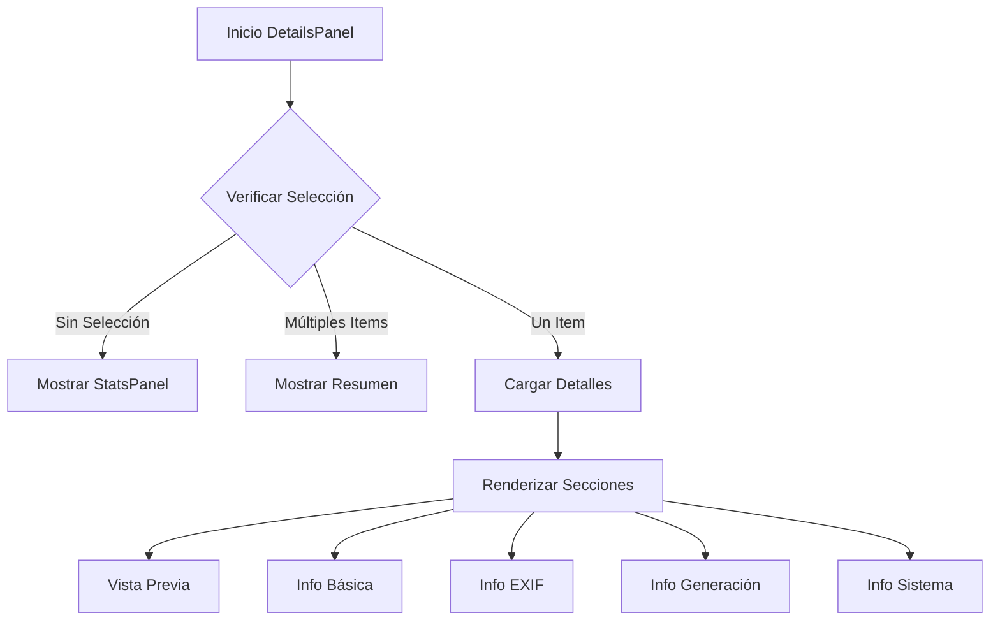

# DetailsPanel

## Descripción General

El `DetailsPanel` es un componente que muestra información detallada sobre los archivos seleccionados en la aplicación. Proporciona una interfaz rica en información que incluye metadatos, información EXIF, detalles del sistema de archivos y más.

## Ubicación

`src/components/panels/details/details-panel.tsx`

## Responsabilidades

- Mostrar información detallada de archivos seleccionados
- Gestionar la visualización de metadatos
- Proporcionar acciones rápidas para archivos
- Mostrar previsualización de imágenes
- Manejar múltiples estados de selección
- Mostrar información EXIF para imágenes
- Gestionar información de generación AI

## Interfaz

```typescript
interface DetailsPanelProps {
	selectedItems: FileItem[];
}

interface InfoItemProps {
	icon: React.ReactNode;
	label: string;
	value: string | number | null | undefined;
	tooltip?: string;
}
```

## Dependencias

- `@/components/ui/scroll-area`
- `@/components/ui/card`
- `@/components/ui/badge`
- `@/components/ui/button`
- `@/components/ui/tooltip`
- `@/store/file-manager`
- `@/store/image-viewer`
- `lucide-react` (para iconos)
- `motion/react`

## Secciones

### Vista Previa de Imagen

- Muestra thumbnail del archivo
- Soporta zoom y acciones rápidas
- Indica estado de favorito
- Maneja errores de carga

### Información Básica

- Nombre y tipo de archivo
- Dimensiones de imagen
- Tamaño de archivo
- Espacio de color
- Canal alfa
- Estado de animación

### Información EXIF

- Fabricante de cámara
- Modelo de cámara
- Software utilizado
- Fecha de captura
- Configuración de exposición
- Configuración de apertura
- Sensibilidad ISO
- Distancia focal

### Información de Generación AI

- Prompt utilizado
- Prompt negativo
- Modelo utilizado
- Pasos de generación
- Escala CFG
- Semilla
- Sampler

### Información del Sistema

- Fecha de creación
- Fecha de modificación
- Último acceso
- Ubicación en el sistema

## Estados

### Sin Selección

```tsx
if (!selectedItems.length) {
	return (
		<div className="flex-1 flex items-center justify-center p-4">
			<StatsPanel />
		</div>
	);
}
```

### Múltiples Selecciones

```tsx
if (selectedItems.length > 1) {
	return (
		<div className="flex-1 flex items-center justify-center p-4">
			<Card>
				<CardContent>
					<p>{selectedItems.length} archivos seleccionados</p>
					<p>Tamaño total: {totalSize}</p>
				</CardContent>
			</Card>
		</div>
	);
}
```

### Selección Única

- Muestra todas las secciones de información
- Proporciona acciones contextuales
- Muestra metadatos específicos

## Flujo de Trabajo



## Consideraciones

### Performance

- Implementa memorización de componentes
- Utiliza renderizado condicional
- Optimiza carga de imágenes
- Maneja estados de carga

### Accesibilidad

- Proporciona tooltips informativos
- Mantiene estructura semántica
- Incluye textos alternativos
- Soporta navegación por teclado

### Diseño Responsivo

- Adapta contenido al espacio
- Implementa scrolling suave
- Mantiene legibilidad
- Optimiza layout para diferentes tamaños

## Notas de Implementación

- Utiliza sistema de animaciones con `motion`
- Implementa manejo de errores
- Proporciona feedback visual
- Mantiene estado consistente
- Sigue patrones de diseño establecidos

## Mejoras Futuras

- [ ] Implementar edición de metadatos
- [ ] Agregar soporte para más formatos
- [ ] Mejorar previsualización de imágenes
- [ ] Implementar historial de cambios
- [ ] Agregar más acciones rápidas
- [ ] Mejorar rendimiento con archivos grandes
