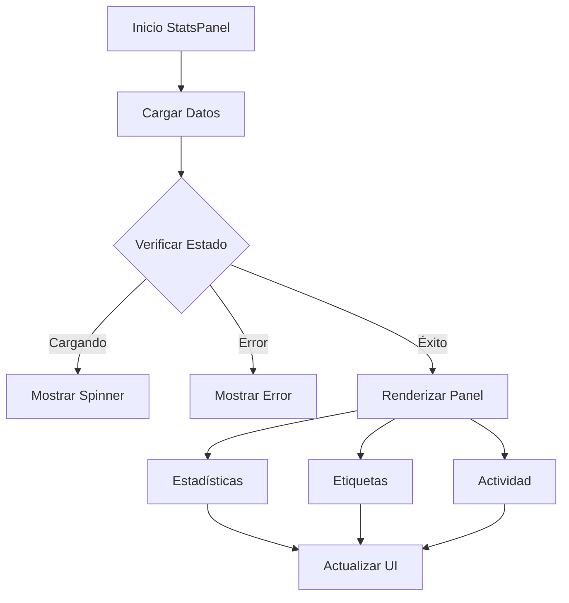

# StatsPanel

## Descripción General

El `StatsPanel` es un componente que muestra estadísticas y métricas importantes de la aplicación. Proporciona una visión general del estado del sistema, incluyendo estadísticas de archivos, etiquetas más usadas y actividad reciente.

## Ubicación

`src/components/panels/stats/stats-panel.tsx`

## Responsabilidades

- Mostrar estadísticas generales del sistema
- Visualizar métricas de uso
- Mostrar etiquetas más utilizadas
- Listar actividad reciente
- Proporcionar feedback visual del estado
- Manejar estados de carga y error

## Interfaz

```typescript
// Componentes Internos
interface TagUsageProps {
	tag?: {
		name: string;
		color: string;
		count: number;
	};
	isLoading: boolean;
}

interface ActivityProps {
	activity?: {
		description: string;
		timestamp: string;
		iconName: string;
	};
	isLoading: boolean;
}

// Componente Principal
interface StatsPanelProps {} // No requiere props
```

## Dependencias

- `@/components/ui/scroll-area`
- `@/components/ui/card`
- `@/components/ui/badge`
- `@/components/ui/icons`
- `@/store/stats`
- `@/components/ui/meteors`

## Secciones

### Estadísticas Generales

- Total de imágenes
- Espacio utilizado
- Colecciones totales
- Etiquetas totales
- Métricas adicionales

### Etiquetas Más Usadas

- Nombre de etiqueta
- Color personalizado
- Contador de uso
- Estado de carga

### Actividad Reciente

- Descripción de actividad
- Marca de tiempo
- Icono representativo
- Estado de carga

## Estados

### Estado de Carga

```tsx
if (isLoading) {
	return (
		<div className="flex items-center justify-center p-4">
			<LoadingSpinner />
		</div>
	);
}
```

### Estado de Error

```tsx
if (error) {
	return (
		<div className="flex items-center justify-center p-4">
			<Card className="w-full">
				<CardHeader>
					<CardTitle className="text-sm text-red-500">Error</CardTitle>
				</CardHeader>
				<CardContent>
					<p className="text-xs text-muted-foreground">{error}</p>
				</CardContent>
			</Card>
		</div>
	);
}
```

### Estado Normal

- Muestra todas las secciones
- Actualiza datos en tiempo real
- Proporciona interactividad
- Mantiene animaciones fluidas

## Flujo de Trabajo



## Componentes Memorizados

### TagUsage

- Muestra información de etiqueta
- Implementa diseño responsivo
- Maneja estados de carga
- Optimiza renders

### Activity

- Muestra actividad individual
- Formatea marcas de tiempo
- Integra iconos dinámicos
- Mantiene consistencia visual

## Consideraciones

### Performance

- Utiliza componentes memorizados
- Implementa carga bajo demanda
- Optimiza actualizaciones de UI
- Maneja caché de datos

### Accesibilidad

- Proporciona estados de carga
- Mantiene contraste adecuado
- Incluye textos descriptivos
- Soporta navegación por teclado

### Diseño Responsivo

- Adapta layout a espacio disponible
- Mantiene legibilidad en todos los tamaños
- Implementa scrolling suave
- Optimiza visualización de datos

## Notas de Implementación

- Utiliza sistema de grids para layout
- Implementa efectos visuales con Meteors
- Mantiene consistencia con tema global
- Proporciona feedback visual inmediato
- Sigue patrones de diseño establecidos

## Mejoras Futuras

- [ ] Implementar gráficos estadísticos
- [ ] Agregar filtros de actividad
- [ ] Mejorar visualización de datos
- [ ] Implementar exportación de estadísticas
- [ ] Agregar más métricas relevantes
- [ ] Mejorar rendimiento con grandes conjuntos de datos
