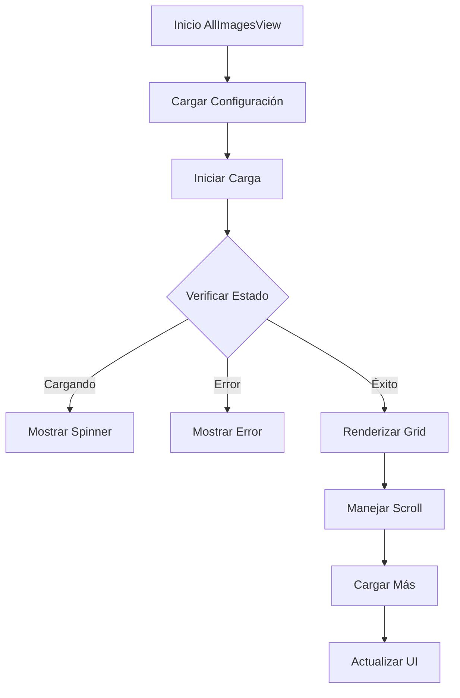

# AllImagesView

## Descripción General

El `AllImagesView` es un componente que muestra una vista completa de todas las imágenes disponibles en la aplicación. Proporciona una interfaz eficiente para visualizar y gestionar grandes colecciones de imágenes.

## Ubicación

`src/components/views/all-images/all-images-view.tsx`

## Responsabilidades

- Mostrar todas las imágenes disponibles
- Gestionar paginación y carga infinita
- Manejar selección de imágenes
- Proporcionar ordenamiento y filtros
- Integrar con el sistema de búsqueda
- Mantener rendimiento con grandes colecciones

## Interfaz

```typescript
interface AllImagesViewProps {
	isResizing: boolean;
}

interface ViewState {
	sortBy: SortOption;
	filterBy: FilterOption;
	viewMode: ViewMode;
	page: number;
	hasMore: boolean;
}
```

## Dependencias

- `@/components/features/file-grid`
- `@/components/ui/scroll-area`
- `@/components/ui/dropdown-menu`
- `@/store/file-manager`
- `@/hooks/use-infinite-scroll`
- `@/components/ui/loading-spinner`

## Características

### Sistema de Visualización

- Grid responsivo de imágenes
- Soporte para diferentes tamaños
- Vista previa de thumbnails
- Indicadores de estado

### Ordenamiento

- Por fecha (más reciente/antiguo)
- Por nombre (A-Z/Z-A)
- Por tamaño (mayor/menor)
- Por tipo de archivo

### Filtros

- Por tipo de archivo
- Por fecha de creación
- Por estado (favoritos/marcados)
- Por metadatos

## Estados

### Estado de Carga

```tsx
if (isLoading) {
	return (
		<div className="flex items-center justify-center h-full">
			<LoadingSpinner />
		</div>
	);
}
```

### Estado Vacío

```tsx
if (isEmpty) {
	return (
		<EmptyState
			icon={ImageIcon}
			title="No hay imágenes"
			description="Comienza agregando imágenes a tu biblioteca"
		/>
	);
}
```

### Estado de Error

```tsx
if (error) {
	return (
		<EmptyState
			icon={AlertTriangle}
			title="Error al cargar imágenes"
			description={error.message}
		/>
	);
}
```

## Flujo de Trabajo



## Consideraciones

### Performance

- Implementa virtualización de lista
- Utiliza lazy loading de imágenes
- Optimiza re-renders
- Maneja memoria eficientemente
- Implementa carga por chunks

### Accesibilidad

- Proporciona navegación por teclado
- Mantiene foco durante scroll
- Incluye textos alternativos
- Soporta zoom de imágenes
- Implementa controles ARIA

### Diseño Responsivo

- Adapta grid a viewport
- Mantiene calidad de imágenes
- Optimiza layout móvil
- Soporta orientación variable
- Implementa gestos táctiles

## Integración con Stores

### FileManager Store

```typescript
const {
	files,
	isLoading,
	error,
	loadMore,
	hasMore,
	selectedItems,
	toggleSelection,
} = useFileManager();
```

### Settings Store

```typescript
const { sortBy, filterBy, viewMode, setSortBy, setFilterBy, setViewMode } =
	useSettingsStore();
```

## Notas de Implementación

- Utiliza IntersectionObserver para scroll infinito
- Implementa debounce en scroll
- Mantiene estado de selección
- Optimiza carga de thumbnails
- Sigue patrones de diseño establecidos
- Implementa caché de imágenes

## Mejoras Futuras

- [ ] Implementar drag and drop
- [ ] Mejorar algoritmo de ordenamiento
- [ ] Agregar más opciones de filtrado
- [ ] Optimizar carga inicial
- [ ] Implementar búsqueda visual
- [ ] Mejorar previsualización
- [ ] Agregar gestos avanzados
- [ ] Implementar modo mosaico
