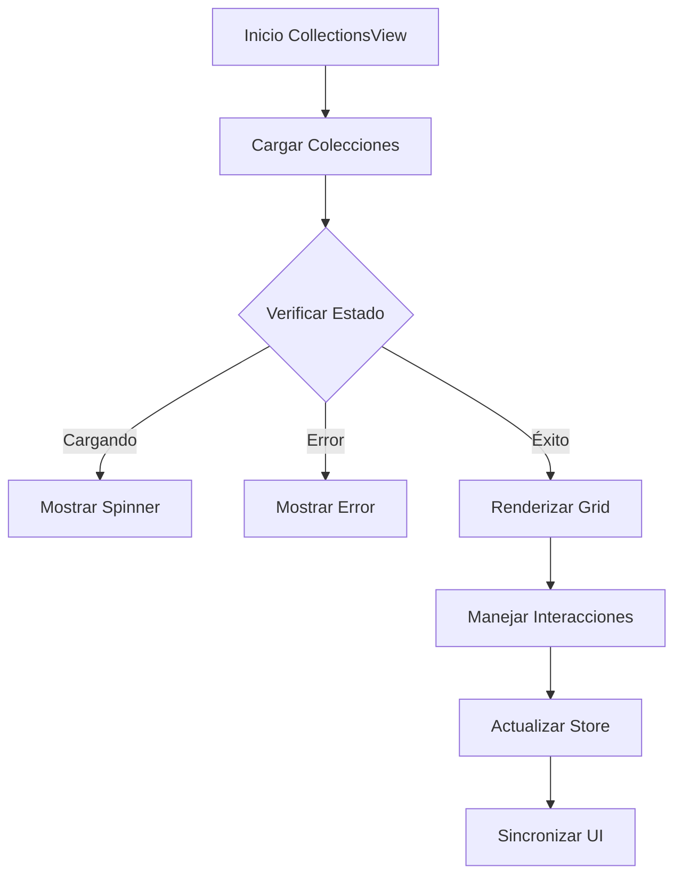

# CollectionsView

## Descripción General

El `CollectionsView` es un componente que proporciona una interfaz para gestionar y visualizar colecciones de imágenes. Permite organizar imágenes en grupos personalizados, con soporte para metadatos adicionales y acciones específicas de colección.

## Ubicación

`src/components/views/collections/collections-view.tsx`

## Responsabilidades

- Mostrar lista de colecciones
- Gestionar creación/edición
- Manejar selección de colecciones
- Proporcionar acciones de colección
- Mantener sincronización con store
- Mostrar estadísticas de colección

## Interfaz

```typescript
interface CollectionsViewProps {
	isResizing: boolean;
}

interface Collection {
	id: string;
	name: string;
	description: string;
	emoji: string;
	color: string;
	itemCount: number;
	createdAt: Date;
	updatedAt: Date;
}

interface CollectionState {
	selectedCollection: string | null;
	viewMode: ViewMode;
	sortBy: SortOption;
}
```

## Dependencias

- `@/components/ui/card`
- `@/components/ui/scroll-area`
- `@/components/ui/button`
- `@/store/collections`
- `@/store/file-manager`
- `@/hooks/use-collection-actions`

## Características

### Sistema de Visualización

- Grid de colecciones
- Vista previa de contenido
- Indicadores de estado
- Acciones contextuales

### Personalización

- Nombre de colección
- Emoji representativo
- Color personalizado
- Descripción detallada

### Acciones

- Crear colección
- Editar detalles
- Eliminar colección
- Agregar/remover items
- Ver estadísticas
- Exportar colección

## Estados

### Estado de Carga

```tsx
if (isLoading) {
	return (
		<div className="flex items-center justify-center h-full">
			<LoadingSpinner />
		</div>
	);
}
```

### Estado Vacío

```tsx
if (isEmpty) {
	return (
		<EmptyState
			icon={CollectionIcon}
			title="No hay colecciones"
			description="Crea una colección para organizar tus imágenes"
		/>
	);
}
```

### Estado de Error

```tsx
if (error) {
	return (
		<EmptyState
			icon={AlertTriangle}
			title="Error al cargar colecciones"
			description={error.message}
		/>
	);
}
```

## Flujo de Trabajo



## Consideraciones

### Performance

- Implementa virtualización de grid
- Utiliza lazy loading de previews
- Optimiza actualizaciones de UI
- Maneja caché de colecciones
- Implementa actualizaciones parciales

### Accesibilidad

- Soporta navegación por teclado
- Mantiene estructura semántica
- Proporciona feedback de estado
- Incluye textos descriptivos
- Implementa roles ARIA

### Diseño Responsivo

- Adapta grid al espacio
- Mantiene legibilidad
- Optimiza para móviles
- Soporta gestos táctiles
- Implementa layout fluido

## Integración con Stores

### Collections Store

```typescript
const {
	collections,
	isLoading,
	error,
	createCollection,
	updateCollection,
	deleteCollection,
	addToCollection,
	removeFromCollection,
} = useCollectionsStore();
```

### FileManager Store

```typescript
const { selectedItems, viewMode, setViewMode, sortBy, setSortBy } =
	useFileManager();
```

## Notas de Implementación

- Utiliza sistema de eventos optimizado
- Implementa memorización de componentes
- Mantiene sincronización bidireccional
- Optimiza operaciones batch
- Sigue patrones establecidos
- Implementa manejo de errores robusto

## Mejoras Futuras

- [ ] Implementar subcarpetas
- [ ] Agregar etiquetas a colecciones
- [ ] Mejorar sistema de previsualización
- [ ] Implementar búsqueda en colecciones
- [ ] Agregar filtros avanzados
- [ ] Mejorar experiencia móvil
- [ ] Implementar compartir colecciones
- [ ] Agregar estadísticas detalladas
