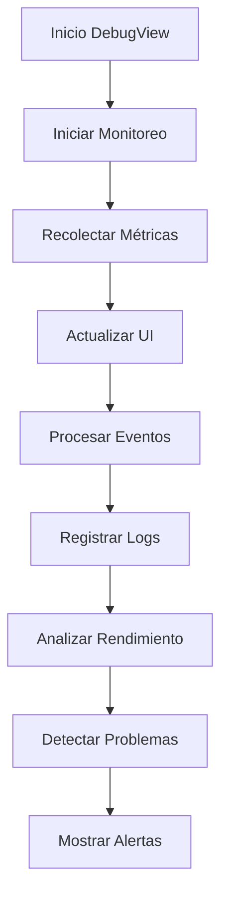

# DebugView

## Descripción General

El `DebugView` es un componente que proporciona herramientas y visualizaciones para el diagnóstico y depuración de la aplicación. Permite monitorear el rendimiento, inspeccionar el estado del sistema y realizar pruebas de funcionalidad.

## Ubicación

`src/components/views/debug/debug-view.tsx`

## Responsabilidades

- Mostrar información de diagnóstico
- Monitorear rendimiento del sistema
- Proporcionar herramientas de debug
- Visualizar logs y errores
- Realizar pruebas de funcionalidad
- Inspeccionar estado global

## Interfaz

```typescript
interface DebugViewProps {
	isResizing: boolean;
}

interface DebugInfo {
	system: {
		memory: {
			total: number;
			used: number;
			free: number;
		};
		cpu: {
			usage: number;
			cores: number;
		};
		storage: {
			total: number;
			used: number;
			free: number;
		};
	};
	application: {
		version: string;
		uptime: number;
		activeUsers: number;
		pendingTasks: number;
	};
	performance: {
		renderTime: number;
		memoryUsage: number;
		cacheSize: number;
		apiLatency: number;
	};
}
```

## Dependencias

- `@/components/ui/tabs`
- `@/components/ui/card`
- `@/components/ui/button`
- `@/store/debug`
- `@/hooks/use-performance`
- `@/components/ui/charts`

## Características

### Monitoreo del Sistema

- Uso de memoria
- Uso de CPU
- Espacio en disco
- Rendimiento de red

### Diagnóstico de Aplicación

- Logs del sistema
- Errores y excepciones
- Estado de componentes
- Métricas de rendimiento

### Herramientas de Debug

- Consola de comandos
- Inspector de estado
- Pruebas de componentes
- Simulador de errores

## Estados

### Estado de Carga

```tsx
if (isLoading) {
	return (
		<div className="flex items-center justify-center h-full">
			<LoadingSpinner />
		</div>
	);
}
```

### Estado de Error

```tsx
if (error) {
	return (
		<EmptyState
			icon={AlertTriangle}
			title="Error en modo debug"
			description={error.message}
		/>
	);
}
```

### Estado de Monitoreo

```tsx
const [metrics, setMetrics] = useState<PerformanceMetrics>({
	fps: 0,
	memory: 0,
	cpu: 0,
	network: 0,
});
```

## Flujo de Trabajo



## Consideraciones

### Performance

- Implementa monitoreo eficiente
- Utiliza muestreo inteligente
- Optimiza recolección de datos
- Maneja memoria cuidadosamente
- Implementa limpieza automática

### Accesibilidad

- Proporciona atajos de teclado
- Mantiene estructura clara
- Incluye descripciones técnicas
- Implementa navegación eficiente
- Soporta modo experto

### Diseño Responsivo

- Adapta paneles al espacio
- Mantiene legibilidad de datos
- Optimiza visualizaciones
- Soporta múltiples layouts
- Implementa vista compacta

## Integración con Stores

### Debug Store

```typescript
const {
	debugInfo,
	isLoading,
	error,
	startMonitoring,
	stopMonitoring,
	clearLogs,
	toggleFeature,
} = useDebugStore();
```

### Performance Store

```typescript
const { metrics, startProfiling, stopProfiling, generateReport } =
	usePerformanceStore();
```

## Notas de Implementación

- Utiliza sistema de logging avanzado
- Implementa profiling inteligente
- Mantiene histórico de métricas
- Optimiza recolección de datos
- Sigue mejores prácticas de debug
- Implementa manejo seguro de errores

## Mejoras Futuras

- [ ] Implementar profiling avanzado
- [ ] Agregar más herramientas de diagnóstico
- [ ] Mejorar visualización de métricas
- [ ] Implementar exportación de datos
- [ ] Agregar más pruebas automatizadas
- [ ] Mejorar sistema de alertas
- [ ] Implementar análisis predictivo
- [ ] Agregar más opciones de depuración
