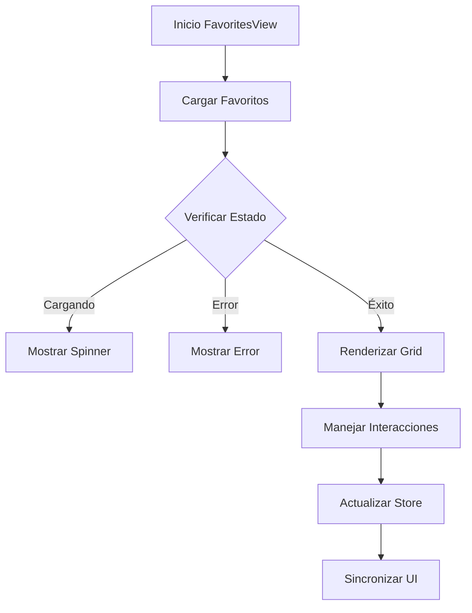

# FavoritesView

## Descripción General

El `FavoritesView` es un componente que muestra una vista filtrada de las imágenes marcadas como favoritas por el usuario. Proporciona una interfaz optimizada para gestionar y visualizar la colección personal de imágenes favoritas.

## Ubicación

`src/components/views/favorites/favorites-view.tsx`

## Responsabilidades

- Mostrar imágenes favoritas
- Gestionar estado de favoritos
- Manejar selección de imágenes
- Proporcionar ordenamiento y filtros
- Mantener sincronización con store
- Proporcionar acciones rápidas

## Interfaz

```typescript
interface FavoritesViewProps {
	isResizing: boolean;
}

interface FavoriteState {
	sortBy: SortOption;
	viewMode: ViewMode;
	page: number;
	hasMore: boolean;
}
```

## Dependencias

- `@/components/features/file-grid`
- `@/components/ui/scroll-area`
- `@/components/ui/dropdown-menu`
- `@/store/favorites`
- `@/store/file-manager`
- `@/hooks/use-infinite-scroll`

## Características

### Sistema de Visualización

- Grid responsivo de favoritos
- Vista previa de imágenes
- Indicadores de estado
- Acciones contextuales

### Ordenamiento

- Por fecha de marcado
- Por nombre de archivo
- Por fecha de creación
- Por tamaño de archivo

### Acciones Rápidas

- Remover de favoritos
- Abrir en visor
- Descargar imagen
- Compartir imagen

## Estados

### Estado de Carga

```tsx
if (isLoading) {
	return (
		<div className="flex items-center justify-center h-full">
			<LoadingSpinner />
		</div>
	);
}
```

### Estado Vacío

```tsx
if (isEmpty) {
	return (
		<EmptyState
			icon={HeartIcon}
			title="No hay favoritos"
			description="Marca algunas imágenes como favoritas para verlas aquí"
		/>
	);
}
```

### Estado de Error

```tsx
if (error) {
	return (
		<EmptyState
			icon={AlertTriangle}
			title="Error al cargar favoritos"
			description={error.message}
		/>
	);
}
```

## Flujo de Trabajo



## Consideraciones

### Performance

- Implementa virtualización
- Utiliza lazy loading
- Optimiza re-renders
- Maneja caché local
- Implementa paginación

### Accesibilidad

- Soporta navegación por teclado
- Mantiene foco visual
- Proporciona feedback claro
- Incluye textos descriptivos
- Implementa roles ARIA

### Diseño Responsivo

- Adapta grid al espacio
- Mantiene calidad visual
- Optimiza para móviles
- Soporta gestos táctiles
- Implementa layout fluido

## Integración con Stores

### Favorites Store

```typescript
const { favorites, isLoading, error, toggleFavorite, loadMore, hasMore } =
	useFavoritesStore();
```

### FileManager Store

```typescript
const { selectedItems, toggleSelection, viewMode, setViewMode } =
	useFileManager();
```

## Notas de Implementación

- Utiliza sistema de eventos optimizado
- Implementa memorización de componentes
- Mantiene sincronización bidireccional
- Optimiza operaciones batch
- Sigue patrones establecidos
- Implementa manejo de errores robusto

## Mejoras Futuras

- [ ] Implementar colecciones de favoritos
- [ ] Agregar etiquetas personalizadas
- [ ] Mejorar algoritmos de ordenamiento
- [ ] Implementar búsqueda en favoritos
- [ ] Agregar estadísticas de uso
- [ ] Mejorar experiencia móvil
- [ ] Implementar sincronización
- [ ] Agregar filtros avanzados
