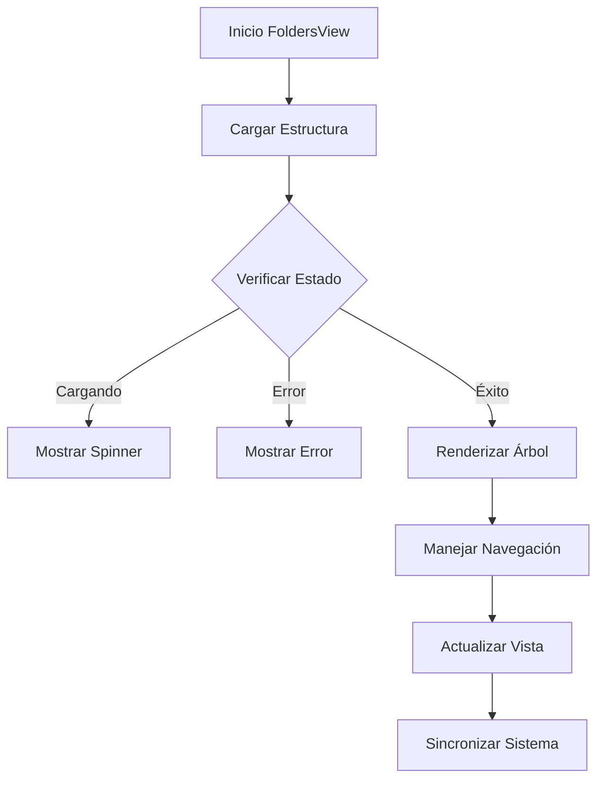

# FoldersView

## Descripción General

El `FoldersView` es un componente que proporciona una interfaz para explorar y gestionar la estructura de carpetas del sistema. Permite navegar por las carpetas monitoreadas y visualizar su contenido de manera eficiente.

## Ubicación

`src/components/views/folders/folders-view.tsx`

## Responsabilidades

- Mostrar estructura de carpetas
- Gestionar navegación jerárquica
- Manejar selección de carpetas
- Proporcionar acciones de carpeta
- Mantener sincronización con sistema
- Mostrar estadísticas de carpetas

## Interfaz

```typescript
interface FoldersViewProps {
	isResizing: boolean;
}

interface FolderState {
	currentPath: string;
	expandedFolders: string[];
	selectedFolder: string | null;
	viewMode: ViewMode;
}
```

## Dependencias

- `@/components/ui/tree-view`
- `@/components/ui/scroll-area`
- `@/components/ui/button`
- `@/store/folders`
- `@/store/file-manager`
- `@/hooks/use-folder-navigation`

## Características

### Sistema de Navegación

- Árbol de carpetas interactivo
- Navegación jerárquica
- Indicadores de estado
- Acciones contextuales

### Visualización

- Vista de árbol expandible
- Iconos de estado
- Contadores de archivos
- Indicadores de monitoreo

### Acciones

- Abrir carpeta
- Agregar a monitoreadas
- Remover de monitoreadas
- Actualizar contenido
- Ver estadísticas

## Estados

### Estado de Carga

```tsx
if (isLoading) {
	return (
		<div className="flex items-center justify-center h-full">
			<LoadingSpinner />
		</div>
	);
}
```

### Estado Vacío

```tsx
if (isEmpty) {
	return (
		<EmptyState
			icon={FolderIcon}
			title="No hay carpetas"
			description="Agrega carpetas para comenzar a monitorear"
		/>
	);
}
```

### Estado de Error

```tsx
if (error) {
	return (
		<EmptyState
			icon={AlertTriangle}
			title="Error al cargar carpetas"
			description={error.message}
		/>
	);
}
```

## Flujo de Trabajo



## Consideraciones

### Performance

- Implementa carga lazy de estructura
- Utiliza virtualización para árboles grandes
- Optimiza actualizaciones de UI
- Maneja caché de estructura
- Implementa actualizaciones parciales

### Accesibilidad

- Soporta navegación por teclado
- Mantiene jerarquía semántica
- Proporciona feedback de estado
- Incluye textos descriptivos
- Implementa roles ARIA

### Diseño Responsivo

- Adapta vista al espacio
- Mantiene legibilidad
- Optimiza para móviles
- Soporta gestos táctiles
- Implementa colapso inteligente

## Integración con Stores

### Folders Store

```typescript
const {
	folders,
	isLoading,
	error,
	addFolder,
	removeFolder,
	updateFolder,
	expandFolder,
	collapseFolder,
} = useFoldersStore();
```

### FileManager Store

```typescript
const { currentPath, setCurrentPath, viewMode, setViewMode } = useFileManager();
```

## Notas de Implementación

- Utiliza sistema de eventos del sistema
- Implementa observadores de cambios
- Mantiene sincronización con disco
- Optimiza operaciones de lectura
- Sigue patrones establecidos
- Implementa manejo de permisos

## Mejoras Futuras

- [ ] Implementar drag and drop
- [ ] Agregar vista de detalles
- [ ] Mejorar rendimiento con muchas carpetas
- [ ] Implementar búsqueda de carpetas
- [ ] Agregar filtros avanzados
- [ ] Mejorar experiencia móvil
- [ ] Implementar favoritos de carpetas
- [ ] Agregar estadísticas detalladas
