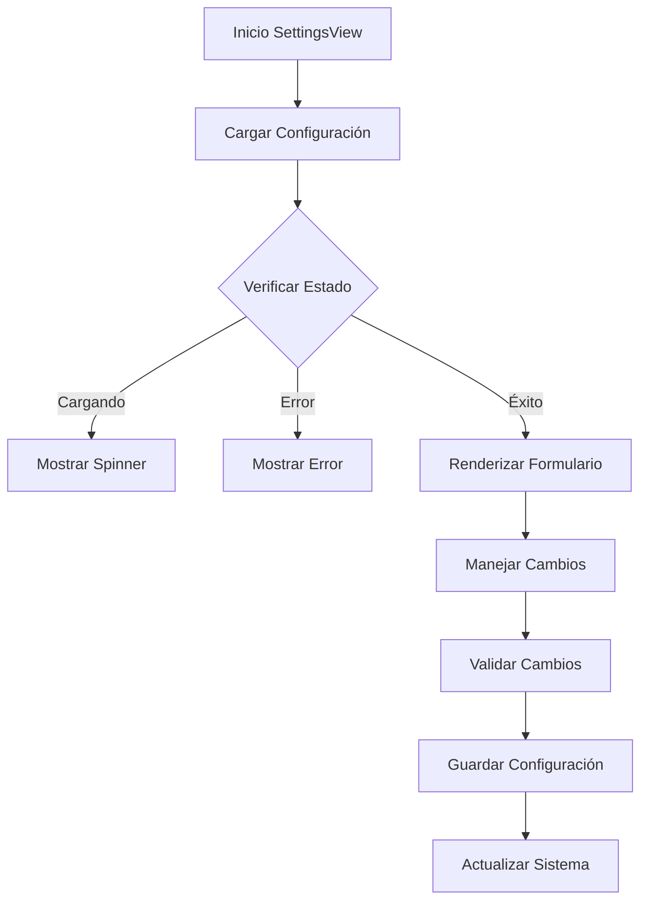

# SettingsView

## Descripción General

El `SettingsView` es un componente que proporciona una interfaz para configurar y personalizar la aplicación. Permite gestionar preferencias del usuario, configuraciones del sistema y opciones avanzadas.

## Ubicación

`src/components/views/settings/settings-view.tsx`

## Responsabilidades

- Mostrar configuraciones disponibles
- Gestionar preferencias de usuario
- Manejar configuración del sistema
- Proporcionar opciones avanzadas
- Mantener sincronización con store
- Validar y aplicar cambios

## Interfaz

```typescript
interface SettingsViewProps {
	isResizing: boolean;
}

interface Settings {
	general: {
		theme: "light" | "dark" | "system";
		language: string;
		autoStart: boolean;
		notifications: boolean;
	};
	display: {
		gridSize: number;
		showFilenames: boolean;
		thumbnailQuality: "low" | "medium" | "high";
		animations: boolean;
	};
	system: {
		watchFolders: string[];
		cacheSize: number;
		concurrentTasks: number;
		debugMode: boolean;
	};
}
```

## Dependencias

- `@/components/ui/tabs`
- `@/components/ui/form`
- `@/components/ui/button`
- `@/store/settings`
- `@/hooks/use-settings`
- `@/components/ui/switch`

## Características

### Secciones de Configuración

- Configuración General
- Preferencias de Visualización
- Configuración del Sistema
- Opciones Avanzadas

### Personalización

- Tema de la aplicación
- Idioma de interfaz
- Tamaño de elementos
- Calidad de miniaturas

### Sistema

- Carpetas monitoreadas
- Gestión de caché
- Rendimiento
- Modo debug

## Estados

### Estado de Carga

```tsx
if (isLoading) {
	return (
		<div className="flex items-center justify-center h-full">
			<LoadingSpinner />
		</div>
	);
}
```

### Estado de Error

```tsx
if (error) {
	return (
		<EmptyState
			icon={AlertTriangle}
			title="Error al cargar configuración"
			description={error.message}
		/>
	);
}
```

### Estado de Guardado

```tsx
const [isSaving, setIsSaving] = useState(false);
const [saveError, setSaveError] = useState<string | null>(null);
```

## Flujo de Trabajo



## Consideraciones

### Performance

- Implementa validación en tiempo real
- Utiliza debounce en cambios
- Optimiza actualizaciones de UI
- Maneja caché de configuración
- Implementa guardado parcial

### Accesibilidad

- Soporta navegación por teclado
- Mantiene estructura semántica
- Proporciona feedback de estado
- Incluye textos descriptivos
- Implementa roles ARIA

### Diseño Responsivo

- Adapta formularios al espacio
- Mantiene legibilidad
- Optimiza para móviles
- Soporta diferentes layouts
- Implementa diseño fluido

## Integración con Stores

### Settings Store

```typescript
const {
	settings,
	isLoading,
	error,
	updateSettings,
	resetSettings,
	importSettings,
	exportSettings,
} = useSettingsStore();
```

### System Store

```typescript
const { systemInfo, updateSystemConfig, clearCache, resetSystem } =
	useSystemStore();
```

## Notas de Implementación

- Utiliza sistema de validación robusto
- Implementa guardado automático
- Mantiene historial de cambios
- Optimiza operaciones de sistema
- Sigue patrones establecidos
- Implementa manejo de errores detallado

## Mejoras Futuras

- [ ] Implementar perfiles de configuración
- [ ] Agregar más opciones de personalización
- [ ] Mejorar sistema de backup
- [ ] Implementar sincronización en la nube
- [ ] Agregar diagnóstico del sistema
- [ ] Mejorar experiencia móvil
- [ ] Implementar asistente de configuración
- [ ] Agregar más opciones avanzadas
