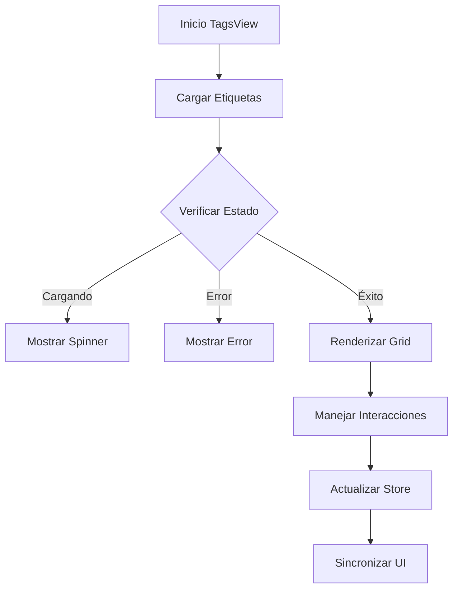

# TagsView

## Descripción General

El `TagsView` es un componente que proporciona una interfaz para gestionar y visualizar etiquetas del sistema. Permite organizar y categorizar imágenes mediante un sistema flexible de etiquetado con soporte para colores personalizados y metadatos.

## Ubicación

`src/components/views/tags/tags-view.tsx`

## Responsabilidades

- Mostrar lista de etiquetas
- Gestionar creación/edición
- Manejar selección de etiquetas
- Proporcionar acciones de etiqueta
- Mantener sincronización con store
- Mostrar estadísticas de uso

## Interfaz

```typescript
interface TagsViewProps {
	isResizing: boolean;
}

interface Tag {
	id: string;
	name: string;
	description: string;
	color: string;
	itemCount: number;
	createdAt: Date;
	updatedAt: Date;
}

interface TagState {
	selectedTag: string | null;
	viewMode: ViewMode;
	sortBy: SortOption;
}
```

## Dependencias

- `@/components/ui/card`
- `@/components/ui/scroll-area`
- `@/components/ui/button`
- `@/store/tags`
- `@/store/file-manager`
- `@/hooks/use-tag-actions`

## Características

### Sistema de Visualización

- Grid de etiquetas
- Vista previa de contenido
- Indicadores de uso
- Acciones contextuales

### Personalización

- Nombre de etiqueta
- Color personalizado
- Descripción detallada
- Atajos de teclado

### Acciones

- Crear etiqueta
- Editar detalles
- Eliminar etiqueta
- Agregar/remover items
- Ver estadísticas
- Fusionar etiquetas

## Estados

### Estado de Carga

```tsx
if (isLoading) {
	return (
		<div className="flex items-center justify-center h-full">
			<LoadingSpinner />
		</div>
	);
}
```

### Estado Vacío

```tsx
if (isEmpty) {
	return (
		<EmptyState
			icon={TagIcon}
			title="No hay etiquetas"
			description="Crea una etiqueta para organizar tus imágenes"
		/>
	);
}
```

### Estado de Error

```tsx
if (error) {
	return (
		<EmptyState
			icon={AlertTriangle}
			title="Error al cargar etiquetas"
			description={error.message}
		/>
	);
}
```

## Flujo de Trabajo



## Consideraciones

### Performance

- Implementa virtualización de grid
- Utiliza lazy loading de previews
- Optimiza actualizaciones de UI
- Maneja caché de etiquetas
- Implementa actualizaciones parciales

### Accesibilidad

- Soporta navegación por teclado
- Mantiene estructura semántica
- Proporciona feedback de estado
- Incluye textos descriptivos
- Implementa roles ARIA

### Diseño Responsivo

- Adapta grid al espacio
- Mantiene legibilidad
- Optimiza para móviles
- Soporta gestos táctiles
- Implementa layout fluido

## Integración con Stores

### Tags Store

```typescript
const {
	tags,
	isLoading,
	error,
	createTag,
	updateTag,
	deleteTag,
	addToTag,
	removeFromTag,
	mergeTags,
} = useTagsStore();
```

### FileManager Store

```typescript
const { selectedItems, viewMode, setViewMode, sortBy, setSortBy } =
	useFileManager();
```

## Notas de Implementación

- Utiliza sistema de eventos optimizado
- Implementa memorización de componentes
- Mantiene sincronización bidireccional
- Optimiza operaciones batch
- Sigue patrones establecidos
- Implementa manejo de errores robusto

## Mejoras Futuras

- [ ] Implementar jerarquía de etiquetas
- [ ] Agregar sugerencias automáticas
- [ ] Mejorar sistema de búsqueda
- [ ] Implementar etiquetas relacionadas
- [ ] Agregar filtros avanzados
- [ ] Mejorar experiencia móvil
- [ ] Implementar importación/exportación
- [ ] Agregar estadísticas detalladas
