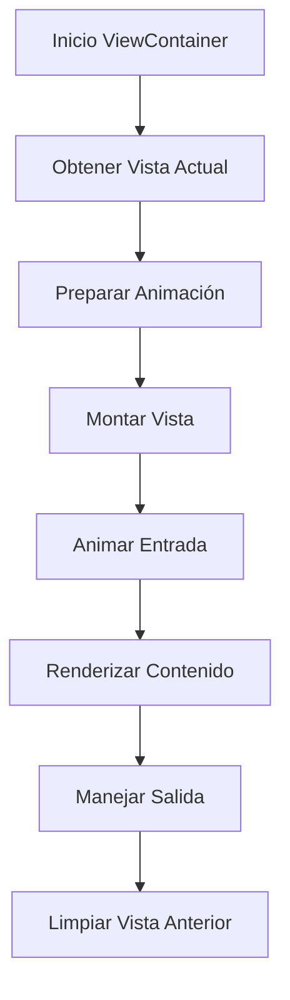

# ViewContainer

## Descripción General

El `ViewContainer` es un componente contenedor principal que gestiona la visualización y transición entre las diferentes vistas de la aplicación. Implementa animaciones suaves y maneja el estado de navegación global.

## Ubicación

`src/components/views/view-container.tsx`

## Responsabilidades

- Gestionar la visualización de vistas
- Manejar transiciones animadas
- Controlar el estado de redimensionamiento
- Integrar con el sistema de navegación
- Proporcionar contexto a las vistas
- Mantener consistencia visual

## Interfaz

```typescript
interface ViewContainerProps {
	isResizing: boolean;
}

interface ViewProps {
	isResizing: boolean;
}

const variants = {
	enter: (direction: number) => ({
		x: direction > 0 ? 1000 : -1000,
		opacity: 0,
	}),
	center: {
		zIndex: 1,
		x: 0,
		opacity: 1,
	},
	exit: (direction: number) => ({
		zIndex: 0,
		x: direction < 0 ? 1000 : -1000,
		opacity: 0,
	}),
};
```

## Dependencias

- `@/store/navigation`
- `@/components/views/*`
- `motion/react`
- `@/components/ui/grid-pattern`

## Vistas Gestionadas

- AllImagesView
- FavoritesView
- SearchView
- FoldersView
- FolderContentView
- CollectionsView
- CollectionContentView
- TagsView
- TagContentView
- SettingsView
- DebugView

## Ejemplo de Uso

```tsx
<ViewContainer isResizing={false} />
```

## Consideraciones

### Performance

- Implementa lazy loading de vistas
- Optimiza transiciones animadas
- Maneja estados de redimensionamiento
- Evita re-renders innecesarios

### Accesibilidad

- Mantiene foco durante transiciones
- Proporciona navegación semántica
- Soporta navegación por teclado
- Mantiene estructura consistente

### Diseño Responsivo

- Adapta vistas al espacio disponible
- Mantiene consistencia en transiciones
- Soporta diferentes tamaños de pantalla
- Optimiza layout para móviles

## Flujo de Trabajo



## Sistema de Animaciones

### Entrada

```typescript
const enterVariant = {
	x: direction > 0 ? 1000 : -1000,
	opacity: 0,
};
```

### Centro

```typescript
const centerVariant = {
	zIndex: 1,
	x: 0,
	opacity: 1,
};
```

### Salida

```typescript
const exitVariant = {
	zIndex: 0,
	x: direction < 0 ? 1000 : -1000,
	opacity: 0,
};
```

## Gestión de Estado

### Navegación

- Utiliza `useNavigationStore`
- Mantiene vista actual
- Controla dirección de transición
- Gestiona historial de navegación

### Redimensionamiento

- Propaga estado a vistas
- Optimiza renders durante resize
- Mantiene consistencia visual
- Evita animaciones durante resize

## Notas de Implementación

- Utiliza `AnimatePresence` para transiciones
- Implementa sistema de variantes de animación
- Mantiene estado consistente entre vistas
- Proporciona contexto a componentes hijos
- Sigue patrones de diseño establecidos

## Mejoras Futuras

- [ ] Implementar transiciones más complejas
- [ ] Agregar soporte para rutas anidadas
- [ ] Mejorar gestión de memoria
- [ ] Implementar precarga de vistas
- [ ] Agregar más efectos visuales
- [ ] Optimizar rendimiento en móviles
