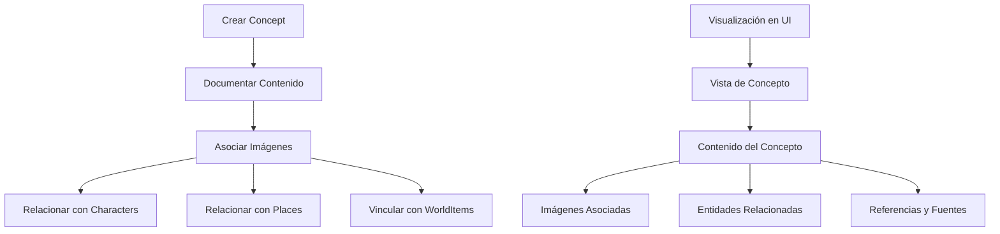

# Documentación de la Entidad Concept

## Introducción

La entidad `Concept` representa ideas, teorías o abstracciones en el sistema de gestión de imágenes. Esta entidad permite a los usuarios organizar y documentar conceptos relacionados con sus proyectos creativos, facilitando la gestión de conocimiento, inspiración y planificación de worldbuilding.

## Estructura de la Entidad

### Propiedades Básicas

```typescript
interface Concept {
    id: string;               // Identificador único (CUID)
    name: string;             // Nombre del concepto (único)
    description?: string;     // Descripción opcional
    emoji: string;            // Emoji para representación visual (default: 💡)
    color: string;            // Color temático (default: #3b82f6)

    // Contenido
    content: string;          // Contenido principal del concepto
    category: string;         // Categoría (default: "general")

    // Visualización
    featuredImage?: string;   // Imagen destacada (referencia)
    isFavorite: boolean;      // Marcado como favorito

    // Metadatos
    createdAt: Date;          // Fecha de creación
    updatedAt: Date;          // Fecha de última actualización
}
```

## Diagrama de Flujo



## Estructura de Carpetas

```
src/
├─ types/
│  ├─ entities/
│  │  ├─ concept/
│  │     ├─ types.ts            # Tipos principales del concepto
│  │     └─ index.ts            # Exportaciones
├─ transformers/
│  ├─ concept/
│  │  ├─ index.ts               # Exportaciones y funciones públicas
│  │  ├─ transformer.ts         # Transformadores principales
│  │  ├─ serializers.ts         # Serializadores/deserializadores
│  │  ├─ mappers.ts             # Funciones de mapeo
│  │  └─ types.ts               # Tipos internos del transformador
├─ components/
│  ├─ cards/
│  │  ├─ concept-card/          # Componentes de tarjeta de concepto
│  ├─ views/
│  │  ├─ concepts/              # Vistas para conceptos
├─ app/
│  └─ api/
│     └─ concepts/              # API endpoints para conceptos
│        └─ route.ts            # Manejadores de rutas
├─ services/
│  └─ concept.service.ts        # Servicio principal para conceptos
```

## Interacciones con el Sistema de Eventos

### Eventos Emitidos

- `concept:created` - Cuando se crea un concepto nuevo
- `concept:updated` - Cuando se modifica un concepto existente
- `concept:deleted` - Cuando se elimina un concepto
- `concepts:changed` - Cuando hay cualquier cambio en la colección de conceptos

## Ejemplos de Uso en el Proyecto

### Creación de un Concepto

```typescript
import { ConceptService } from '@/services/concept.service';
// o usando transformers
import { createConcept } from '@/transformers/concept';

// Crear un concepto básico
const newConcept = await ConceptService.createConcept({
  name: "Viaje del Héroe",
  description: "Estructura narrativa identificada por Joseph Campbell",
  content: "El viaje del héroe es una estructura narrativa que aparece en historias de todo el mundo...",
  category: "narrative",
  emoji: "🦸",
  color: "#e63946"
});

console.log(`Concepto creado: ${newConcept.id}`);
```

### Obtención de Conceptos

```typescript
import { ConceptService } from '@/services/concept.service';
// o usando transformers
import { searchConcepts, getConceptById } from '@/transformers/concept';

// Buscar conceptos por criterios
const searchResult = await ConceptService.getConcepts({
  category: "narrative",
  search: "héroe",
  sortBy: "name",
  sortOrder: "asc",
  page: 0,
  pageSize: 10
});

console.log(`Encontrados ${searchResult.total} conceptos`);
console.log(`Estadísticas por categoría:`, searchResult.stats.byCategory);

// Obtener un concepto específico
const concept = await ConceptService.getConcept("concept_id_here");
if (concept) {
  console.log(`Concepto: ${concept.name}`);
  console.log(`Contenido: ${concept.content.substring(0, 100)}...`);
}
```

### Asociación de Imágenes con Concepto

```typescript
import { prisma } from '@/lib/prisma';

// Asociar imágenes a un concepto
async function associateImagesWithConcept(conceptId: string, imageIds: string[]) {
  // Crear conexiones entre concepto e imágenes
  await prisma.concept.update({
    where: { id: conceptId },
    data: {
      images: {
        connect: imageIds.map(id => ({ id }))
      }
    }
  });

  return await prisma.concept.findUnique({
    where: { id: conceptId },
    include: { images: true }
  });
}

// Ejemplo de uso
const updatedConcept = await associateImagesWithConcept(
  "concept_id_here",
  ["image_id_1", "image_id_2"]
);
```

### Vinculación con otras Entidades

```typescript
import { prisma } from '@/lib/prisma';

// Vincular un concepto con personajes y lugares
async function connectConceptToEntities(
  conceptId: string,
  characterIds: string[],
  placeIds: string[]
) {
  // Actualizar concepto con relaciones
  await prisma.concept.update({
    where: { id: conceptId },
    data: {
      characters: {
        connect: characterIds.map(id => ({ id }))
      },
      places: {
        connect: placeIds.map(id => ({ id }))
      }
    }
  });

  return await prisma.concept.findUnique({
    where: { id: conceptId },
    include: {
      characters: true,
      places: true
    }
  });
}

// Ejemplo de uso
const updatedConcept = await connectConceptToEntities(
  "hero_journey_id",
  ["protagonist_id", "mentor_id"],
  ["ordinary_world_id", "special_world_id"]
);
```

### Actualización de un Concepto

```typescript
import { ConceptService } from '@/services/concept.service';
// o usando transformers
import { updateConcept } from '@/transformers/concept';

// Actualizar un concepto
const updatedConcept = await ConceptService.updateConcept("concept_id_here", {
  description: "Estructura narrativa identificada por Joseph Campbell en su obra 'El héroe de las mil caras'",
  content: "Contenido actualizado con nuevas investigaciones y ejemplos...",
  emoji: "🏆"
});
```

## Consideraciones Importantes

1. **Estructura de Contenido**: La entidad Concept es ideal para almacenar información textual extensa, como teorías, definiciones o conocimiento estructurado.

2. **Relaciones Abstractas**: Un Concept puede relacionarse con múltiples entidades del sistema:
   - Puede estar representado por imágenes
   - Puede aplicarse a personajes
   - Puede manifestarse en lugares
   - Puede relacionarse con objetos
   - Puede ser parte de otros conceptos

3. **Organización de Conocimiento**: Los conceptos son excelentes para crear sistemas coherentes de conocimiento dentro de proyectos creativos o de worldbuilding.

4. **Filtrado y Búsqueda**: El servicio incluye capacidades avanzadas de filtrado y búsqueda para navegar por el conocimiento de manera eficiente.

## Integraciones con Otras Entidades

La entidad Concept se integra con:

- **Image**: Las imágenes pueden estar asociadas a conceptos mediante relación many-to-many
- **Video**: Los videos pueden estar asociados a conceptos mediante relación many-to-many
- **Character**: Los personajes pueden relacionarse con conceptos mediante relación many-to-many
- **Place**: Los lugares pueden manifestar conceptos mediante relación many-to-many
- **WorldItem**: Los objetos pueden estar relacionados con conceptos mediante relación many-to-many
- **Group**: Los conceptos pueden ser agrupados mediante relación many-to-many

## Casos de Uso Típicos

1. **Worldbuilding**: Documentar las reglas, leyes naturales y filosofías de un mundo ficticio.
2. **Desarrollo Narrativo**: Organizar conceptos narrativos como arquetipos, estructuras de trama o temas.
3. **Sistemas de Magia**: Definir y documentar sistemas de magia, tecnología o habilidades sobrenaturales.
4. **Desarrollo de Personajes**: Crear conceptos psicológicos o sociológicos que definen a los personajes.
5. **Planificación de Proyectos**: Utilizar conceptos para definir ideas clave o pilares de un proyecto creativo.

## Conclusión

La entidad Concept proporciona una estructura flexible para documentar y organizar conocimiento abstracto dentro del sistema de gestión de imágenes. Su capacidad para relacionarse con otras entidades la convierte en una herramienta poderosa para proyectos de worldbuilding, narrativa y documentación creativa.