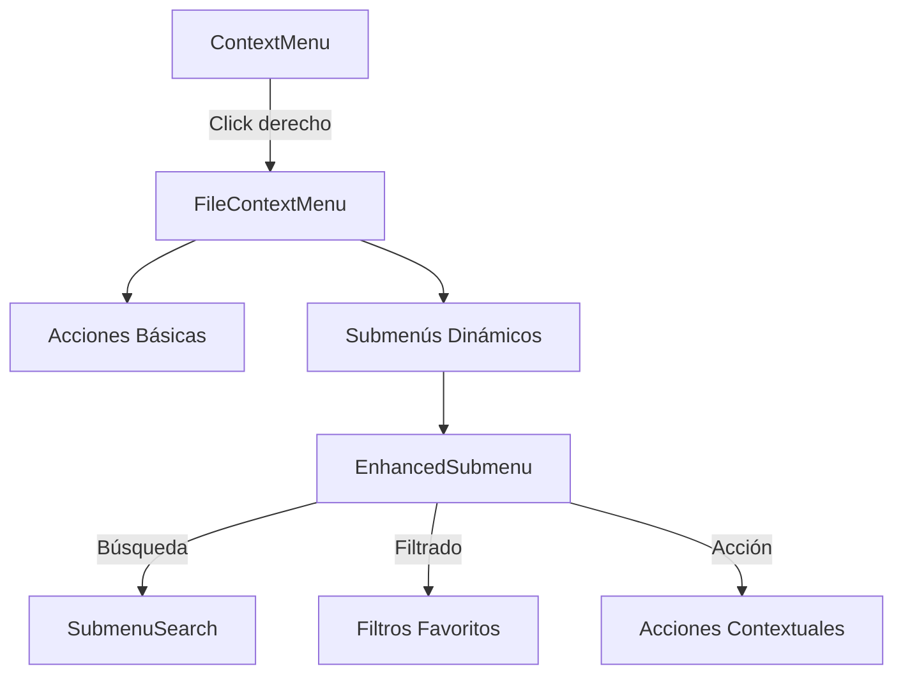

# Menú Contextual Mejorado

## Visión general

El menú contextual es una parte esencial de la interfaz de usuario del FileBrowser, permitiendo a los usuarios realizar acciones rápidas sobre los archivos. La versión mejorada incluye submenús dinámicos con búsqueda y filtrado para una experiencia más eficiente.



## Componentes principales

### FileContextMenu

Componente principal que muestra el menú contextual al hacer clic derecho en un archivo. Incluye:

- Acciones básicas (vista previa, descargar, eliminar, etc.)
- Submenús para entidades (colecciones, etiquetas, álbumes)
- Indicadores de carga para acciones asíncronas

### EnhancedSubmenu

Submenú mejorado con características avanzadas:

- **Búsqueda en tiempo real**: Filtra elementos mientras escribes
- **Filtro de favoritos**: Muestra solo los elementos marcados como favoritos
- **Ordenación inteligente**: Prioriza favoritos y elementos recientes
- **Área de desplazamiento**: Para manejar grandes cantidades de elementos
- **Creación rápida**: Botón para crear nuevos elementos directamente desde el submenú

```tsx
<EnhancedSubmenu
  title="Colecciones"
  icon={<BookImage />}
  items={collections}
  isLoading={isLoading}
  file={currentFile}
  onAction={handleAction}
  actionType="add-to-collection"
  createActionType="collection-create"
/>
```

### SubmenuSearch

Componente de búsqueda específico para los submenús:

- Input optimizado para espacios reducidos
- Debounce integrado para evitar búsquedas innecesarias
- Diseño compacto que se integra con el menú contextual

## Flujo de interacción

1. **Apertura del menú**: El usuario hace clic derecho en un archivo
2. **Carga de datos**: Al abrir un submenú, se cargan los datos necesarios si no están ya en caché
3. **Búsqueda y filtrado**: El usuario puede buscar o filtrar elementos dentro del submenú
4. **Acción**: Al seleccionar un elemento, se ejecuta la acción correspondiente (añadir a colección, etc.)
5. **Creación**: El usuario puede crear nuevos elementos directamente desde el submenú

## Ventajas de la implementación

1. **Mejor experiencia de usuario**: Búsqueda y filtrado rápido sin salir del contexto
2. **Rendimiento optimizado**: Carga asíncrona y bajo demanda de los datos
3. **Escalabilidad**: Maneja grandes cantidades de elementos con virtualización
4. **Consistencia**: Interfaz unificada para diferentes tipos de entidades
5. **Extensibilidad**: Fácil de adaptar para nuevos tipos de entidades

## Consideraciones técnicas

- Los submenús utilizan un sistema de caché para evitar cargar los mismos datos repetidamente
- La búsqueda se realiza localmente para una respuesta instantánea
- Los favoritos y elementos recientes se destacan para un acceso más rápido
- Se utilizan componentes memoizados para optimizar el rendimiento