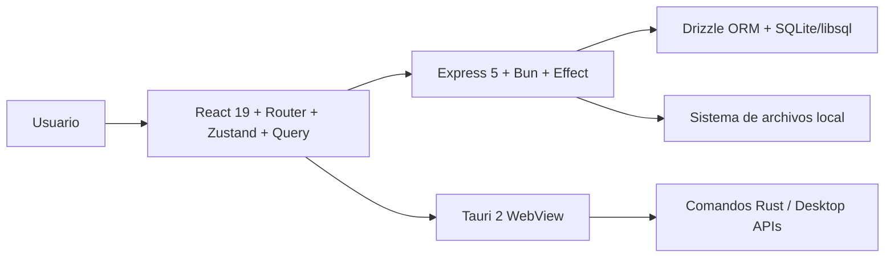
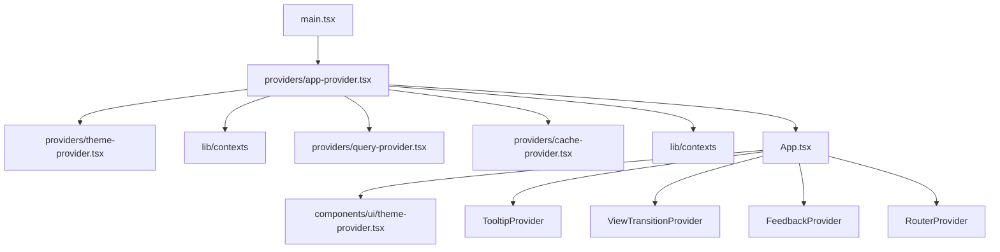
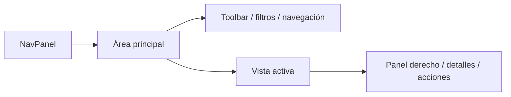
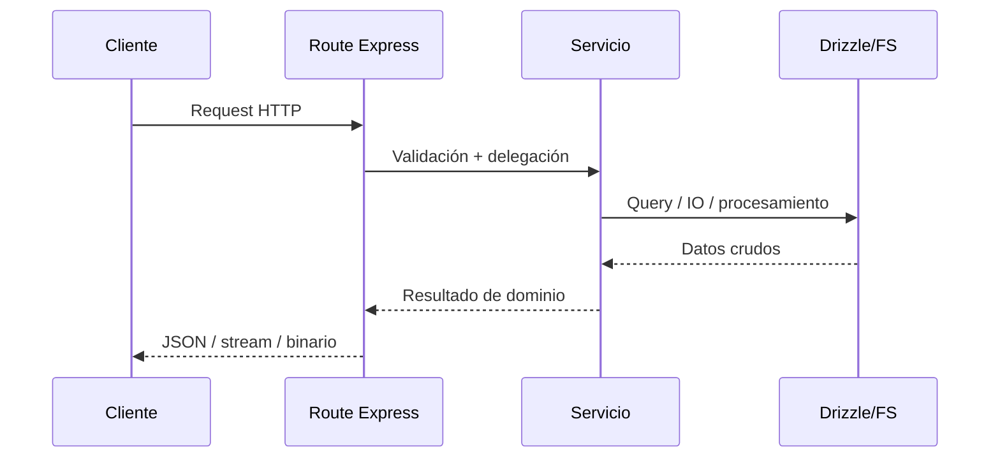

# Arquitectura del sistema

**Proyecto:** Image Manager  
**Última revisión:** 2026-05-08  
**Estilo arquitectónico:** monolito cliente-servidor con opción desktop

## 1. Vista general

Image Manager es un sistema monolítico con cuatro bloques principales:

1. **UI React** para navegación, edición y visualización.
2. **API Express sobre Bun** como capa de orquestación y negocio.
3. **SQLite/libsql vía Drizzle ORM** como persistencia principal.
4. **Sistema de archivos local** como fuente real de los assets.

Opcionalmente, el conjunto se empaqueta en **Tauri 2** para ejecución de escritorio.

## 2. Contexto de arquitectura

## 3. Modos de ejecución

### Modo web local

- Frontend en `http://localhost:5173`
- Backend en `http://localhost:4000`
- Proxy de `/api` desde Vite hacia Express

### Modo desktop

- Tauri abre una WebView del frontend
- El backend Express se empaqueta o levanta como recurso local
- Rust aporta comandos nativos para integración con el sistema operativo

## 4. Bootstrap de la aplicación

### Entrada del cliente

El arranque real ocurre en este orden:

1. `src/main.tsx`
2. `src/providers/app-provider.tsx`
3. `src/App.tsx`
4. `src/router.tsx`

### Estructura de providers

Hay **dos capas de composición** por evolución histórica del proyecto:

Esto implica una realidad importante para mantenimiento:

- existe una **capa de compatibilidad/migración** entre providers antiguos y nuevos,
- el sistema de tema tiene más de un punto de integración,
- la documentación debe tratarlo como estado actual, no como anomalía invisible.

## 5. Arquitectura frontend

### Capas principales

| Capa | Responsabilidad |
| --- | --- |
| `components/ui` | primitivas y wrappers de UI |
| `components/layout` | layout principal y paneles |
| `components/features` | file browser y file viewer |
| `components/views` | páginas y vistas por dominio |
| `store` | estado local/global de UI y entidades |
| `hooks` | hooks de navegación, consulta y UX |
| `providers` | infraestructura React compartida |

### Routing

`src/router.tsx` usa una combinación de:

- vistas **eager** para rutas críticas,
- vistas **lazy** para reducir peso inicial,
- layout único (`MainLayout`) como contenedor de toda la navegación.

### Layout conceptual

### Estado

La UI usa un enfoque mixto:

- **Zustand** para estado de interfaz, selección, visores y catálogos.
- **TanStack Query** para estado servidor y sincronización de datos remotos.

No existe un mega-store único; el diseño favorece stores por responsabilidad.

## 6. Arquitectura backend

### Punto de entrada

`src/server/index.ts` configura:

- Express
- Helmet
- Rate limiting
- JSON/urlencoded parsers
- archivos estáticos de uploads
- middleware de logging
- routers de la API
- health check y manejo de errores

### Familias de routers montadas

| Base | Ruta |
| --- | --- |
| Carpetas | `/api/folders` |
| Imágenes | `/api/images` |
| Videos | `/api/videos` |
| Audio | `/api/audio` |
| Tags | `/api/tags` |
| Álbumes | `/api/albums` |
| Colecciones | `/api/collections` |
| Characters | `/api/characters` |
| Places/Concepts/Prompts | `/api/places`, `/api/concepts`, `/api/prompts` |
| Filesystem y descargas | `/api/files`, `/api/download` |
| Search | `/api/search` y redirección `/search` |
| Metadata | `/api/metadata`, `/api/metadata-advanced` |
| Thumbnails | `/api/thumbnails`, `/api/thumbnails/unified` |
| Settings/Profiles/Favorites | `/api/settings`, `/api/profiles`, `/api/favorites` |
| Eventing/queue/system | `/api/events`, `/api/queue`, `/api/system`, `/api/stats`, `/api/activity` |
| Debug y utilidades | `/api/debug`, `/api/reindex`, `/api/reindex-logs` |

### Patrón de capa de negocio

El patrón dominante es:

En varias rutas, la lógica se expresa mediante **Effect-TS** y se ejecuta a través de adaptadores de Express.

## 7. Persistencia y modelo de datos

El esquema Drizzle está segmentado por dominios:

- `core`
- `dev`
- `files`
- `organization`
- `taxonomy`
- `worldbuilding`
- `relations`

La base de datos no sustituye al filesystem: lo **modela, enriquece y relaciona**.

## 8. Sistemas transversales relevantes

### File Entity Mapper

Mapea archivos físicos a entidades persistidas en tres grandes pasos:

1. creación básica,
2. extracción de metadatos,
3. generación de thumbnail.

El core usa un contrato tipado de processor por entidad (`checkExists`, `createBasicEntity`, `extractMetadata`, `generateThumbnail`) y valida hash antes de consultar duplicados.

### Reindexado

El backend combina:

- reindexado estructurado por carpeta,
- reindexado incremental con hashes/cambios,
- eventos/progreso para feedback de la UI.

El reindex incremental resuelve subcarpetas con un mapa `parentId -> children` y recorrido iterativo para evitar recursion profunda y filtros repetidos sobre el listado completo.

### Thumbnails

Hay varias rutas especializadas:

- thumbnails por imagen,
- previews JSON,
- waveforms de audio,
- thumbnails 3D,
- servicio unificado complementario.

Los previews SVG generados por servidor escapan texto de nombres y metadatos antes de interpolarlo, especialmente en documentos, JSON y modelos 3D.

### Logging

El sistema usa logging estructurado en cliente y servidor, con especial peso en:

- request logging,
- eventos de sistema,
- diagnósticos de procesos largos.

## 9. Seguridad y límites operativos

- Helmet con CSP relajada por necesidades SPA/locales.
- Rate limiting aplicado sobre `/api/`.
- Límite alto de payload JSON para operaciones multimedia.
- Exposición controlada de `/uploads` como estáticos.
- Descargas con `Content-Disposition` codificado, `nosniff` y flujo binario directo en `GET/POST /api/download`.

## 10. Testing como parte de la arquitectura

El proyecto contempla tres niveles:

- **unit/integration** con Vitest + jsdom,
- **UI/component** con Testing Library,
- **end-to-end** con Playwright y servidor real.

La configuración de Vitest fuerza ejecución secuencial para minimizar conflictos con SQLite.

## 11. Trade-offs arquitectónicos

### Beneficios del monolito actual

- onboarding más directo,
- despliegue local sencillo,
- menos fricción entre UI, backend y DB,
- trazabilidad más simple durante desarrollo.

### Costes asumidos

- anchura funcional alta en un solo repositorio,
- coexistencia de capas históricas y nuevas,
- fuerte dependencia de orden y consistencia documental,
- algunos sistemas transversales son complejos de explicar sin mapa previo.

## 12. Riesgos y puntos de atención

- El dominio es muy amplio y puede inducir duplicación accidental.
- La coexistencia de providers/contextos requiere disciplina.
- El ecosistema de rutas mezcla endpoints de negocio, utilidades, debug y compatibilidad.
- Los procesos de thumbnailing y reindexado son potentes, pero también los más sensibles a drift operativo.

## 13. Documentos relacionados

- [`./REPOSITORY-MAP.md`](./REPOSITORY-MAP.md)
- [`./FRONTEND-GUIDE.md`](./FRONTEND-GUIDE.md)
- [`./SERVICES-GUIDE.md`](./SERVICES-GUIDE.md)
- [`./DATABASE-SCHEMA.md`](./DATABASE-SCHEMA.md)
- [`./IMPLEMENTATION-DETAILS.md`](./IMPLEMENTATION-DETAILS.md)
