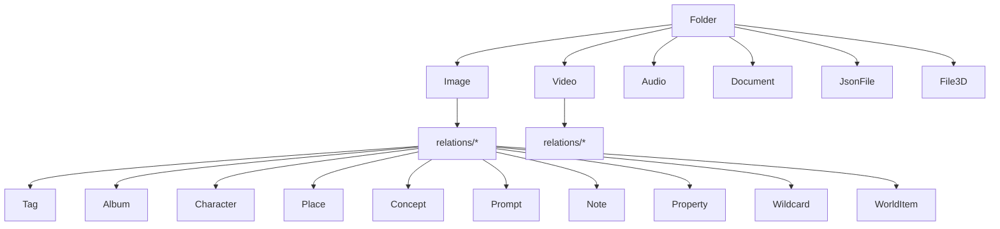

# Esquema de base de datos

Esta guía describe la **organización real del esquema Drizzle** y la forma en que la base de datos modela el dominio del proyecto.

## 1. Papel de la base de datos en el sistema

SQLite/libsql no almacena únicamente registros auxiliares; actúa como el modelo lógico del producto. El sistema de archivos conserva los assets físicos, mientras que la base de datos guarda:

- catálogo de entidades,
- conteos y estadísticas,
- relaciones many-to-many,
- metadata estructurada,
- thumbnails y previews,
- estado operativo del sistema.

## 2. Organización del schema

La fuente principal es `src/lib/drizzle/schema/`.

```text
schema/
├─ core/
├─ dev.ts
├─ files/
├─ organization/
├─ relations/
├─ taxonomy/
├─ worldbuilding/
└─ index.ts
```

## 3. Dominios del esquema

### Core

Archivos reales del dominio:

- `activities.ts`
- `aggregates.ts`
- `fileStats.ts`
- `metadatas.ts`
- `profiles.ts`
- `queueJobs.ts`
- `settings.ts`
- `thumbnails.ts`

#### Qué cubre el dominio core

- actividad del sistema,
- agregados y conteos desnormalizados,
- metadata estructurada,
- perfiles y configuraciones,
- cola de trabajos,
- thumbnails persistidos.

### Dev

`dev.ts` centraliza tablas y enums orientados a características de desarrollo u observabilidad interna.

### Files

Archivos reales del dominio:

- `audio.ts`
- `documents.ts`
- `file3Ds.ts`
- `files.ts`
- `images.ts`
- `jsonFiles.ts`
- `uploadedImages.ts`
- `videos.ts`

#### Qué cubre el dominio files

- representación de archivos de media y soporte,
- rutas, hashes, tamaños, dimensiones y metadata específica,
- soporte a archivos subidos y artefactos derivados.

### Organization

Archivos reales del dominio:

- `albums.ts`
- `collections.ts`
- `favorites.ts`
- `folders.ts`
- `groups.ts`
- `tags.ts`

#### Qué cubre el dominio organization

- árbol de carpetas,
- agrupaciones de contenido,
- favoritos,
- tags y organización lógica.

### Taxonomy

Archivos reales del dominio:

- `notes.ts`
- `prompts.ts`
- `properties.ts`
- `tasks.ts`
- `wildcards.ts`

#### Qué cubre el dominio taxonomy

- metadatos creativos,
- conocimiento estructurado,
- anotaciones y plantillas,
- clasificación adicional del contenido.

### Worldbuilding

Archivos reales del dominio:

- `characters.ts`
- `concepts.ts`
- `places.ts`
- `worldItems.ts`

#### Qué cubre

- entidades narrativas y semánticas conectables con media.

### Relations

Agrupa las tablas intermedias many-to-many entre media y entidades del resto del dominio.

## 4. Ejemplos representativos

### Tabla `Folder`

Ubicación: `src/lib/drizzle/schema/organization/folders.ts`

Campos destacados:

- `id`
- `name`
- `description`
- `path`
- `emoji`
- `color`
- `featuredImage`
- `isFavorite`
- `totalImages`
- `totalVideos`
- `totalFiles`
- `totalSize`
- `lastIndexed`
- `createdAt`
- `updatedAt`
- `parentId`
- `presetId`

Características observables:

- unicidad de `path`,
- índices por `lastIndexed` y fechas,
- constraints de longitud y formato,
- soporte explícito a árbol por `parentId`.

### Tabla `Image`

Ubicación: `src/lib/drizzle/schema/files/images.ts`

Campos destacados:

- `id`
- `name`
- `description`
- `path`
- `hash`
- `size`
- `width`
- `height`
- `metadata`
- `thumbnail`
- `thumbnailSize`
- `thumbnailWidth`
- `thumbnailHeight`
- `thumbnailMimeType`
- `thumbnailError`
- `thumbnailErrorAt`
- `thumbnailOptimizedAt`
- `aiEngine`
- `aiModel`
- `aiOriginDetected`
- `isFavorite`
- `folderId`
- `noteId`
- `createdAt`
- `updatedAt`
- `addedAt`

Características observables:

- constraint de hash SHA-256 (`length(hash) = 64`),
- límites de tamaño y dimensiones,
- unicidad compuesta por `path` y `folderId`,
- índices sobre favoritos, fechas y metadata IA.

## 5. Modelo relacional

El diseño general sigue esta lógica:



## 6. Qué tipo de datos persiste

### Datos de catálogo

- nombre,
- descripción,
- path,
- IDs,
- timestamps,
- atributos de favoritos y presentación.

### Datos físicos o derivados

- hash,
- tamaño,
- resolución,
- thumbnails,
- waveform/preview,
- metadata cruda o serializada.

### Datos semánticos

- tags,
- relaciones a entidades creativas,
- prompts,
- propiedades,
- notas,
- wildcards.

### Datos operativos

- jobs,
- actividad,
- settings,
- agregados,
- stats.

## 7. Relación con la capa de servicios

Los servicios usan Drizzle como puerta de acceso al modelo persistente. La regla de diseño del repo es que la lógica de negocio viva en `src/services/` y no directamente en las rutas.

## 8. Consideraciones importantes

- La base de datos es local y portable.
- El filesystem sigue siendo la fuente física del archivo.
- El schema está muy orientado a relaciones cruzadas.
- Las tablas de relaciones son fundamentales para la experiencia del producto.
- `schema/index.ts` es la exportación unificada que consume la app.

## 9. Lecturas relacionadas

- [`./ARCHITECTURE.md`](./ARCHITECTURE.md)
- [`./SERVICES-GUIDE.md`](./SERVICES-GUIDE.md)
- [`./IMPLEMENTATION-DETAILS.md`](./IMPLEMENTATION-DETAILS.md)
