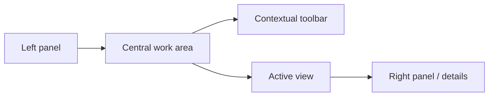

# Product design and UX

This document summarizes the visual and interaction logic of the project. It covers product and interface architecture.

## 1. Nature of the interface

Media Manager is not a landing page. It is not a minimal CRUD app. The UI is a **dense workspace** for exploring large content libraries.

That nature explains these decisions:

- panel layout
- side navigation
- contextual toolbar
- views by domain
- details panel
- integrated previews and viewers

## 2. Main shell

The application turns around `MainLayout` and panel-style navigation.

### Left panel

Typical responsibilities:

- hierarchical navigation
- access to sections
- fast change among domains

### Central area

Typical responsibilities:

- show complete views
- support different exploration modes
- host the toolbar and the main content

### Right panel

Typical responsibilities:

- entity details
- contextual actions
- complementary information

## 3. Visual philosophy

The UI mixes two needs:

1. **functional density**, because the domain is broad
2. **visual expression**, because the product has a strong creative component

For that reason these pieces coexist:

- semantic tokens
- multiple themes
- cards and views with visual identity
- visible transitions and feedback

## 4. Theme system

The project supports multiple custom themes in addition to `light`, `dark`, and `system`.

Observed themes:

- light
- dark
- cafe
- violeta
- madera
- nocturno
- verde
- atardecer
- corporativo
- carbon
- teal
- citrico
- aurora
- neon

## 5. Token-based design

The visual system rests on these files:

- `tokens.css`
- `design-tokens.css`
- `globals.css`
- `view-transition.css`

### What they provide

These files provide:

- semantic colors
- reusable scales
- consistency among entities
- support for multiple themes without rewriting components

## 6. Behavior by view

The UI does not use one view for everything. Each domain has its own section. Each section can look different by content type.

### Examples

Examples include:

- folders and hierarchical exploration
- media grids or listings
- creative-entity views
- settings panels
- search results

## 7. Relation between UX and architecture

Frontend architecture conditions UX in these ways:

- lazy loading to reduce initial cost
- stores by responsibility to support complex interactions
- Query to keep data in sync
- SSE and refresh for long-running processes
- specialized viewers so the user stays in context

## 8. Feedback and operation

The product needs to communicate many states:

- loading
- errors
- operation success
- reindex progress
- missing or generated previews
- selection and navigation changes

For that reason these surfaces appear:

- toasts
- panels
- progress updates
- logging for technical operation
- feedback stores and providers

## 9. UX risks from the domain

Watch these UX risks:

- too many entities can raise cognitive load
- too many routes or views can make onboarding harder
- coexistence of old and new features can create behavior differences
- long processes need clear feedback so they do not feel broken

## 10. What to preserve as the UI evolves

Preserve these qualities:

- consistency among shell, toolbar, and panels
- use of tokens instead of hardcoded colors
- a clear split among navigation, content, and detail
- support for large libraries
- visibility of system state

## 11. Related documents

The following documents complete this design view:

- [`./FRONTEND-GUIDE.md`](./FRONTEND-GUIDE.md)
- [`./ARCHITECTURE.md`](./ARCHITECTURE.md)
- [`./STYLES-AND-THEMES-GUIDE.md`](./STYLES-AND-THEMES-GUIDE.md)
