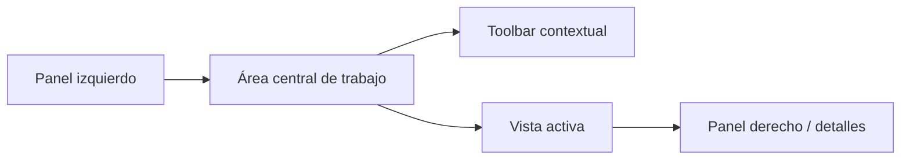

# Diseño y UX del producto

Este documento resume la lógica visual y de interacción del proyecto desde una perspectiva de producto y arquitectura de interfaz.

## 1. Naturaleza de la interfaz

Image Manager no es una landing, ni una app CRUD mínima. La UI está pensada como un **workspace denso** para explorar bibliotecas grandes de contenido.

Eso explica varias decisiones:

- layout con paneles,
- navegación lateral,
- toolbar contextual,
- vistas por dominio,
- panel de detalles,
- previews y viewers integrados.

## 2. Shell principal

La aplicación gira en torno a `MainLayout` y a una navegación tipo panel.

### Panel izquierdo

Responsabilidades típicas:

- navegación jerárquica,
- acceso a secciones,
- cambio rápido entre dominios.

### Área central

Responsabilidades típicas:

- mostrar vistas completas,
- soportar distintos modos de exploración,
- alojar la toolbar y el contenido principal.

### Panel derecho

Responsabilidades típicas:

- detalles de entidad,
- acciones contextuales,
- información complementaria.

## 3. Filosofía visual

La UI mezcla dos necesidades:

1. **densidad funcional**, porque el dominio es amplio;
2. **expresividad visual**, porque el producto tiene un componente creativo fuerte.

Por eso conviven:

- tokens semánticos,
- múltiples temas,
- cards y vistas con identidad visual,
- transiciones y feedback visibles.

## 4. Sistema de temas

El proyecto soporta múltiples temas personalizados además de `light`, `dark` y `system`.

Temas observados:

- light
- dark
- cafe
- violeta
- madera
- nocturno
- verde
- atardecer
- corporativo
- carbon
- teal
- citrico
- aurora
- neon

## 5. Diseño basado en tokens

La base del sistema visual se apoya en:

- `tokens.css`
- `design-tokens.css`
- `globals.css`
- `view-transition.css`

### Qué aportan

- colores semánticos,
- escalas reutilizables,
- consistencia entre entidades,
- soporte de múltiples temas sin reescribir componentes.

## 6. Comportamiento por vistas

La UI no usa una sola vista para todo. Cada dominio tiene su propia sección y puede expresarse de forma diferente según el tipo de contenido.

### Ejemplos

- carpetas y exploración jerárquica,
- grids o listados de media,
- vistas de entidades creativas,
- paneles de configuración,
- resultados de búsqueda.

## 7. Relación entre UX y arquitectura

La arquitectura del frontend condiciona la UX de varias maneras:

- lazy loading para reducir coste inicial,
- stores por responsabilidad para sostener interacciones complejas,
- Query para mantener datos sincronizados,
- SSE y refresco para procesos de larga duración,
- viewers especializados para evitar salir del contexto.

## 8. Feedback y operación

El producto necesita comunicar muchos estados:

- carga,
- errores,
- éxito de operaciones,
- progreso de reindexado,
- previews faltantes o generados,
- cambios de selección y navegación.

Por eso aparecen:

- toasts,
- paneles,
- progress updates,
- logging para operación técnica,
- stores y providers de feedback.

## 9. Riesgos UX derivados del dominio

- demasiadas entidades pueden elevar la carga cognitiva,
- exceso de rutas o vistas puede dificultar onboarding,
- coexistencia de features antiguas y nuevas puede generar diferencias de comportamiento,
- los procesos largos requieren feedback claro para no sentirse rotos.

## 10. Qué conviene preservar al evolucionar la UI

- consistencia entre shell, toolbar y paneles,
- uso de tokens en lugar de colores hardcodeados,
- separación clara entre navegación, contenido y detalle,
- soporte a bibliotecas grandes,
- visibilidad del estado del sistema.

## 11. Documentos relacionados

- [`./FRONTEND-GUIDE.md`](./FRONTEND-GUIDE.md)
- [`./ARCHITECTURE.md`](./ARCHITECTURE.md)
- [`./STYLES-AND-THEMES-GUIDE.md`](./STYLES-AND-THEMES-GUIDE.md)
