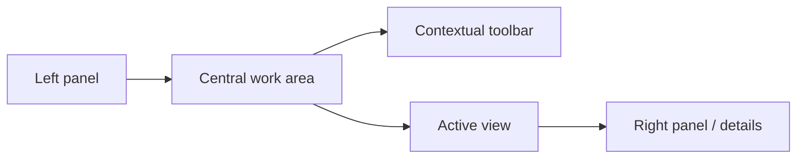
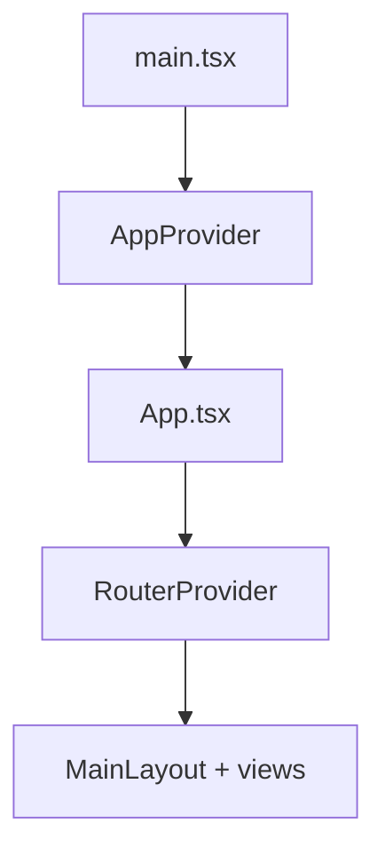

# Frontend guide

The UI is a dense workspace for large libraries. It is not a landing page and not a minimal CRUD app. The shell splits navigation, content, and detail.

Preserve these qualities when the UI changes:

- consistency among shell, toolbar, and panels
- tokens instead of hardcoded colors
- a clear split among navigation, content, and detail
- support for large libraries
- visible system state (loading, errors, reindex, missing previews)

## Boot sequence

Frontend startup runs in this order:

`main.tsx` locates `#root`, creates the React root, mounts `AppProvider`, and loads global styles.

`AppProvider` composes `ThemeProvider` from `src/providers/`, `SettingsProvider`, `QueryProvider`, `CacheProvider`, `FileProvider`, and `Toaster`.

`App.tsx` then composes `ThemeProvider` from `components/ui`, `TooltipProvider`, `ViewTransitionProvider`, `ReactScanProvider`, `FeedbackProvider`, `ErrorBoundary`, `SkipLink`, catalog bootstrap, SSE refresh, and `RouterProvider`.

Treat those two provider layers as complementary. They are not one consolidated system.

## Routing

Configuration lives in `src/router.tsx`. `MainLayout` wraps the app. Routes mix eager and lazy views by domain, with wrappers for hierarchical folders and entity detail.

View families include dashboard, development, folders, all-files, all-images, videos, audios, documents, json-files, file3d, favorites, collections, albums, groups, tags, characters, places, world-items, concepts, wildcards, prompts, notes, properties, search, and settings.

## Component organization

| Path | Role |
| --- | --- |
| `src/components/ui/` | Primitives and wrappers: buttons, dialogs, tooltips, toaster, UI providers, accessibility |
| `src/components/layout/` | Application shell and panels |
| `src/components/features/file-browser-new/` | Folder routes, hierarchical navigation, exploration, selection |
| `src/components/features/file-viewer/` | Per-type viewing and viewer stores |
| `src/components/views/` | Product pages. Each folder is one section |

## Client state

Zustand stores live in `src/store/`: `ui.store.ts`, `selection.store.ts`, `search.store.ts`, `reindex.store.ts`, `thumbnails.store.ts`, `file-view.store.ts`, `details-panel.store.ts`, `entity-catalog-store.ts`, `unified-file-manager.store.ts`, and per-entity stores in `entities/`.

TanStack Query, through `QueryProvider`, caches responses, invalidates queries, and syncs server state. Devtools are available in development.

Contexts also live in `src/providers/`, `src/lib/contexts/`, and `src/components/ui/`.

## Visual system

Styles load from `src/styles/app-globals.css`, `globals.css`, `scrollbar.css`, `selecto.css`, and `view-transition.css`. Tokens live in `tokens.css` and `design-tokens.css`.

The app supports multiple custom themes and resolves the system theme. See [`STYLES-AND-THEMES-GUIDE.md`](./STYLES-AND-THEMES-GUIDE.md).

## Backend interaction

The frontend talks to the backend through HTTP and the Query client, stores and hooks, SSE for refresh and progress, and preview, thumbnail, and original routes.

`EntityCatalogBootstrapper` preloads the entity catalog. `useNavigationRefresh` syncs navigation after server-side changes. Lazy routes keep the initial bundle smaller.

## Testing

Frontend tests use Vitest, jsdom, Testing Library, and `tests/setup.ts`. Setup includes `@testing-library/jest-dom/vitest`, `ResizeObserver`, `requestAnimationFrame`, `IntersectionObserver`, `matchMedia`, and SQLite pragmas for the test environment.

## How to change the frontend

1. Start at `router.tsx` and the involved view.
2. Decide whether the change lives in `components/views`, `features`, `store`, or `providers`.
3. Check whether the data comes from Query, Zustand, or both.
4. Confirm whether preview, thumbnail, or SSE already covers the flow.

## Related reading

- [`./ARCHITECTURE.md`](./ARCHITECTURE.md)
- [`./REPOSITORY-MAP.md`](./REPOSITORY-MAP.md)
- [`./STYLES-AND-THEMES-GUIDE.md`](./STYLES-AND-THEMES-GUIDE.md)
