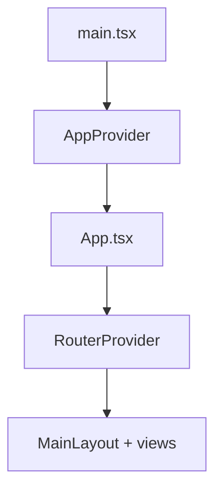

# Frontend guide

This document explains how the project interface is assembled. It also explains how the main pieces relate.

## 1. Real boot sequence

Frontend startup runs in this order:

### `main.tsx`

Responsibilities:

- locate the `root` node
- create the React root
- mount `AppProvider`
- load global styles

### `AppProvider`

Base infrastructure composition:

- `ThemeProvider` from `src/providers/`
- `SettingsProvider`
- `QueryProvider`
- `CacheProvider`
- `FileProvider`
- `Toaster`

### `App.tsx`

UI and runtime composition:

- `ThemeProvider` from `components/ui`
- `TooltipProvider`
- `ViewTransitionProvider`
- `ReactScanProvider`
- `FeedbackProvider`
- `ErrorBoundary`
- `SkipLink`
- catalog bootstrap and SSE refresh
- `RouterProvider`

## 2. Routing

The configuration lives in `src/router.tsx`.

### Characteristics

Routing has these characteristics:

- `MainLayout` as the container for the whole app
- a mix of eager and lazy views
- routes by functional domain
- wrappers for hierarchical folder cases and entity detail

### Router view families

The router groups these view families:

- dashboard
- development
- folders
- all-files / all-images
- videos / audios / documents / json-files / file3d
- favorites / collections / albums / groups / tags
- characters / places / world-items / concepts / wildcards / prompts / notes / properties
- search
- settings

## 3. Component organization

### `src/components/ui/`

This folder holds reusable primitives and wrappers.

Example responsibilities:

- buttons
- dialogs
- tooltips
- toaster
- UI providers
- accessibility

### `src/components/layout/`

This folder defines the main structure and panels of the application shell.

### `src/components/features/`

Two features dominate:

#### `file-browser-new/`

This feature covers:

- wrappers for folder routes
- hierarchical navigation
- visual exploration
- integration with panels and selection

#### `file-viewer/`

This feature covers:

- detailed viewing by entity or file
- support for different formats
- interaction with viewer stores

### `src/components/views/`

This folder is the catalog of complete functional pages. Each view folder represents a product section.

## 4. Client state

### Zustand

Location: `src/store/`

Relevant stores:

- `ui.store.ts`
- `selection.store.ts`
- `search.store.ts`
- `reindex.store.ts`
- `thumbnails.store.ts`
- `file-view.store.ts`
- `details-panel.store.ts`
- `entity-catalog-store.ts`
- `unified-file-manager.store.ts`
- per-entity stores in `entities/`

### TanStack Query

`QueryProvider` uses `queryClient` from the web layer. It serves these needs:

- response cache
- invalidation
- devtools support in development
- server-state synchronization

## 5. Providers and contexts

A combination of contexts lives in:

- `src/providers/`
- `src/lib/contexts/`
- `src/components/ui/`

### Important implication

The frontend keeps a working architecture with migration heritage. Treat providers as complementary layers. Do not treat them as one perfectly consolidated system.

## 6. Visual system

### Base styles

Styles load from:

- `src/styles/app-globals.css`
- `src/styles/globals.css`
- `src/styles/scrollbar.css`
- `src/styles/selecto.css`
- `src/styles/view-transition.css`

### Tokens

The visual system rests on:

- `tokens.css`
- `design-tokens.css`
- `STYLES-AND-THEMES-GUIDE.md`

### Themes

The app supports multiple custom themes. It also resolves the system theme.

## 7. Backend interaction

The frontend consumes the backend mainly through:

- HTTP and Query client
- stores and hooks
- SSE for refresh and progress flows
- preview, thumbnail, and original routes

## 8. Functional frontend patterns

### Navigation by domain

Each view maps one part of the domain. This avoids a single page for everything.

### Lazy loading

Lazy loading reduces the initial bundle. It spreads cost by section.

### Background bootstrap

`EntityCatalogBootstrapper` preloads the entity catalog.

### SSE refresh

`useNavigationRefresh` syncs navigation or server-side changes.

## 9. Frontend testing

### Unit and integration

Frontend tests use:

- Vitest
- jsdom
- Testing Library
- global setup in `tests/setup.ts`

### What the environment prepares

The test environment prepares:

- `@testing-library/jest-dom/vitest`
- `ResizeObserver`
- `requestAnimationFrame`
- `IntersectionObserver`
- `matchMedia`
- SQLite pragmas for the test environment

## 10. Visible risks and debt

Watch these risks:

- Dual provider and theme composition.
- High breadth in the view catalog.
- Some historical frontend README descriptions no longer match the tree exactly.
- The browser and viewer concentrate a lot of interaction complexity.

## 11. Recommendations for frontend changes

Follow this sequence when you change the frontend:

1. Look first at `router.tsx` and the involved view.
2. Identify whether the change lives in `components/views`, `features`, `store`, or `providers`.
3. Check whether the data comes from Query, Zustand, or both.
4. Confirm whether preview, thumbnail, or SSE already covers the flow.

## 12. Related reading

The following documents complete this frontend view:

- [`./ARCHITECTURE.md`](./ARCHITECTURE.md)
- [`./REPOSITORY-MAP.md`](./REPOSITORY-MAP.md)
- [`./STYLES-AND-THEMES-GUIDE.md`](./STYLES-AND-THEMES-GUIDE.md)
