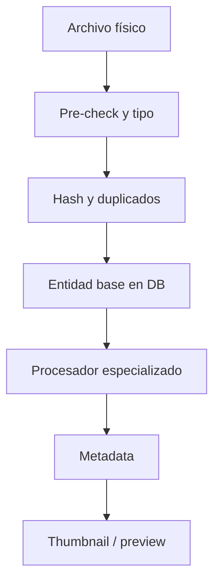

# Detalles de implementación

Este documento describe **cómo están implementados los sistemas más importantes del proyecto**. No sustituye a los archivos fuente; funciona como una guía de lectura para entender el comportamiento real del sistema.

## 1. Ingesta y mapeo de archivos

La ingestión gira alrededor de `src/services/file-entity-mapper/`.

### Componentes clave

- `core.service.ts`
- `file-entity-mapper.service.ts`
- `processors/` por tipo de archivo
- `utils/` para hash, métricas e identificación

### Pipeline conceptual

### Responsabilidades

- decidir el tipo de entidad a partir de extensión/MIME,
- evitar duplicados por hash cuando aplica,
- persistir entidad base,
- delegar metadata al procesador correcto,
- generar preview o thumbnail asociado.

## 2. Reindexado

El sistema de reindexado no es una sola función; combina varias capas.

### Piezas relevantes

- `src/services/folder/reindex/folder-reindex.service.ts`
- `src/services/folder/reindex/reindex-incremental.service.effect.ts`
- `src/services/folder/reindex/reindex-phases/`
- rutas en `src/server/routes/folders.effect.ts`
- rutas auxiliares en `src/server/routes/api/reindex-incremental.ts`

### Tipos de flujo

#### Reindexado estructurado

Se usa desde rutas como:

- `POST /api/folders/reindex-all`
- `POST /api/folders/:id/reindex`

Este flujo está orientado a la ejecución “completa” y a la emisión de progreso.

#### Reindexado incremental

La implementación Effect-TS compara hashes y tamaños almacenados con el estado actual, intentando evitar trabajo innecesario.

### Qué hace de verdad

- obtiene carpetas objetivo,
- resuelve subcarpetas si corresponde,
- recoge archivos persistidos por tipo,
- delega detección de cambios a `content-hash.service`,
- actualiza hashes/estado de entidades cambiadas,
- emite progreso hacia el frontend.

## 3. Sistema de thumbnails y previews

El proyecto usa varias rutas y servicios especializados, no un único mecanismo monolítico.

### Entradas principales

- `src/server/routes/thumbnails.effect.ts`
- `src/server/routes/thumbnails-unified.ts`
- `src/server/routes/json-thumbnails.ts`
- `src/server/routes/audio-waveforms.ts`
- `src/server/routes/3d-thumbnails.ts`
- `src/services/thumbnail/`

### Realidad operativa

- imágenes: thumbnail u original según endpoint,
- audio: waveform y datos de preview,
- JSON: preview legible,
- 3D: thumbnail/info especializado,
- carpetas: preview SVG compuesto con media reciente.

### Observación importante

La capa de previews está distribuida por tipo de contenido. Documentarla como “un solo servicio de thumbnails” sería engañoso; hay un servicio unificado, pero convive con rutas y generadores específicos.

## 4. Búsqueda

La búsqueda principal vive en `src/server/routes/search.effect.ts`.

### Endpoints clave

- `GET /api/search`
- `GET /api/search/images`
- `GET /api/search/fts`

### Comportamiento

- `performSearch` resuelve búsqueda global por tipo y paginación.
- `searchFilesFts` intenta usar FTS y puede degradar a fallback.
- `SEARCH_FTS_REQUIRE=1` obliga el uso de FTS cuando se necesite comportamiento estricto.

### Consecuencia práctica

La búsqueda tiene dos modos conceptuales:

1. **búsqueda funcional y flexible**, que puede caer a LIKE,
2. **búsqueda explícitamente FTS**, que puede fallar si el entorno no la soporta.

## 5. Operaciones de archivos

La base de operaciones físicas pasa por:

- `src/server/routes/files.effect.ts`
- `src/services/file/`

### Capacidades relevantes

- leer contenido de directorios,
- crear directorios,
- renombrar,
- copiar,
- mover,
- consultar contenido de archivos,
- descargar recursos.

Este sistema alimenta tanto funciones de mantenimiento como operaciones de UI avanzadas.

## 6. Batch operations, selección y undo/redo

### Selección

Se apoya en Zustand y stores como:

- `selection.store.ts`
- `unified-file-manager.store.ts`

### Undo/redo

Existe una implementación concreta en:

- `src/services/undo-redo/undo-redo-manager.ts`

Esta pieza:

- mantiene historial,
- soporta `execute`, `undo` y `redo`,
- modela acciones como copiar, mover, eliminar o renombrar,
- usa un `EventEmitter` compatible con navegador,
- emite cambios de estado y notificaciones.

No es un placeholder vacío; es una implementación real, aunque con límites lógicos en acciones como borrado irreversible.

## 7. Frontend: navegación y viewer

### Navegación

El router expone una gran cantidad de vistas lazy/eager bajo `MainLayout`.

### File browser

El browser nuevo vive en `src/components/features/file-browser-new/` y funciona como una capa clave para:

- navegación jerárquica,
- previews de carpeta,
- composición con wrappers,
- integración con stores y vistas.

### File viewer

`src/components/features/file-viewer/` concentra la visualización detallada. El proyecto además tiene viewers y content views específicos dentro de `components/views/*`.

## 8. Providers y compatibilidad interna

La composición de providers refleja una arquitectura en transición.

### Capa externa (`AppProvider`)

- `providers/theme-provider.tsx`
- `SettingsProvider`
- `QueryProvider`
- `CacheProvider`
- `FileProvider`

### Capa interna (`App.tsx`)

- `components/ui/theme-provider.tsx`
- `TooltipProvider`
- `ViewTransitionProvider`
- `FeedbackProvider`
- `ErrorBoundary`

### Qué implica

- Hay compatibilidad heredada de una migración previa.
- El estado de tema/contexto está repartido.
- Esta situación debe tratarse como deuda técnica controlada, no como error invisible.

## 9. Tauri y escritorio

### Configuración

`src-tauri/tauri.conf.json` define:

- `devUrl` apuntando al frontend local,
- bundling de recursos del backend compilado,
- ventana principal y opciones de seguridad,
- assets de iconos.

### Puente nativo

El código Rust en `src-tauri/src/` complementa funciones desktop. La app no reescribe la lógica de negocio en Rust; usa Rust para integración nativa, no para duplicar el backend Express.

## 10. Logging y observabilidad

### Cliente

- `src/lib/logger/client-logger.ts`

### Servidor

- `src/lib/logger/server-logger.ts`
- `src/server/middleware/logging.ts`

### Utilidades operativas

- `scripts/run-with-log.js`
- `scripts/logging-utils.js`
- `bun run logs:list`
- `bun run check:errors`

El proyecto está pensado para dejar rastro suficiente durante build, test, runtime y procesos largos.

## 11. Testing y entorno de pruebas

### Vitest

- entorno `jsdom`,
- setup en `tests/setup.ts`,
- paralelismo desactivado por conflictos potenciales con SQLite,
- polyfills para observers y RAF,
- ajuste de pragmas SQLite al iniciar tests.

### Playwright

- levanta `bun run dev:full`,
- usa `http://localhost:5173` como base,
- corre principalmente sobre Chromium.

## 12. Tooling y scripts

### Vite+

`vite.config.ts` define:

- chunks manuales,
- proxy hacia backend,
- exclusión de módulos server-only en cliente,
- configuración de lint/fmt integrada en el ecosistema `vp`.

### Scripts relevantes

- desarrollo (`dev:*`)
- build (`build:*`)
- chequeos (`check`, `lint`, `format`, `tsc`)
- DB (`db:*`)
- logs (`logs:*`)
- Playwright (`test:e2e`, `playwright:*`)

## 13. Puntos delicados para mantenimiento

- Evitar documentar como “simple CRUD” un backend que mezcla JSON, SSE, binarios y previews.
- Distinguir claramente entre rutas de dominio y rutas de debug/operación.
- Recordar que el producto tiene coexistencia de capas heredadas y modernas.
- No asumir que todo el procesamiento multimedia pasa por una sola abstracción.

## 14. Lecturas siguientes

- [`./ARCHITECTURE.md`](./ARCHITECTURE.md)
- [`./SERVICES-GUIDE.md`](./SERVICES-GUIDE.md)
- [`./API-REFERENCE.md`](./API-REFERENCE.md)
- [`./DATABASE-SCHEMA.md`](./DATABASE-SCHEMA.md)
