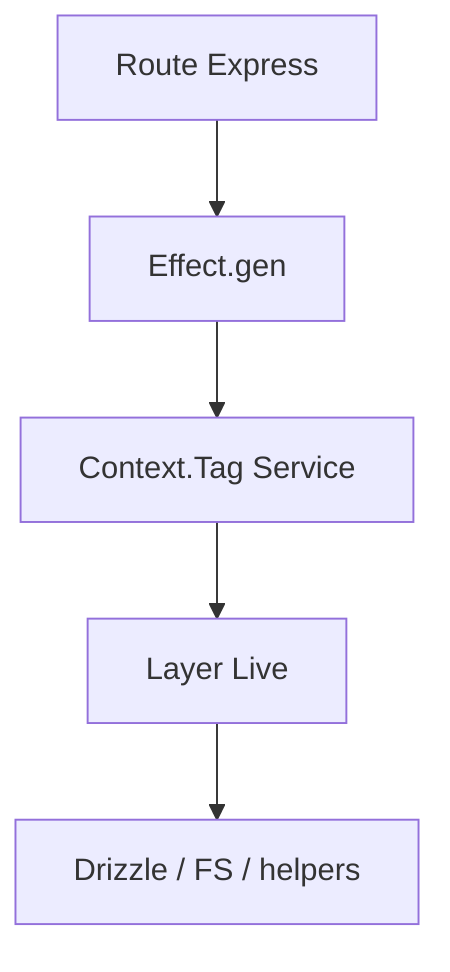

# Guía de servicios

Esta guía documenta la capa de negocio del proyecto: su estructura, patrones y sistemas relevantes.

## 1. Rol de la capa de servicios

`src/services/` contiene la lógica que traduce el dominio del producto a operaciones concretas sobre:

- base de datos,
- sistema de archivos,
- thumbnails,
- metadata,
- búsquedas,
- acciones de mantenimiento.

La intención del proyecto es que las rutas Express deleguen aquí y no implementen negocio complejo directamente.

## 2. Organización del directorio

### Servicios por entidad

- `image/`
- `video/`
- `audio/`
- `document/`
- `json-file/`
- `file3d/`
- `uploaded-images/`
- `folder/`
- `album/`
- `collection/`
- `group/`
- `tag/`
- `note/`
- `prompt/`
- `property/`
- `task/`
- `wildcard/`
- `character/`
- `place/`
- `concept/`
- `world-item/`
- `worldbuilding/`
- `profile/`
- `settings/`
- `favorite/`

### Servicios de sistema

- `thumbnail/`
- `thumbnail-config/`
- `progress/`
- `cache/`
- `activity/`
- `metadata/`
- `stats/`
- `toast/`
- `undo-redo/`
- `clipboard/`
- `drag-selection/`
- `download/`
- `queue-job/`
- `file/`
- `file-changes/`
- `file-entity-mapper/`
- `folder-files/`

## 3. Patrón de servicio predominante

### Estructura observada

Muchos dominios siguen esta familia de archivos:

- `*.service.ts`
- `*.service.effect.ts`
- `*-errors.effect.ts`
- eventos/helpers auxiliares

### Qué significa

- la capa clásica aún existe en algunos lugares,
- la capa nueva usa **Effect-TS**,
- el repo está orientado a seguir consolidando el patrón effect.

## 4. Ejemplo real: `ImageService`

`src/services/image/image.service.effect.ts` muestra bien el patrón actual.

### Rasgos observables

- validación de input con schemas effect,
- errores tipados (`ImageNotFound`, `ImageValidationError`, etc.),
- operaciones CRUD y operaciones enriquecidas,
- soporte a favoritos, batch delete, thumbnail y búsqueda por hash,
- `Context.Tag` + `Layer` para inyección.

### Capacidades de `ImageService`

- crear,
- obtener por id,
- obtener por id con stats,
- listar con filtros,
- actualizar,
- borrar individual o por lote,
- contar por carpeta,
- togglear favorito,
- operar thumbnails y original,
- buscar por hash o por path+folder.

## 5. Effect-TS en la práctica

### Patrón conceptual

### Ventajas en este proyecto

- errores tipados,
- composición explícita,
- mejor control de efectos asíncronos,
- adaptación clara a Express mediante adapters.

## 6. Sistemas transversales importantes

### File Entity Mapper

Ubicación: `src/services/file-entity-mapper/`

Responsabilidad:

- convertir archivo físico en entidad persistida,
- elegir procesador correcto,
- orquestar metadata y preview.

### Reindexado

Ubicación principal:

- `src/services/folder/reindex/`

Responsabilidad:

- reindexado estructurado,
- reindexado incremental,
- fases de procesamiento,
- integración con emisión de progreso.

### Thumbnailing

Ubicación principal:

- `src/services/thumbnail/`

Responsabilidad:

- generación/lectura de thumbnails,
- coordinación con endpoints y previews,
- configuración específica en `thumbnail-config/`.

### Progress tracking

Ubicación:

- `src/services/progress/`

Responsabilidad:

- seguimiento de procesos largos,
- soporte para UI y operaciones largas del servidor.

## 7. Relación con rutas y frontend

### Rutas

Las rutas Express consumen servicios para:

- CRUD,
- búsqueda,
- previews,
- operaciones batch,
- descargas,
- reindexado,
- eventos.

### Frontend

El frontend normalmente no consume estos servicios directamente; lo hace mediante la API o mediante stores/adapters intermedios.

## 8. Qué no conviene asumir

- que todos los servicios son CRUD simples,
- que todo pasa por un solo `index.ts`,
- que el repo usa solo la capa heredada o solo Effect-TS,
- que thumbnails y metadata viven en un único punto del sistema.

## 9. Riesgos de mantenimiento

- anchura funcional del directorio `services/`,
- coexistencia de implementaciones nuevas y heredadas,
- fuerte dependencia del conocimiento del dominio,
- posibilidad de dispersión si no se respetan las responsabilidades por carpeta.

## 10. Cómo abordar un cambio nuevo

1. Identificar si es cambio de dominio o de infraestructura.
2. Revisar carpeta de servicio existente.
3. Confirmar si ya hay versión `effect`.
4. Revisar la ruta Express que lo expone.
5. Verificar si requiere transformer, store o preview asociado.

## 11. Lecturas relacionadas

- [`./ARCHITECTURE.md`](./ARCHITECTURE.md)
- [`./IMPLEMENTATION-DETAILS.md`](./IMPLEMENTATION-DETAILS.md)
- [`./API-REFERENCE.md`](./API-REFERENCE.md)
