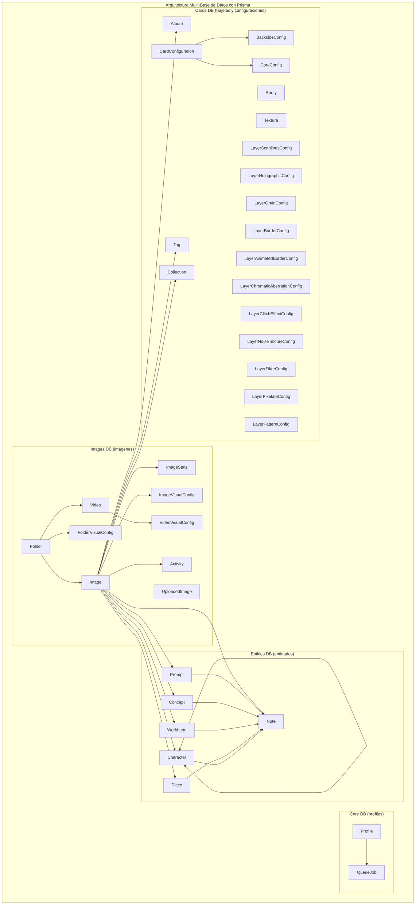

# Migración a PostgreSQL

## Arquitectura de Bases de Datos Propuesta

## Estructura de Relaciones entre Bases de Datos

La arquitectura propuesta divide el esquema actual en 4 bases de datos PostgreSQL separadas pero relacionadas:

1. **Core DB (profiles)**: Contiene los modelos fundamentales para el funcionamiento del sistema.
   - Profile: Perfiles de usuario
   - QueueJob: Sistema de colas

2. **Images DB (imágenes)**: Gestiona todo lo relacionado con imágenes y carpetas.
   - Image: Imágenes y sus metadatos
   - Folder: Estructura de carpetas
   - Video: Videos
   - Configuraciones visuales relacionadas
   - Estadísticas y actividades

3. **Entities DB (entidades)**: Almacena las entidades del mundo.
   - Character: Personajes
   - Place: Lugares
   - WorldItem: Objetos del mundo
   - Concept: Conceptos
   - Prompt: Prompts
   - Note: Notas

4. **Cards DB (tarjetas y configuraciones)**: Gestiona las tarjetas y sus configuraciones visuales.
   - Album, Tag, Collection: Organizadores de contenido
   - CardConfiguration: Configuración de tarjetas
   - Rarity, Texture: Propiedades de tarjetas
   - Configuraciones de capas y efectos visuales

Las relaciones entre bases de datos se mantienen mediante referencias a IDs, permitiendo consultas entre ellas.