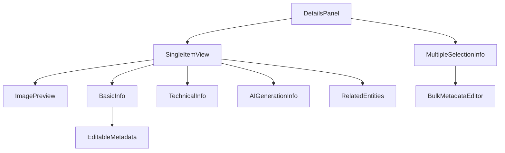

# Panel de Detalles

## Visión general

El Panel de Detalles es un componente clave para visualizar y editar información sobre los elementos seleccionados en el FileBrowser. Proporciona una interfaz rica para ver metadatos, editar información y realizar acciones sobre los elementos.



## Componentes principales

### DetailsPanel

Componente principal que gestiona la visualización de detalles para uno o múltiples elementos seleccionados.

```tsx
<DetailsPanel selectedItems={selectedItems} />
```

### MultipleSelectionInfo

Muestra información agregada cuando se seleccionan múltiples elementos:
- Resumen de tipos de archivo
- Tamaño total
- Etiquetas comunes
- Colecciones compartidas
- Miniaturas de los elementos seleccionados

```tsx
<MultipleSelectionInfo items={selectedItems} />
```

### EditableMetadata

Permite editar metadatos básicos (título y descripción) de un elemento individual:

```tsx
<EditableMetadata
  item={item}
  onUpdate={handleUpdateMetadata}
/>
```

### BulkMetadataEditor

Permite editar metadatos de múltiples elementos a la vez:

```tsx
<BulkMetadataEditor items={selectedItems} />
```

## Funcionalidades

### Visualización de detalles individuales

Cuando se selecciona un único elemento, el panel muestra:
- Vista previa de la imagen
- Información básica (nombre, descripción, tamaño, tipo)
- Información técnica (resolución, formato, espacio de color)
- Información de generación por IA (si está disponible)
- Entidades relacionadas (colecciones, etiquetas, etc.)

### Visualización de selección múltiple

Cuando se seleccionan múltiples elementos, el panel muestra:
- Resumen de los elementos seleccionados (cantidad, tipos, tamaño total)
- Miniaturas de los elementos
- Metadatos comunes
- Etiquetas y colecciones compartidas
- Acciones masivas

### Edición de metadatos

El panel permite editar metadatos de dos formas:

1. **Edición individual**: Para un elemento único, permite editar:
   - Título
   - Descripción

2. **Edición masiva**: Para múltiples elementos, permite aplicar a todos:
   - Título común
   - Descripción común

### Acciones masivas

Cuando hay múltiples elementos seleccionados, se pueden realizar acciones como:
- Descargar todos los elementos
- Añadir etiquetas a todos
- Añadir a una colección
- Mover a otra carpeta
- Eliminar elementos

## Integración con otros componentes

El Panel de Detalles se integra con:

- **FileBrowser**: Recibe los elementos seleccionados
- **Server Actions**: Para guardar los cambios en los metadatos
- **RightPanel**: Se muestra como contenido del panel lateral derecho

## Rendimiento

Para garantizar un buen rendimiento:

- Los componentes están memorizados para evitar renderizados innecesarios
- La carga de metadatos se realiza de forma asíncrona
- Se utiliza un sistema de caché para evitar solicitudes repetidas

## Accesibilidad

El panel incluye características de accesibilidad como:
- Etiquetas adecuadas para los campos de formulario
- Estados de carga visibles
- Mensajes de error claros
- Soporte para navegación por teclado