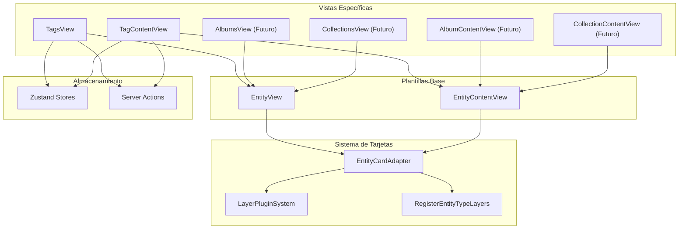
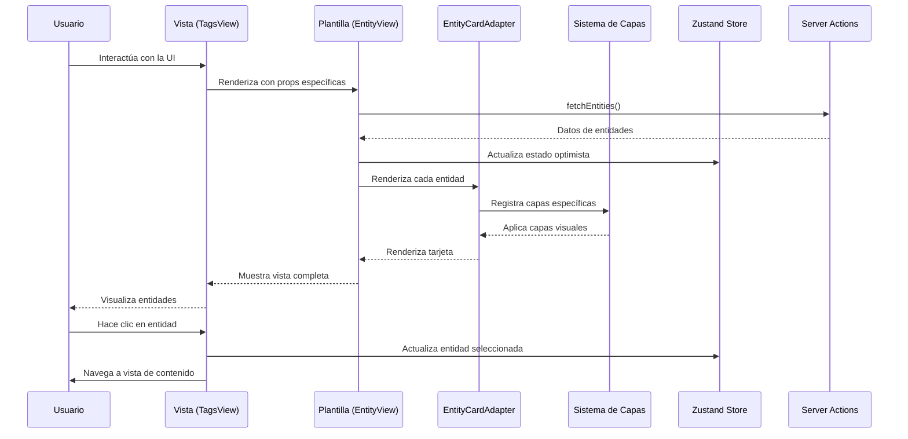
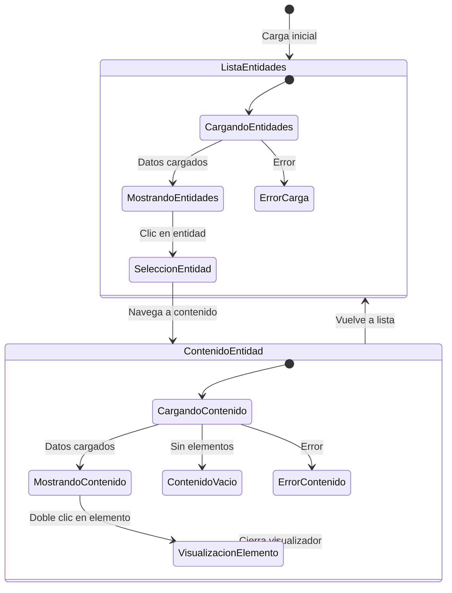

# Diagrama de Flujo: Sistema de Vistas con EntityCard

Este documento describe el flujo de trabajo y la arquitectura del nuevo sistema de vistas que utiliza el componente EntityCard.

## Diagrama de Arquitectura

## Flujo de Datos

## Flujo de Interacción

