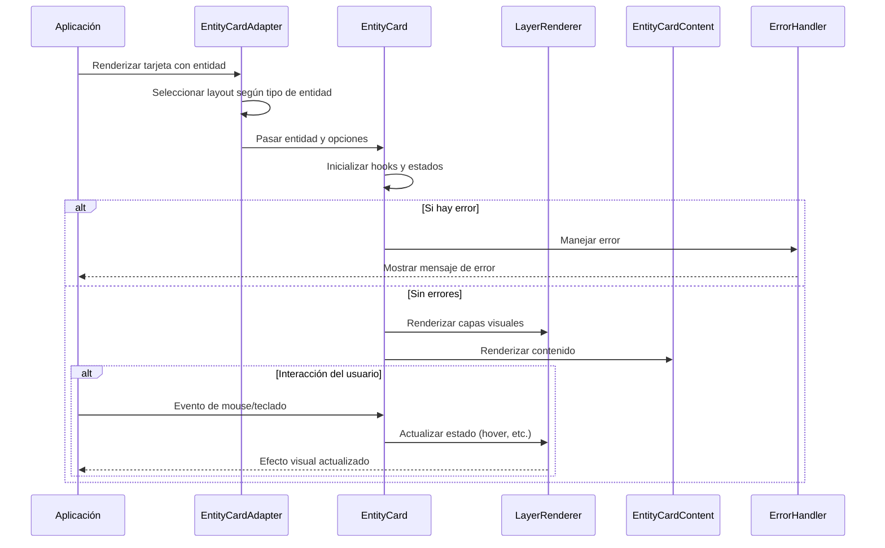
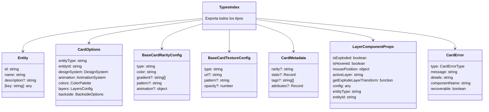
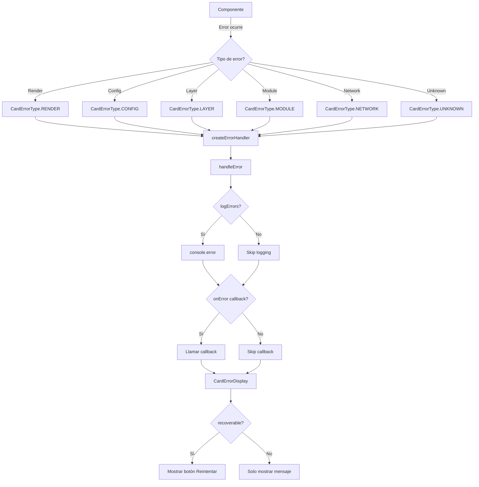
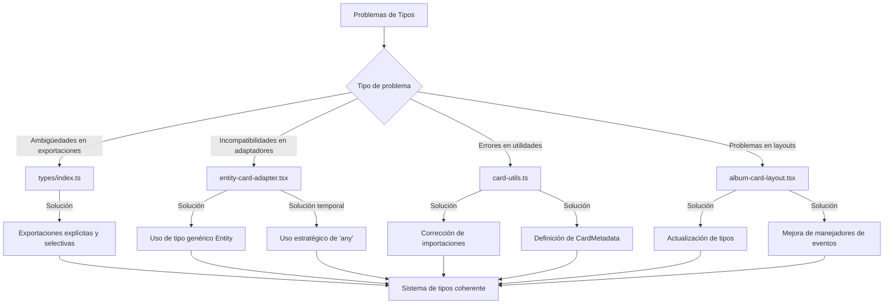

# Arquitectura del Sistema Entity Cards

## Diagrama de Componentes

```mermaid
graph TD
    subgraph "Componentes Principales"
        EntityCard[EntityCard]
        EntityCardAdapter[EntityCardAdapter]
        EntityCardContent[EntityCardContent]
        EntityCardWrapper[EntityCardWrapper]
        EntityCardLayerWrapper[EntityCardLayerWrapper]
    end

    subgraph "Sistema de Capas"
        LayerRenderer[LayerRenderer]
        LayerPluginSystem[LayerPluginSystem]
        RegisterLayers[RegisterLayers]

        subgraph "Capas Individuales"
            GlowLayer[GlowLayer]
            BorderLayer[BorderLayer]
            ScanlinesLayer[ScanlinesLayer]
            HolographicLayer[HolographicLayer]
            GrainLayer[GrainLayer]
            ShaderLayer[ShaderLayer]
        end
    end

    subgraph "Layouts Específicos"
        AlbumCardLayout[AlbumCardLayout]
        FolderCardLayout[FolderCardLayout]
        TagCardLayout[TagCardLayout]
        ImageCardLayout[ImageCardLayout]
    end

    subgraph "Módulos"
        AnimationModule[AnimationModule]
        BacksideModule[BacksideModule]
        ColorsModule[ColorsModule]
        CoreModule[CoreModule]
        DesignModule[DesignModule]
    end

    subgraph "Sistema de Tipos"
        TypesIndex[types/index.ts]
        UnifiedCardTypes[unified-card-types.ts]
        CardLayerTypes[card-layer-types.ts]
        BaseCardTypes[base-card-types.ts]
        SharedCardTypes[shared-card-types.ts]
    end

    subgraph "Utilidades"
        ErrorHandler[error-handler.tsx]
        CardUtils[card-utils.ts]
    end

    EntityCard --> EntityCardContent
    EntityCard --> LayerRenderer
    EntityCard --> BacksideModule
    EntityCard --> ErrorHandler

    EntityCardAdapter --> EntityCardWrapper
    EntityCardAdapter --> AlbumCardLayout
    EntityCardAdapter --> FolderCardLayout
    EntityCardAdapter --> TagCardLayout
    EntityCardAdapter --> ImageCardLayout

    LayerRenderer --> GlowLayer
    LayerRenderer --> BorderLayer
    LayerRenderer --> ScanlinesLayer
    LayerRenderer --> HolographicLayer
    LayerRenderer --> GrainLayer
    LayerRenderer --> ShaderLayer

    EntityCard --> AnimationModule
    EntityCard --> ColorsModule
    EntityCard --> DesignModule

    TypesIndex --> UnifiedCardTypes
    TypesIndex --> CardLayerTypes
    TypesIndex --> BaseCardTypes
    TypesIndex --> SharedCardTypes

    EntityCard --> TypesIndex
    LayerRenderer --> TypesIndex
    EntityCardAdapter --> TypesIndex
    AlbumCardLayout --> TypesIndex
    CardUtils --> TypesIndex
```

## Flujo de Datos

## Sistema de Tipos Centralizado (Actualizado)

## Sistema de Manejo de Errores

## Solución de Problemas de Tipos

