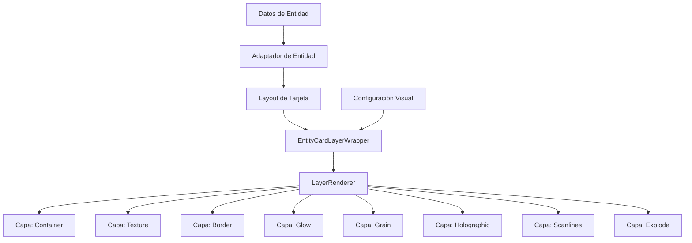

# Documentación del Sistema de Entity Cards

## Fecha: 16/03/2024

## Introducción

El sistema de Entity Cards es un conjunto de componentes React diseñados para mostrar diferentes tipos de entidades (álbumes, colecciones, personajes, etc.) en forma de tarjetas interactivas con efectos visuales avanzados. Este sistema utiliza un enfoque modular basado en capas que permite personalizar la apariencia y comportamiento de las tarjetas.

## Arquitectura del Sistema

El sistema de Entity Cards está organizado en varias capas:

1. **Adaptadores**: Conectan los datos de las entidades con los componentes de presentación.
2. **Layouts**: Definen la estructura visual de cada tipo de tarjeta.
3. **Capas (Layers)**: Implementan efectos visuales como bordes, brillos, texturas, etc.
4. **Formularios**: Permiten la edición de datos de las entidades.
5. **Utilidades**: Funciones auxiliares para manipulación de datos y configuraciones.

### Diagrama de Arquitectura



## Componentes Principales

### EntityCardAdapter

Este componente actúa como punto de entrada para el sistema, adaptando los datos de una entidad específica al formato requerido por los layouts de tarjetas.

```typescript
import { EntityCardAdapter } from '@/components/features/entity-cards/entity-card-adapter';

// Ejemplo de uso
<EntityCardAdapter
  entityType="album"
  entity={albumData}
  options={{
    enableGlowEffect: true,
    enableHolographicEffect: true,
  }}
  onClick={() => handleCardClick(albumData.id)}
/>
```

### Layouts de Tarjetas

Cada tipo de entidad tiene su propio layout que define cómo se muestra la información específica de ese tipo.

Layouts disponibles:

- AlbumCardLayout
- CharacterCardLayout
- CollectionCardLayout
- ConceptCardLayout
- FolderCardLayout
- NoteCardLayout
- PlaceCardLayout
- PromptCardLayout
- TagCardLayout
- WorldItemCardLayout

### EntityCardLayerWrapper

Este componente envuelve el contenido de la tarjeta y gestiona la renderización de las diferentes capas visuales.

```typescript
import { EntityCardLayerWrapper } from '@/components/features/entity-cards/entity-card-layer-wrapper';

// Ejemplo de uso
<EntityCardLayerWrapper
  title="Título de la Tarjeta"
  description="Descripción de la tarjeta"
  entityType="album"
  entityId="123"
  visualOptions={{
    enableGlowEffect: true,
    enableHolographicEffect: true,
    glowOptions: {
      intensity: 0.7,
      size: 15,
    },
  }}
/>
```

### Sistema de Capas

El sistema de capas permite añadir efectos visuales a las tarjetas. Cada capa se encarga de un efecto específico y puede ser activada o desactivada según las necesidades.

Capas disponibles:

- Container: Contenedor base de la tarjeta
- Texture: Textura de fondo
- Border: Borde decorativo
- Glow: Efecto de brillo
- Grain: Efecto de grano
- Holographic: Efecto holográfico
- Scanlines: Efecto de líneas de escaneo
- Explode: Efecto de explosión para mostrar capas separadas

## Adaptadores Personalizados

El sistema utiliza adaptadores personalizados para convertir los datos de las entidades al formato esperado por los layouts.

```typescript
import { createCustomCardAdapter } from '@/components/features/entity-cards/adapters/card-adapter-factory';

// Ejemplo de creación de un adaptador personalizado
const MyCustomCard = createCustomCardAdapter<CustomEntity, CustomCardProps, 'customEntity'>(
	CustomCardLayout,
	'customEntity',
	(props) => {
		return {
			data: props.customEntity,
			// Otras propiedades necesarias para el layout
		};
	}
);
```

## Formularios de Entidades

El sistema incluye formularios para la creación y edición de diferentes tipos de entidades.

```typescript
import { AlbumForm } from '@/components/features/entity-cards/layouts/forms/album-form';

// Ejemplo de uso
<AlbumForm
  initialData={albumData}
  onSubmit={handleSubmit}
  onCancel={handleCancel}
  isLoading={isLoading}
/>
```

## Configuración Visual

Las tarjetas pueden ser personalizadas con diferentes opciones visuales:

```typescript
const visualOptions = {
	enable3DEffect: true,
	enableHolographicEffect: true,
	enableGlowEffect: true,
	enableBorderEffect: true,
	enableGrainEffect: true,

	designSystem: {
		preset: 'album',
		variant: 'default',
		aspectRatio: '4/5',
		cornerStyle: 'rounded',
		cornerRadius: 8,
		elevation: 2,
		shadowStyle: 'soft',
	},

	holographicOptions: {
		patternType: 'linear',
		intensity: 0.5,
		animationSpeed: 1,
		visibleOnHover: true,
	},

	glowOptions: {
		intensity: 0.7,
		size: 15,
		blurAmount: 10,
		animationType: 'pulse',
		pulseSpeed: 1.5,
		visibleOnHover: true,
	},

	// Otras opciones...
};
```

## Migración del Sistema Antiguo al Nuevo

Si estás utilizando el sistema antiguo de capas, puedes migrar al nuevo sistema siguiendo estos pasos:

1. Reemplaza las importaciones del sistema antiguo:

   ```typescript
   // Antiguo
   import { LayerRenderer } from '@/components/features/entity-cards/modules/layers/layer-plugin-system';

   // Nuevo
   import { LayerRenderer } from '@/components/features/entity-cards/layers/layer-plugin-system';
   ```

2. Actualiza las propiedades del LayerRenderer:

   ```typescript
   // Antiguo
   <LayerRenderer
     layers={layers}
     context={context}
   />

   // Nuevo
   <LayerRenderer
     isExploded={isExploded}
     isHovered={isHovered}
     mousePosition={mousePosition}
     activeLayer={activeLayer}
     getExplodeLayerTransform={getExplodeLayerTransform}
     entityType={entityType}
     entityId={entityId}
     configs={configs}
     context={context}
   />
   ```

3. Utiliza el adaptador para componentes antiguos si es necesario:

   ```typescript
   import { adaptLegacyLayer } from '@/components/features/entity-cards/modules/layers/layer-plugin-system';

   const adaptedLayer = adaptLegacyLayer(legacyLayer);
   ```

## Ejemplos de Uso

### Tarjeta de Álbum Básica

```tsx
import { AlbumCard } from '@/components/features/entity-cards/layouts/album-card';

function MyComponent() {
	const albumData = {
		id: '123',
		name: 'Mi Álbum',
		description: 'Descripción del álbum',
		emoji: '📷',
		color: '#3b82f6',
		// Otras propiedades...
	};

	return (
		<AlbumCard
			album={albumData}
			onClick={() => console.log('Álbum clickeado')}
			onEdit={(id) => console.log(`Editar álbum ${id}`)}
			onDelete={(id) => console.log(`Eliminar álbum ${id}`)}
		/>
	);
}
```

### Tarjeta con Efectos Visuales Personalizados

```tsx
import { EntityCardAdapter } from '@/components/features/entity-cards/entity-card-adapter';

function MyComponent() {
	const characterData = {
		id: '456',
		name: 'Personaje',
		description: 'Descripción del personaje',
		// Otras propiedades...
	};

	const customOptions = {
		enableGlowEffect: true,
		enableHolographicEffect: true,
		glowOptions: {
			intensity: 0.9,
			size: 20,
			color: '255, 0, 0', // Rojo
		},
		holographicOptions: {
			patternType: 'radial',
			intensity: 0.7,
		},
	};

	return (
		<EntityCardAdapter
			entityType="character"
			entity={characterData}
			options={customOptions}
			enableExplode={true}
			onExplodedChange={(isExploded) => console.log(`Explosión: ${isExploded}`)}
		/>
	);
}
```

## Mejores Prácticas

1. **Uso de Adaptadores**: Utiliza los adaptadores proporcionados para cada tipo de entidad en lugar de crear implementaciones personalizadas.

2. **Configuración Visual**: Mantén las configuraciones visuales en archivos separados para facilitar su reutilización.

3. **Rendimiento**: Para mejorar el rendimiento, utiliza memoización para evitar renderizados innecesarios:

   ```tsx
   const memoizedOptions = useMemo(
   	() => ({
   		enableGlowEffect: true,
   		// Otras opciones...
   	}),
   	[
   		/* dependencias */
   	]
   );
   ```

4. **Tipos**: Utiliza los tipos proporcionados por el sistema para garantizar la seguridad de tipos:

   ```tsx
   import type { CardOptions } from '@/components/features/entity-cards/types/unified-card-types';

   const options: Partial<CardOptions> = {
   	// Opciones...
   };
   ```

5. **Gestión de Errores**: Implementa manejo de errores adecuado para casos donde los datos de la entidad puedan ser inválidos o incompletos.

## Conclusión

El sistema de Entity Cards proporciona una forma flexible y potente de mostrar diferentes tipos de entidades con efectos visuales avanzados. Su arquitectura modular permite personalizar cada aspecto de las tarjetas y adaptarlas a las necesidades específicas de tu aplicación.
