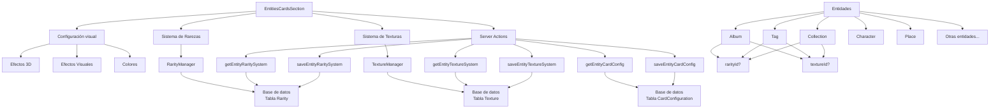

# Sistema de Configuración de Tarjetas de Entidades

El sistema de configuración de tarjetas de entidades permite personalizar visualmente cómo se muestran las diferentes entidades (álbumes, etiquetas, colecciones, etc.) en forma de tarjetas dentro de la aplicación.

## Arquitectura

El sistema está compuesto por los siguientes componentes principales:

## Componentes Principales

### 1. EntitiesCardsSection

Componente principal que agrupa toda la configuración y permite seleccionar la entidad a configurar. Maneja el estado global y la comunicación con las acciones del servidor.

### 2. RarityManager

Permite gestionar los diferentes niveles de rareza para cada tipo de entidad:

- Crear, editar y eliminar rarezas
- Asignar colores y probabilidades
- Distribuir automáticamente las probabilidades
- Vista previa de rarezas

### 3. TextureManager

Permite gestionar las texturas que se pueden aplicar a las tarjetas:

- Crear, editar y eliminar texturas
- Definir patrones CSS y colores
- Aplicar presets predefinidos
- Vista previa en tiempo real

### 4. Server Actions

Funciones del servidor para gestionar la persistencia de los datos:

- `getEntityCardConfig`: Obtiene la configuración de tarjetas para un tipo de entidad
- `saveEntityCardConfig`: Guarda la configuración de tarjetas
- `getEntityRaritySystem`: Obtiene el sistema de rarezas para un tipo de entidad
- `saveEntityRaritySystem`: Guarda la configuración del sistema de rarezas
- `getEntityTextureSystem`: Obtiene el sistema de texturas para un tipo de entidad
- `saveEntityTextureSystem`: Guarda la configuración del sistema de texturas

## Modelos de Base de Datos

### CardConfiguration

Almacena la configuración visual general de las tarjetas para cada tipo de entidad.

### Rarity

Almacena la configuración de rarezas para cada tipo de entidad:

- Nombre de la rareza
- Color
- Probabilidad
- Orden
- Descripción

### Texture

Almacena la configuración de texturas para cada tipo de entidad:

- Nombre de la textura
- Patrón CSS
- Colores primario y secundario
- Orden
- Descripción

## Funcionalidades Principales

1. **Configuración visual de tarjetas**:

   - Efectos 3D (rotación, elevación)
   - Efectos visuales (holográfico, scanlines, brillo)
   - Colores personalizados

2. **Sistema de rarezas**:

   - Definición de múltiples niveles de rareza
   - Colores y probabilidades personalizadas
   - Distribución automática basada en posición

3. **Sistema de texturas**:

   - Patrones CSS personalizados
   - Presets predefinidos (metálico, holográfico, etc.)
   - Vista previa en tiempo real

4. **Activación/desactivación de sistemas**:
   - Cada sistema (rareza, textura) puede activarse/desactivarse independientemente
   - La configuración se mantiene incluso cuando está desactivada

## Uso

El sistema está diseñado para ser extensible y puede aplicarse a cualquier tipo de entidad que necesite una representación visual en forma de tarjeta. Actualmente soporta:

- Álbumes
- Etiquetas
- Colecciones
- Personajes
- Lugares
- Objetos del mundo
- Conceptos
- Prompts
- Notas

## Posibles Extensiones Futuras

1. **Sistema de categorías**: Permitir categorizar entidades con colores y estilos específicos
2. **Efectos avanzados**: Añadir más efectos visuales como partículas, sombras avanzadas, etc.
3. **Plantillas completas**: Permitir guardar y cargar configuraciones completas como plantillas
4. **Integración con IA**: Generar automáticamente texturas y estilos con IA
5. **Animaciones personalizadas**: Permitir definir comportamientos de animación específicos
