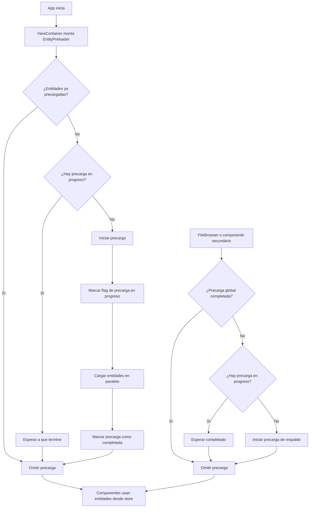

# Optimización de EntityPreloader para Precarga Centralizada de Entidades

## 📑 Resumen

Este documento describe la implementación optimizada del sistema de precarga de entidades en la aplicación de gestión de imágenes. El objetivo es proporcionar un mecanismo eficiente para cargar las entidades necesarias (colecciones, etiquetas, álbumes, etc.) de forma centralizada, evitando montajes redundantes y llamadas innecesarias.

## 🔍 Problema Original

La implementación anterior presentaba los siguientes problemas:

1. **Montajes redundantes**: Múltiples instancias de `EntityPreloader` se montaban en la jerarquía de componentes.
2. **Llamadas duplicadas**: Cada vista realizaba sus propias llamadas para cargar entidades.
3. **Logs excesivos**: El sistema mostraba mensajes como:
   ```
   ℹ️ INFO [EntityLoader] ✅ Precarga global ya completada, omitiendo cualquier precarga...
   ℹ️ INFO [EntityPreloader] ✅ Entidades ya precargadas globalmente, omitiendo precarga
   ```
4. **Ciclos infinitos de renders**: Componentes realizando verificaciones redundantes de precarga causaban ciclos de renders.

## 🛠️ Solución Implementada

### 1. Centralización del EntityPreloader

Se centralizó la precarga de entidades en un solo punto de la aplicación:

```jsx
// src/components/views/view-container.tsx
export function ViewContainer() {
  return (
    <div>
      {/* Único lugar donde debe montarse el EntityPreloader */}
      <EntityPreloader
        mode="all"
        respectGlobalState={false}
        onPreloadComplete={() => {
          console.log('Todas las entidades precargadas con éxito');
        }}
      />

      {/* Resto del contenido... */}
    </div>
  );
}
```

### 2. Mejoras en el Componente EntityPreloader

El componente `EntityPreloader` ahora:

- Verifica si la precarga ya se realizó antes de iniciar una nueva
- Utiliza un estado global para indicar si las entidades están cargadas
- Detecta y respeta precargas en progreso de otros componentes
- Evita cargas duplicadas con mejor coordinación
- Proporciona opciones para controlar el comportamiento de precarga:

```typescript
interface EntityPreloaderProps {
  /**
   * Modo de carga de entidades:
   * - 'all': Carga todas las entidades definidas en ALL_ENTITIES
   * - 'priority': Carga solo las entidades prioritarias definidas en PRIORITY_ENTITIES
   * - 'custom': Carga solo las entidades especificadas en customEntities
   */
  mode?: PreloaderMode;

  /**
   * Lista personalizada de entidades a cargar (solo usado si mode es 'custom')
   */
  customEntities?: string[];

  /**
   * Función a ejecutar cuando la precarga se completa
   */
  onPreloadComplete?: () => void;

  /**
   * Si se establece en false, se omitirá la verificación global y siempre se ejecutará
   * Útil solo para el preloader principal en layout.tsx
   * @default true
   */
  respectGlobalState?: boolean;
}
```

### 3. Mejoras en el Hook useEntityLoader

- Verificación mejorada de datos existentes en el store
- Mejor detección de precarga global ya ejecutada
- Mecanismo de espera para entidades que están siendo cargadas por otros componentes
- Mejor manejo de errores durante la carga

### 4. Solución para Ciclos Infinitos de Renders

Los ciclos infinitos de renders se resolvieron mediante:

- Uso de referencias (`useRef`) para controlar si una precarga ya se inició
- Coordinación entre componentes mediante flags globales en `window`
- Mejor detección de precargas activas
- Limpieza adecuada al desmontar componentes

```javascript
// Coordinación global entre componentes
declare global {
  interface Window {
    entityPreloadComplete?: boolean;
    entityPreloadInProgress?: boolean;
    preloadingEntities?: Set<string>;
  }
}
```

### 5. Implementación de Mecanismo de Respaldo

- El componente `FileBrowser` ahora actúa como respaldo, solo iniciando precarga si no se detecta una precarga global completada
- Mecanismo de espera cuando detecta una precarga en progreso
- Limpieza adecuada de estados al desmontar

## 📊 Diagrama de Flujo de Precarga



## 📚 Reglas de Uso

1. **Un solo EntityPreloader principal**: Solo debe existir una instancia principal de `EntityPreloader` en el layout principal con `respectGlobalState={false}`
2. **Entidades prioritarias**: Cargar primero las entidades más importantes usando el modo 'priority'
3. **Coordinación entre componentes**: Utilizar los flags globales para evitar duplicación
4. **Respeto de estados**: Componentes secundarios deben verificar si ya hay una precarga en curso

## 🚀 Beneficios

- **Reducción de llamadas API**: Solo se realizan las llamadas necesarias
- **Mejor rendimiento**: No hay ciclos infinitos de renders ni precargas duplicadas
- **Experiencia de usuario mejorada**: Carga más rápida al evitar operaciones redundantes
- **Logs más limpios**: Reducción del ruido en la consola

## 🧪 Pruebas Realizadas

- **Verificación de logs**: Reducción significativa de mensajes redundantes
- **Rendimiento de carga**: Mejora en tiempo de inicio de la aplicación
- **Coordinación entre vistas**: Correcto funcionamiento al navegar entre diferentes vistas
- **Manejo de errores**: Respuesta adecuada cuando la API falla, con mecanismos de respaldo

## 📝 Consideraciones Futuras

- Implementar un sistema de reintento con backoff exponencial para entidades que fallan
- Añadir opciones para invalidación selectiva de caché de entidades
- Considerar implementación con React Context para un control más granular
